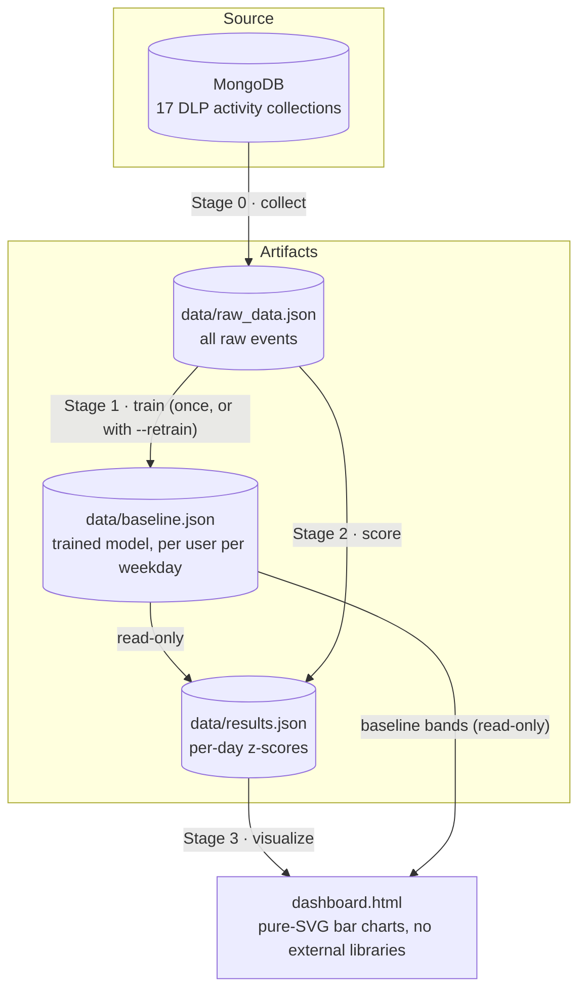

# UEBA Working-Hours Pipeline

**Detects unusual work start / finish times for every user and every weekday —
including Saturday and Sunday — and visualizes the deviations on a self-contained
HTML dashboard.**

The pipeline reads employee activity timestamps from a DataGaze DLP MongoDB
(17 collections: emails, telegrams, file monitors, web visits, ...), turns them
into a daily "work start / work finish" per user, learns each user's normal
schedule **per weekday**, and flags days that deviate from the norm with a
z-score.

---

## 1. Big picture



### The core idea in 3 steps

1. **Baseline (learned once).** For every user and every weekday (Mon–Sun — all
   7 days, weekends included), the pipeline learns "when does this person
   normally start / finish work": the mean and standard deviation of daily start
   and finish times over the collection window (default 60 days).
2. **Score (every run).** Each day is compared against the baseline of **its own
   weekday only**:
   `zStart = (actual start − weekday meanStart) / weekday stdStart`
3. **Visualize.** The dashboard draws each day's actual work span plus a
   yellow→green gradient bar showing how far that day deviated from the weekday
   norm.

### Key design rule: weekdays are fully independent

Each weekday is learned and scored in complete isolation. A Saturday is compared
only against the user's Saturday baseline — never against Monday, never against
their weekday average.

```
User "Ahmad"
├── Monday   : 8 days  → baseline (Monday)
├── Tuesday  : 8 days  → baseline (Tuesday)
├── Wednesday: 8 days  → baseline (Wednesday)
├── Thursday : 8 days  → baseline (Thursday)
├── Friday   : 8 days  → baseline (Friday)
├── Saturday : 6 days  → baseline (Saturday)   ← fully independent
└── Sunday   : 6 days  → baseline (Sunday)     ← fully independent
```

Consequences:

- If a person works a different schedule on weekends (different hours, fewer
  days), it does **not** contaminate the weekday baselines — and vice versa.
- Saturday and Sunday are handled with **exactly the same rules** as any other
  weekday: same noise filter, same minimum-sample count, same z-score math.
  If a weekday simply has fewer than 5 valid days, its baseline is left empty
  and its days are drawn gray (no false detection).

---

## 2. Pipeline stages

| Stage | Module            | Reads                          | Writes               | Runs when                          |
|-------|-------------------|--------------------------------|----------------------|------------------------------------|
| 0     | `pipeline/collector.py`   | MongoDB (17 collections) | `data/raw_data.json` | every run, unless `--skip-collect` |
| 1     | `pipeline/trainer.py`     | `raw_data.json`          | `data/baseline.json` | only if baseline is missing, or with `--retrain` |
| 2     | `pipeline/scorer.py`      | `raw_data.json` + `baseline.json` (read-only) | `data/results.json` | every run |
| 3     | `pipeline/visualizer.py`  | `results.json` + `baseline.json` | `dashboard.html`  | every run |

`main.py` is the single entry point and orchestrates the four stages in order.

### What "work start / finish" means

For each user and each calendar day, from **all** events of that day:

| Value     | Definition                                   |
|-----------|----------------------------------------------|
| `start`   | earliest event timestamp of the day          |
| `finish`  | latest event timestamp of the day            |
| `duration`| `finish − start`                             |

All times are stored as **minutes from 00:00** (e.g. 09:30 → 570).

---

## 3. Noise filter (used by Stage 1 and Stage 2 identically)

A day is only considered a "real working day" if it passes **both** rules:

| Rule                 | Default limit | Why                                                            |
|----------------------|---------------|----------------------------------------------------------------|
| Minimum events/day   | ≥ 5 events    | 1–2 events = laptop waking up / a stray sync — not a workday   |
| Maximum span/day     | ≤ 12 hours    | a 00:00→23:xx span means a background daemon, not a person     |

The filter is applied **identically in training and scoring**, so both stages
agree on which days are "real". Both limits are configurable via `.env`.

---

## 4. Math details

### 4.1 Baseline (Stage 1)

For each user `U` and weekday `W`, over all `n` valid days that fall on `W`:

| Field          | Computation                                            |
|----------------|--------------------------------------------------------|
| `meanStart`    | mean of the daily starts (minutes from 00:00)          |
| `stdStart`     | sample standard deviation (n−1) of the daily starts    |
| `meanFinish`   | mean of the daily finishes                             |
| `stdFinish`    | sample standard deviation of the daily finishes        |
| `meanDuration` | mean of the daily durations                            |
| `count`        | `n`                                                    |

If `n < MIN_DOW_SAMPLES` (default **5**), the weekday is stored with `null`
statistics and its days are never scored (gray bar in the dashboard).

### 4.2 Z-score (Stage 2)

For a day `d` that falls on weekday `W`:

```
zStart  = ( start(d)  − meanStart_W ) / stdStart_W
zFinish = ( finish(d) − meanFinish_W ) / stdFinish_W
```

- `z < 0` → earlier than usual, `z > 0` → later than usual.
- If `std = 0` or the baseline is missing → `z = null` (cannot be scored).

### 4.3 Interpreting z-scores

| `|z|`      | Status (see `get_status_color` in `pipeline/utils.py`) | Meaning              |
|------------|--------------------------------------------------------|----------------------|
| < 0.5      | normal (green)                                         | within usual variation |
| 0.5 – 1.19 | watch (yellow)                                         | mildly off            |
| 1.2 – 1.79 | anomaly (orange)                                       | clearly unusual       |
| ≥ 1.8      | severe (red)                                           | strongly unusual      |

In the dashboard, the arrival/departure **markers** blend green→yellow as `|z|`
grows (fully yellow from `|z| ≥ 2`), so even without reading the numbers you can
see which days are far from the norm.

---

## 5. Project structure

```
ueba/
├── main.py                      # single entry point — orchestrates stages 0–3
├── .env                         # configuration (Mongo URI, thresholds, limits)
├── requirements.txt             # python dependencies
├── dashboard.html               # generated artifact — open it in a browser
├── dashboard_backup.html        # backup of the last real-data dashboard
│
├── pipeline/
│   ├── utils.py                 # shared config, time helpers, noise filter,
│   │                            #   username mapping, z-score status colors
│   ├── collector.py             # Stage 0: MongoDB → raw_data.json
│   ├── trainer.py               # Stage 1: raw_data.json → baseline.json
│   ├── scorer.py                # Stage 2: baseline + raw → results.json
│   └── visualizer.py            # Stage 3: results + baseline → dashboard.html
│
├── tools/
│   └── make_synthetic_data.py   # demo-data generator (no MongoDB needed)
│
├── data/
│   ├── raw_data.json            # Stage 0 output — all collected events
│   ├── baseline.json            # Stage 1 output — the trained model
│   └── results.json             # Stage 2 output — per-day z-scores
│
└── data_backup/                 # snapshot of REAL Mongo data
                                 #   (raw_data / baseline / results + dashboard)
```

---

## 6. Data file formats

### 6.1 `raw_data.json` (Stage 0 output)

One entry per collection; each entry groups all timestamps of one client:

```json
{
  "emails": [
    { "uid": "6a7f...a1",
      "tss": ["2026-08-10T09:12:03", "2026-08-10T10:02:11", "..."] }
  ],
  "telegrams": [ { "uid": "6a7f...a2", "tss": ["..."] } ]
}
```

### 6.2 `baseline.json` (Stage 1 output — the trained model)

```json
{
  "meta": { "windowDays": 60, "trainedAt": "2026-08-25T16:10:01",
            "minDowSamples": 5, "userCount": 8 },
  "baselines": {
    "6a7f...a1": {
      "username": "Ahmad Jon",
      "weeks": {
        "Monday":   { "count": 8, "meanStart": 540.00, "stdStart": 25.00,
                      "meanFinish": 1050.00, "stdFinish": 25.00, "meanDuration": 510.00 },
        "...":      { "all seven weekdays, including Saturday and Sunday" },
        "Saturday": { "count": 6, "meanStart": 642.34, "stdStart": 45.13,
                      "meanFinish": 987.60, "stdFinish": 29.09, "meanDuration": 345.26 }
      }
    }
  }
}
```

If a weekday has fewer than 5 samples, the entry exists but all statistics are
`null` (e.g. `"count": 3, "meanStart": null, ...`).

### 6.3 `results.json` (Stage 2 output)

```json
{
  "meta": { "evalFrom": "2026-06-30", "evalTo": "2026-08-24",
            "generatedAt": "...", "baselineTrainedAt": "..." },
  "users": [
    { "clientId": "6a7f...a1", "username": "Ahmad Jon",
      "days": [
        { "date": "2026-08-10", "dayOfWeek": "Monday",
          "start": "08:58:12", "finish": "17:31:45", "durationMin": 513.55,
          "zStart": 0.084, "zFinish": -0.134 }
      ] }
  ]
}
```

| Field         | Meaning                                             |
|---------------|-----------------------------------------------------|
| `date`        | calendar day of the day being scored                |
| `dayOfWeek`   | Monday … Sunday (determines which baseline was used)|
| `start`       | earliest event of the day (`HH:MM:SS`)              |
| `finish`      | latest event of the day (`HH:MM:SS`)                |
| `durationMin` | finish − start in minutes                           |
| `zStart`      | z-score of the start vs. that weekday's baseline    |
| `zFinish`     | z-score of the finish vs. that weekday's baseline   |

`zStart` / `zFinish` are `null` when the weekday has no usable baseline.

---

## 7. Configuration (`.env`)

All settings live in `.env` in the project root. **`.env` values override the
code defaults**, so always change `.env` (not the code) when tuning.

| Variable           | Default                      | Meaning                                                     |
|--------------------|------------------------------|-------------------------------------------------------------|
| `MONGO_URI`        | `mongodb://localhost:27017/` | MongoDB connection string                                    |
| `DB_NAME`          | `ueba_db`                    | database name                                                |
| `DAYS_WINDOW`      | `60`                         | training/collection window in days                           |
| `MIN_DOW_SAMPLES`  | `5`                          | min valid days per weekday before a baseline is built        |
| `MIN_DAILY_EVENTS` | `5`                          | noise filter: minimum events for a day to count as a workday |
| `MAX_DAILY_HOURS`  | `12`                         | noise filter: max work span for a day to count as a workday  |
| `Z_THRESHOLD`      | `1.2`                        | `|z|` above which a day is "anomaly" (status color)          |
| `SEVERE_THRESHOLD` | `1.8`                        | `|z|` above which a day is "severe" (status color)           |

---

## 8. Quick start

```bash
cd ueba

# 1) Python environment
python -m venv venv
venv/bin/pip install -r requirements.txt

# 2) Point at your MongoDB
#    (edit .env: MONGO_URI, DB_NAME)

# 3) Run the full pipeline
venv/bin/python main.py

# 4) Open the result
xdg-open dashboard.html     # or just open it in a browser
```

### Command reference

| Command                                | What it does                                                        |
|----------------------------------------|---------------------------------------------------------------------|
| `python main.py`                       | full pipeline (collect → train if needed → score → dashboard)       |
| `python main.py --retrain`             | **re-learn the baseline** from the current raw data                 |
| `python main.py --skip-collect`        | skip MongoDB, reuse the existing `data/raw_data.json`               |
| `python main.py --skip-collect --retrain` | full rebuild from existing raw data (no Mongo needed)           |

The baseline is a **one-time model**: it is written only when missing or with
`--retrain`. Stage 2 never writes to `baseline.json` — it only reads it.

---

## 9. Demo mode (no MongoDB required)

`tools/make_synthetic_data.py` generates a realistic `raw_data.json` in exactly
the same format as the collector: 56-day window, fixed seed (42), 8 synthetic
users with their own schedules.

| User | Weekday schedule (Mon–Fri) | Weekend schedule (Sat & Sun) | Planted anomalies (weekdays only) |
|------|----------------------------|------------------------------|-----------------------------------|
| a1   | 09:45 → 18:00              | 11:00 → 16:30                | —                                 |
| a2   | 09:00 → 17:30              | 11:00 → 16:30                | —                                 |
| a3   | 10:00 → 18:30              | 11:30 → 17:00                | —                                 |
| a4   | 08:30 → 17:00              | 10:30 → 16:00                | —                                 |
| a5   | 09:15 → 18:15              | 11:00 → 16:30                | —                                 |
| a6   | 10:30 → 19:00              | 12:00 → 17:30                | —                                 |
| a7 "night owl"    | 09:00 → 17:30 | 10:00 → 16:00 | **6 days** start at 01:30–02:30   |
| a8 "late finisher"| 09:45 → 18:00   | 11:00 → 16:30     | **4 days** finish at 21:30–23:00  |

Every user also works **6 Saturdays and 6 Sundays** (2 rest days skipped per
weekend type), so the weekend baselines get n = 6 ≥ 5 and are fully trained.
Weekend schedules differ from weekday ones on purpose — this is the
"weekends are independent" rule in action.

```bash
# generate demo data (⚠ overwrites data/raw_data.json — back up real data first!)
venv/bin/python tools/make_synthetic_data.py

# rebuild baseline + results + dashboard from the demo data
venv/bin/python main.py --skip-collect --retrain
```

To go back to real data afterwards: `venv/bin/python main.py --retrain`
(Stage 0 re-collects from MongoDB and overwrites `raw_data.json`).

---

## 10. How to read the dashboard

- **One chart per user** — pick a user from the dropdown at the top.
- **X-axis:** *every* calendar day of the evaluation window, in order. Days
  with no activity keep their slot (grid line + date label) but have no bar.
  Rotated date labels; **Saturday and Sunday dates are red** and sit on a light
  gray background strip.
- **Y-axis:** hours of the day, 00:00 at the bottom → 24:00 at the top.

### Chart elements

| Element | What it means |
|---------|---------------|
| White bar | that day's actual work span (first → last event) |
| Dashed band, light green | **arrival** baseline for that weekday: `meanStart ± σ` (reference only) |
| Dashed band, darker green | **departure** baseline for that weekday: `meanFinish ± σ` (reference only) |
| Yellow → green gradient bar | **deviation**: spans from the actual time (yellow end) to the weekday mean (green end). The longer the bar, the bigger the deviation. Used for both arrival and departure, early or late. |
| Small marker (4 px) at start/finish | arrival / departure point. Green ≈ on the baseline, yellow = far away (fully yellow at \|z\| ≥ 2) |
| Gray dashed bar | that weekday has no baseline yet (< 5 samples) |
| Red date label + gray strip | Saturday / Sunday |

**Hovering** over any bar shows a tooltip with: date, weekday, start, finish,
duration, `zStart`, `zFinish` and the weekday baseline (`mean ± σ` for arrival
and departure).

> Note: the dashboard's own UI labels (legend, dropdown) are written in Uzbek.

### Typical readings

| Situation | What you see |
|-----------|--------------|
| Arrived 2 h early | long yellow→green gradient *below* the arrival band; yellow marker at the early start; negative `zStart` |
| Normal day | tiny or no gradient; green markers; `|z| < 0.5` |
| Finished very late | long gradient *above* the finish band; yellow marker at the late finish; positive `zFinish` |
| Weekend shift (e.g. 11:00 instead of the weekday 09:00) | compared against the **Saturday/Sunday** baseline — if it matches the weekend norm, the markers stay green |
| First week (baseline not built yet) | gray dashed bars, no bands, no markers |

---

## 11. Backups & real data

| Where | What |
|-------|------|
| `data/` | current working artifacts (may be demo data) |
| `data_backup/` | snapshot of the **real** Mongo snapshot: `raw_data.json`, `baseline.json`, `results.json` |
| `dashboard_backup.html` | the dashboard built from that real snapshot |

Restore the real-data state:

```bash
cp data_backup/* data/
cp dashboard_backup.html dashboard.html
```

Go back to live Mongo data (overwrites `data/raw_data.json`):

```bash
venv/bin/python main.py --retrain
```

---

## 12. Caveats & known behaviors

1. **Z-score dilution is expected.** The baseline is trained once over the whole
   window, so anomalies planted inside the window inflate σ. A single outlier
   among `n` samples can reach at most `|z| ≈ (n−1)/√n` (e.g. ≈ 2.5 for n = 8).
   This is statistical behavior, not a bug.
2. **The synthetic generator is date-relative.** It computes which of the last
   56 days are Saturdays/Sundays *relative to today*. Re-running it on a
   different weekday shifts the weekend dates. Fine for a demo; for production
   data this is irrelevant (Stage 0 reads real timestamps).
3. **MongoDB down during training** → username mapping degrades gracefully:
   a warning is printed and client IDs are used as names. The rest of the
   pipeline is unaffected.
4. **Never overwrite `baseline.json` by hand** — it is the trained model.
   Re-learn with `--retrain` instead.
5. **`.env` overrides code defaults.** When changing a limit, edit `.env`
   (e.g. `MIN_DOW_SAMPLES`), otherwise the code default may silently be ignored.
6. **Weekend demo coverage.** In the synthetic set each user works exactly
   6 Saturdays + 6 Sundays (2 rest days skipped each), giving weekend
   baselines with n = 6. If real data has < 5 weekend days per user, weekend
   baselines stay empty and weekend days render gray — same rule as any other
   weekday.

---

## 13. Quick glossary

| Term | Meaning |
|------|---------|
| **weekday / weekday baseline** | one of the 7 days (Mon–Sun) and that user's learned start/finish statistics for that day |
| **start / finish** | first / last event of the day (minutes from 00:00) |
| **σ (sigma / std)** | standard deviation — how much the user's start/finish varies |
| **z-score** | deviation in units of σ; 0 = exactly on the baseline |
| **band** | the `mean ± σ` reference zone for arrival (light) / departure (dark) on the dashboard |
| **retrain** | recompute the baseline from the current raw data (`--retrain`) |
