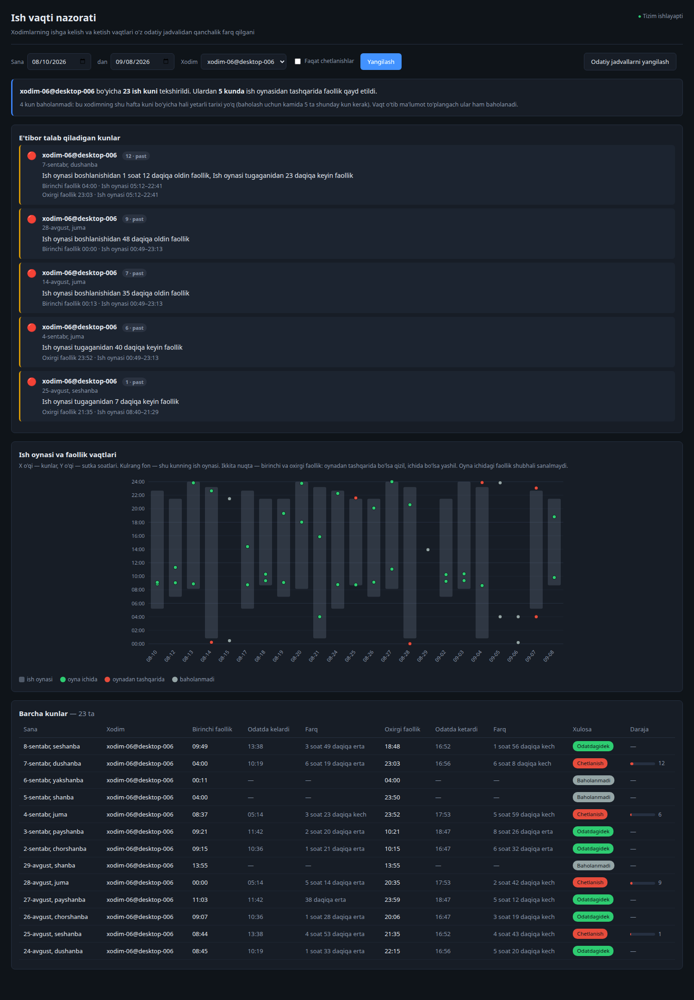
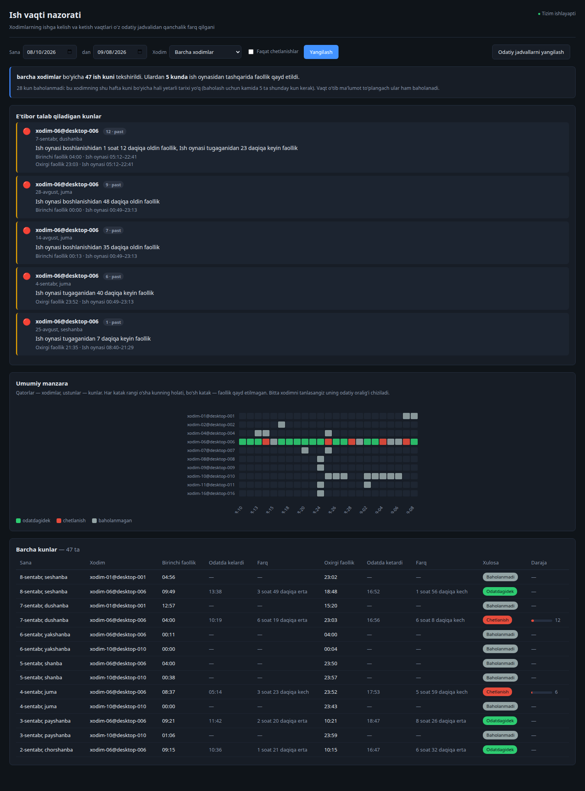

# UEBA — Ish vaqti tahlili

Har bir xodim uchun **o'zining odatiy ish oynasini** o'rganadi, so'ng har kuni
shu oynadan **tashqarida** faollik bo'lganini tekshiradi. Ish vaqtidan
tashqaridagi faollik — DLP nuqtai nazaridan e'tibor talab qiladigan holat.

Ma'lumot manbai — DataGaze DLP tizimining MongoDB'sidagi
**`agentsessions`** collection'i: agentning DLP serveri bilan ulanish
sessiyalari. DLP har bir (xodim, kompyuter, kun) uchun bitta yozuv yuritadi —
agent o'sha kuni qachon ulangan va qachon uzilgan.

---

## Mundarija

- [Dashboard](#dashboard)
- [Umumiy manzara](#umumiy-manzara)
- [Bosqichma-bosqich](#bosqichma-bosqich) — collector, trainer, trigger, worker, dashboard
- [Matematika](#matematika-bitta-kun-qanday-baholanadi) — oyna, chetlanish, ball, risk
- [To'liq misol](#toliq-misol-bitta-kun-boshidan-oxirigacha)
- [Sof ish vaqti](#sof-ish-vaqti--activemin)
- [O'qitish jarayoni](#oqitish-jarayoni-train--retrain)
- [Ishga tushganda nima bo'ladi](#ishga-tushganda-nima-boladi)
- [Dashboard qanday ishlaydi](#dashboard-qanday-ishlaydi)
- [Yangi detector qo'shish](#yangi-detector-qoshish)
- [API](#api)
- [Ma'lumot tuzilmalari](#malumot-tuzilmalari)
- [Ishga tushirish](#ishga-tushirish)
- [Sozlamalar](#sozlamalar)
- [Loglar va kuzatuv](#loglar-va-kuzatuv)
- [Muammolarni bartaraf etish](#muammolarni-bartaraf-etish)
- [Testlar](#testlar)
- [Edge caselar](#edge-caselar)
- [Muhim qoidalar](#muhim-qoidalar)

---

## Dashboard



*Bitta xodim tanlangan holat. Grafikda X — kunlar, Y — sutka soatlari;
kulrang fon — o'sha kunning ish oynasi; ikkita nuqta — birinchi va oxirgi
faollik (oyna ichida yashil, tashqarida qizil, baseline yo'q bo'lsa kulrang).*



*Xodim tanlanmagan holat — qatorlar xodimlar, ustunlar kunlar.*

---

## Umumiy manzara

```
alpha-demo.agentsessions                 (DLP bazasi — FAQAT O'QILADI)
        │
        ├── COLLECTOR ──► raw_data_for_train ──► TRAINER ──► baseline
        │   (90 kunlik tarix)                                (o'rganilgan norma)
        │
        └── TRIGGER ──► RabbitMQ ──► WORKER ──► PROCESSOR ──► results
            (har 5 soatda)             (×3)     (detectorlar)      │
                                                              DASHBOARD
```

Yuqoridagi tarmoq — **o'qitish**, faqat talab bo'yicha ishlaydi.
Pastdagisi — **baholash**, har 5 soatda avtomatik.

### Ikkita baza, aniq ajratilgan

| Baza | Rejim | Nima bor |
|---|---|---|
| `alpha-demo` (DLP) | **faqat o'qish** | `agentsessions`, `clients`, `groups` |
| `ueba_local` | o'qish/yozish | `raw_data_for_train`, `baseline`, `baseline_runs`, `trigger_data`, `results`, `training_jobs` |

Ajratish kod darajasida: [services/mongo.py](services/mongo.py) da ikkita
alohida `MongoClient` bor. `main_db()` faqat `find()` uchun ishlatiladi,
`local_db()` esa barcha yozuvlar uchun. DLP bazasiga yozish jismonan
mumkin emas — bu tasodifiy emas, ataylab qo'yilgan to'siq.

### Manba collection

```json
{
  "clientId":         ObjectId("684d6e4c0614f7499b947d48"),  // clients._id ga bog'lanadi
  "computer":         ObjectId("684d6e4c0614f7499b947d41"),
  "dateStr":          "25.08.2026",                          // yozuv qaysi kunga tegishli
  "date":             ISODate("2026-08-25T00:00:00"),
  "connectTime":      ISODate("2026-08-25T09:12:04"),        // kunning BIRINCHI ulanishi
  "disconnectTime":   ISODate("2026-08-25T18:31:22"),        // OXIRGI uzilish
  "disconnectReason": "transport close"
}
```

**Yozuvning kaliti — `clientId` + `computer` + `dateStr`.** Ya'ni har xodimga,
har kompyuteri uchun, har kunga bitta yozuv.

DLP jamoasi tasdiqlagan xatti-harakat:

| Hodisa | Nima bo'ladi |
|---|---|
| Agent ulanadi, bugunga yozuv yo'q | yangi yozuv: `connectTime = hozir`, `disconnectTime = null` |
| Agent uziladi | `disconnectTime` va `disconnectReason` yoziladi |
| Kun ichida **qayta** ulanadi | faqat `disconnectTime` yangilanadi — **`connectTime` tegilmaydi** |

Oxirgi qator eng muhimi: shu tufayli `connectTime` doim kunning **birinchi**
ulanishi, `disconnectTime` esa **oxirgi** uzilishi bo'lib qoladi. Ya'ni ular
to'g'ridan-to'g'ri ish kunining boshi va oxiri — qo'shimcha hisob-kitob kerak emas.

Maydon nomlari `.env` da (`SESSION_CONNECT_FIELD`, `SESSION_DISCONNECT_FIELD`,
`SESSION_DATE_FIELD`) — DLP nomlarni o'zgartirsa kodga tegilmaydi.

**Ikkita cheklov** (DLP hujjatidan):

1. **`disconnectTime` bo'sh bo'lishi mumkin** — sessiya hali tugamagan yoki
   ertangi kunga o'tib ketgan. Bu «yarim tungacha ishladi» degani **emas**,
   shuning uchun bunday yozuv kun **oxiri** uchun ishlatilmaydi (boshi uchun
   ishlatiladi).
2. **Kompyuter bir necha kun o'chmasa oraliq kunlar tushib qoladi** — yozuv
   faqat ulanish paytida yaratiladi. Yozuvning yo'qligi «ishlamagan» degani
   emas; bunday kun `insufficient` bo'lib qoladi.

---

## Bosqichma-bosqich

### 1. Collector — tarixni yig'adi

**[services/collector.py](services/collector.py)** · faqat o'qitish paytida

Har bir active xodim uchun `agentsessions` dan **90 kunlik** sessiyalarni
oladi. Har xodim uchun **bitta so'rov**.

**Active xodim kim:** `clients` da `disabled: false` yoki maydon umuman
yo'q. Ya'ni `disabled` qo'yilmagan xodim ham active hisoblanadi.

**Oyna ataylab to'liq tugagan kunlardan iborat:**

```
window_end   = bugungi 00:00        ← ishga tushirilgan kun KIRMAYDI
window_start = window_end − 90 kun  ← eng eski kun ham 00:00 dan boshlanadi
```

Nima uchun: agar oyna `now − 90 kun` bo'lganda, soat 15:20 da ishga
tushirilsa eng eski kun 15:20 dan boshlanardi (ertalabki qismi yo'q),
bugungi kun esa chala bo'lardi. Ikkalasi soxta kelish/ketish vaqti berib
normani buzardi. Endi oyna **soat nechada ishga tushirilganidan qat'i
nazar bir xil**.

**Har kun uchun uchta qiymat** ([services/workday.py](services/workday.py)):

```
start      = kunning eng erta connectTime     (kompyuterlar bo'ylab min)
finish     = kunning eng kech disconnectTime  (kompyuterlar bo'ylab max)
activeMin  = sessiyalar davomiyligi yig'indisi
```

Bir xodimda ikkita kompyuter bo'lsa o'sha kunga ikkita yozuv tushadi —
chegaralar ular bo'ylab birlashtiriladi. `activeMin` esa yig'indi, ya'ni
`durationMin` dan farqi: u kun boshidan oxirigacha bo'lgan **to'liq** oraliq
(uzilishlar ichida), `activeMin` esa faqat **tarmoqda turilgan** vaqt.

**Arxiv oynaning aynan nusxasi bo'lib qoladi.** Collector uchta tozalash
qiladi:

1. Manbadan yo'qolgan kunlar o'chiriladi (DLP tomonda ma'lumot o'chirilgan
   bo'lsa, bizda ham qolmasin).
2. Oynadan chiqib ketgan kunlar o'chiriladi — **barcha xodimlar uchun**,
   sikldan tashqarida. Sikl ichida bo'lganda collector bormaydigan xodimning
   yozuvlari abadiy qolib ketardi.
3. Active ro'yxatda yo'q xodimlarning yozuvlari o'chiriladi — **faqat run
   to'liq muvaffaqiyatli bo'lsa**. Manba buzilib qisqa ro'yxat qaytarsa,
   butun arxiv qirilib ketmasin.

**Manba xatosida hech narsa yozilmaydi.** O'qish yozishdan oldin to'liq
bajariladi; xato bo'lsa o'sha xodim butunlay o'tkazib yuboriladi va uning
eski, to'g'ri ma'lumoti saqlanib qoladi. «O'qib bo'lmadi» ni «hech narsa
yo'q» deb qabul qilish mumkin emas — bu ikki xil holat.

Tarmoq uzilishlari ko'pincha o'tkinchi bo'lgani uchun
`SOURCE_READ_RETRIES` (2) marta qayta uriniladi.

### 2. Trainer — normani o'rganadi

**[services/trainer.py](services/trainer.py)**

Arxivdagi kunlarni **har hafta kuni alohida** guruhlaydi. Shanba faqat
shanbalar bilan solishtiriladi — odamlarning dam olish kunidagi rejimi
boshqacha bo'ladi va aralashtirilsa norma ma'nosini yo'qotadi.

Har guruh uchun o'rtacha va **sample** standart og'ish (`n−1` bo'luvchi):

```json
"Tuesday": { "count": 5, "meanStart": 817.7, "stdStart": 297.87,
                         "meanFinish": 1012.15, "stdFinish": 276.69,
                         "meanDuration": 194.44 }
```

Raqamlar — **kun boshidan daqiqa**. `817.7` = 13:37.

Namuna `MIN_DOW_SAMPLES` (3) dan kam bo'lsa statistika `null` bo'ladi va
o'sha hafta kuni baholanmaydi — faqat `count` yoziladi. Ikki kunlik
ma'lumotdan norma chiqarish yolg'on bo'lardi.

**Baseline versiyalanadi.** Har o'qitish yangi `baselineId` oladi, eskilari
(`BASELINE_KEEP_VERSIONS` = 5 tasi) saqlanadi. Almashtirish tartibi qat'iy:

```
1. yangi versiya yoziladi va DARROV current: true qilinadi
2. KEYIN eski versiyalar current: false ga o'tkaziladi
```

Shu tartibda «joriy versiya yo'q» oynasi umuman bo'lmaydi. Bir lahza
ikkitasi bo'lib qolsa, o'quvchi eng yangisini oladi.

### 3. Trigger — yangi ma'lumotni navbatga tashlaydi

**[services/trigger.py](services/trigger.py)** · har 5 soatda, **faqat
avtomatik** — API orqali ishga tushirish yo'li yo'q

`trigger_data` collection'i uchta savolga javob beradi va uning yagona
egasi trigger'dir:

| Savol | Qanday javob beradi |
|---|---|
| Qayerdan davom etish kerak? | xodimning eng oxirgi `finish` i = cursor |
| Nima yuborilgan? | ichida faqat MQ'ga **muvaffaqiyatli yetib borgan** kunlar |
| Takror yuborilmayaptimi? | `start`, `finish`, `eventCount` solishtiriladi |

**Cursor kun boshiga tushiriladi.** Oxirgi `finish` 2026-09-08T18:48 bo'lsa,
keyingi o'tish 2026-09-08T00:00 dan o'qiydi. Nima uchun: o'sha kun to'liq
qayta olinadi, shuning uchun chala kelgan ma'lumot keyingi o'tishda
**o'zini to'g'rilaydi**. Cursor umuman bo'lmasa (birinchi o'tish) —
`now − LOOKBACK_HOURS` (5 soat).

**Dedup:** kun `trigger_data` dagi yozuv bilan uchala maydon bo'yicha bir
xil bo'lsa, qayta yuborilmaydi. Ma'lumot o'zgargan bo'lsa — yuboriladi va
`results` yangilanadi.

**Tartib qat'iy: avval publish, keyin yozish.**

```python
publish(channel, job)                      # 1. RabbitMQ'ga
for doc in day_docs:
    trigger_col.update_one(..., upsert=True)   # 2. keyin trigger_data ga
```

Teskari bo'lsa, navbat yiqilganda kun «yuborilgan» deb belgilanib, hech
qachon baholanmay qolardi. Hozirgi tartibda esa eng yomon holat — cursor
orqada qoladi va keyingi o'tishda qayta yuboriladi. Hech narsa yo'qolmaydi.

**Tozalash:** har o'tishda `trigger_data` dan `DAYS_WINDOW` kundan eski
yozuvlar, `results` dan `RESULTS_RETENTION_DAYS` (365) kundan eskilari
o'chiriladi.

Bitta xodimda xato bo'lsa qolganlari davom etadi — xato o'sha xodim
doirasida ushlanadi.

### 4. Worker + Processor — baholaydi

**[mq/worker.py](mq/worker.py)** (`WORKER_COUNT` = 3 ta thread) →
**[services/processor.py](services/processor.py)**

**Navbat sozlamalari:**

| Parametr | Qiymat | Nima uchun |
|---|---|---|
| Queue | `ueba_jobs`, **durable** | RabbitMQ qayta ishga tushsa navbat yo'qolmaydi |
| Message | `delivery_mode=2` | xabar diskda saqlanadi |
| `prefetch_count` | **1** | bitta worker bir vaqtda bitta job — yuk teng taqsimlanadi |
| Auto-ack | **yo'q** | ack faqat ish tugagach, aks holda xato bo'lsa job yo'qolardi |

Har thread **o'z ulanishiga** ega — `pika` talabi: bir connection, bir thread.

**Job payload'i:**

```json
{
  "jobId": "8f3c...uuid4",
  "clientId": "6a68d16e4abd38577c6314fb",
  "hostname": "azam@azam-upc",
  "windowStart": "2026-09-08T00:00:00",
  "windowEnd": "2026-09-09T12:00:00",
  "days": {
    "2026-09-08": { "start": "2026-09-08T09:49:00", "finish": "2026-09-08T18:48:16",
                    "eventCount": 12, "dayOfWeek": "Tuesday",
                    "durationMin": 539.27, "activeMin": 384.6 }
  },
  "sentAt": "2026-09-09T12:00:00"
}
```

**Worker nima qiladi:**

1. JSON parse. Buzuq bo'lsa → darrov tashlanadi, qayta urinilmaydi
   (buzuq JSON qayta urinishdan tuzalmaydi).
2. `current_baseline_id()` → xodimning **joriy** baseline'ini topadi.
   Topilmasa ham kunlar yo'qolmaydi: natija baribir yoziladi,
   `status: insufficient` bo'ladi.
3. `evaluate_job(job, baseline)` → natija hujjatlari.
4. `results` ga upsert (`{clientId, date}` kaliti) → **idempotent**,
   takroriy job zarar qilmaydi.
5. `basic_ack`.

**Xato siyosati.** Message header'ida `x-retries` hisoblagichi bor:

```
xato + x-retries < MAX_RETRIES(3)  →  x-retries+1 bilan QAYTA PUBLISH
xato + x-retries >= 3              →  tashlanadi + ERROR log
```

Tashlangan job avtomatik qaytmaydi, chunki kunlar `trigger_data` da
«yuborilgan» deb turadi. Qo'lda qaytarish yo'li
[Muammolarni bartaraf etish](#muammolarni-bartaraf-etish) da.

**Processor o'zi hech narsa hisoblamaydi.** U har kun uchun `DayContext`
quradi va uni **detectorlar ro'yxatidan** o'tkazadi
([registry.py](services/detectors/registry.py)). Shuning uchun ikkinchi
detector qo'shilganda processor o'zgarmaydi.

Har detector alohida `try/except` ichida chaqiriladi. Bitta detector
yiqilsa `evaluated: false` yoziladi va kun yo'qolmaydi — aks holda job
3 marta qayta urinilib, keyin butunlay tashlanardi.

### 5. Dashboard — ko'rsatadi

Natijalar `results` ga yoziladi. Dashboard `/api/results` dan o'qiydi va
statistika tilida emas, **oddiy tilda** ko'rsatadi:

> «Ish oynasi boshlanishidan 1 soat 12 daqiqa oldin faollik ·
> Birinchi faollik 04:00 · Ish oynasi 05:12–22:41»

Tafsilotlar: [Dashboard qanday ishlaydi](#dashboard-qanday-ishlaydi).

---

## Matematika: bitta kun qanday baholanadi

### 1-qadam — ish oynasi quriladi

```
lo = meanStart  − T·σ(start)          T = ANOMALY_Z_THRESHOLD (1.0)
hi = meanFinish + T·σ(finish)
```

Misol: o'rtacha kelish 13:37 (±4s58d), ketish 16:52 (±4s37d) → oyna
**08:39 – 21:28**.

Oyna har hafta kuni uchun alohida — dushanbaniki dushanbanikidan,
jumaniki jumanikidan.

### 2-qadam — chetlanishmi?

```
start < lo   yoki   finish > hi   →   CHETLANISH
```

Bir daqiqa ham chetlanish. Va bu **aniq** ishlaydi: kunning barcha
hodisalari `start` va `finish` orasida yotadi, demak ikkala chekka oyna
ichida bo'lsa — o'sha kunning **hamma** faolligi oyna ichida. Alohida
hodisalarni tekshirish shart emas.

> **Kech kelish va erta ketish shubhali EMAS.** Odatda 09:00 da keladigan
> xodim 13:00 da kelsa — 13:00 oyna ichida, hech narsa chiqmaydi. Tizim
> intizomni emas, **ish vaqtidan tashqaridagi faollikni** kuzatadi. Bu
> ongli tanlov: kech kelish kadrlar masalasi, tunda ishlash esa DLP
> masalasi.

### 3-qadam — darajasi qanday?

Chetlanish borligini bildik. Endi **qanchaligini** o'lchash kerak — 0 dan
100 gacha raqam.

Bizda `zOut` bor: chetlanish xodimning o'z og'ishiga (σ) nisbatan qanchalik
katta. Lekin u chegaralanmagan — 1.0 dan cheksizgacha bo'lishi mumkin.
Uni 0–100 shkalasiga o'tkazish kerak.

#### Formula qayerdan kelib chiqadi

Bu **min-max normalizatsiya** — bir oraliqdagi qiymatni belgilangan
shkalaga o'tkazishning standart usuli:

```
ball = 100 · (qiymat − eng_past) / (eng_yuqori − eng_past)
```

`eng_past` da 0, `eng_yuqori` da 100 chiqadi, oradagilar chiziqli
taqsimlanadi. Bizda ikkala chekka `.env` dan keladi:

```
eng_past   = ANOMALY_Z_THRESHOLD  = 1.0     chetlanish shu yerdan boshlanadi
eng_yuqori = ANOMALY_Z_FULL_SCALE = 3.0     shu yerda maksimal deb hisoblaymiz
```

Shundan:

```
zOut = max(zStart, zFinish)                 faqat oynadan CHIQARUVCHI tomon

ball = 100 · (zOut − 1.0) / (3.0 − 1.0)  =  100 · (zOut − 1) / 2
                             └────┬────┘
                        oraliq kengligi = 2
```

`2` — sehrli raqam emas, `3.0 − 1.0` ning natijasi. `.env` da
`ANOMALY_Z_FULL_SCALE=4.0` qilsangiz bo'luvchi `3` bo'ladi.

#### Ko'rinishi

```
ball
100 │                              ╭────────────────  3.0 dan keyin tekis
    │                          ╱
 75 │                      ╱
 50 │                  ╱              to'g'ri chiziq
 25 │              ╱
  1 │          ╱
  0 │──────────┤
    └──────────┼──────┼──────┼──────┼──────────────  zOut
              1.0    1.5    2.0    2.5    3.0
           chegara                      to'liq shkala
```

| zOut | 0.99 | 1.0 | 1.2 | 1.5 | 2.0 | 2.5 | ≥ 3.0 | σ = 0 |
|---|---|---|---|---|---|---|---|---|
| **ball** | 0 | 1 | 10 | 25 | 50 | 75 | **100** | **100** |

#### Nega shkala 1.0 dan boshlanadi, 0 dan emas

Bu eng muhim nuqta.

`zOut < 1.0` — bu **chetlanish emas**, faollik oyna ichida, ball 0.

Agar `ball = 100 · zOut / 3` deb yozganimizda, arang chegaradan chiqqan kun
**33 ball** olardi. Ya'ni olti daqiqalik chiqish «uchdan bir maksimal xavf»
bo'lib ko'rinardi — bu yolg'on.

Shuning uchun shkala **chegaradan boshlanadi**. U «o'rtachadan qancha uzoq»
emas, **«chegaradan qancha o'tib ketdi»** degan savolga javob beradi:

```
zOut = 1.048   →   chegaradan atigi 0.048 σ o'tdi   →    2 ball
zOut = 1.475   →   chegaradan 0.475 σ o'tdi         →   24 ball
zOut = 3.000   →   chegaradan 2 σ o'tdi             →  100 ball
```

#### Nega 3.0 da to'xtaydi

Ma'lum bir nuqtadan keyin «ko'proq» degani qarorni o'zgartirmaydi. Xodim
o'z odatiy oynasidan **2σ nariga** chiqqan bo'lsa, u allaqachon «butunlay
boshqa vaqtda ishlagan». 3σ va 8σ orasidagi farq amaliy ahamiyatga ega
emas — ikkalasi ham bir xil xulosaga olib keladi.

Shuning uchun `min(1, ...)` bilan cheklanadi. Lekin **xom qiymat
yo'qolmaydi** — `details.zOut` va `details.outsideMin` da saqlanadi, ya'ni
100 ball olgan kunlarni ham bir-biridan ajratib saralash mumkin.

#### `max(1, ...)` nima uchun

Chegaradan bir daqiqa o'tgan kun `100 · 0.0001 / 2 = 0.005` beradi,
yaxlitlanib **0** bo'lardi. Natijada «chetlanish, lekin ball 0» degan
ziddiyat chiqardi. Shuning uchun chetlanish bo'lgan kun kamida **1** ball
oladi.

Kodda ([scoring.py](services/detectors/scoring.py)):

```python
ball = max(1, round_half_up(100.0 * min(1.0, (z_out - t) / (full - t))))
```

`round()` o'rniga `round_half_up()` — Python'ning o'zi «bankir
yaxlitlashi» qiladi (`round(24.5) == 24`).

#### Uchta haqiqiy misol

Bir xodim, `sanja@desktop-q46u2et`:

**5-sentabr, shanba → 2 ball**

```
Baseline (shanba):  ketish 17:04,  σ = 125 daqiqa
Oyna:               14:55 – 19:10
Haqiqat:            16:33 – 19:16

19:16 oynadan 6 daqiqa keyin
zFinish = 6 / 125 + 1.0 = 1.048

ball = 100 · (1.048 − 1) / 2 = 2.4  →  2
```

**15-avgust, shanba → 3 ball**

```
Oyna:      14:55 – 19:10       (o'sha shanba normasi)
Haqiqat:   14:52 – 15:06

14:52 oynadan 2.6 daqiqa oldin
zStart = 2.6 / 51 + 1.0 = 1.052

ball = 100 · (1.052 − 1) / 2 = 2.6  →  3
```

**14-avgust, juma → 24 ball**

```
Baseline (juma):  kelish 09:09,  σ = 283 daqiqa
Oyna:             04:26 – 21:22
Haqiqat:          02:12 – 21:10

02:12 oynadan 134.5 daqiqa oldin
zStart = 134.5 / 283 + 1.0 = 1.475

ball = 100 · (1.475 − 1) / 2 = 23.75  →  24
```

#### Nega raqamlar past chiqdi

E'tibor bering: 134 daqiqa erta kelish atigi **24 ball** oldi. Sabab —
ball daqiqada emas, **xodimning o'z σ birligida** o'lchanadi:

| Hafta kuni | Kelish σ | Ma'nosi |
|---|---|---|
| Shanba | 51 daqiqa | nisbatan barqaror |
| Juma | **283 daqiqa** | ±4.7 soat tebranish |

Jumada 134 daqiqa erta kelish — bu uning odatiy tebranishining **yarmidan
kam**. Tizim buni halol ko'rsatyapti: bu xodim uchun g'ayrioddiy emas.

Solishtiring: agar xodim har kuni aniq 09:00 da kelsa (`σ = 10 daqiqa`),
o'sha 134 daqiqalik chiqish `zOut = 14.4` berardi va ball **100** bo'lardi.

Aynan shu narsa daqiqa bilan o'lchashdan afzalligi: bir xil 30 daqiqalik
chiqish barqaror xodim uchun favqulodda holat, beqaror xodim uchun oddiy
tebranish. Daqiqa bu farqni ko'rmaydi, σ ko'radi.

#### Ball 100 ga qachon yetadi

```
zOut ≥ 3.0    →    oynadan 2σ dan ko'proq chiqish
```

Yuqoridagi xodimning jumasi uchun: `283 × 2 = 566 daqiqa` ≈ **9.5 soat**
oynadan tashqarida. Ya'ni deyarli butun kunni g'ayrioddiy vaqtda
o'tkazish kerak.

#### Ikkita sozlama nimani o'zgartiradi

| Sozlama | Kattalashtirsangiz | Kichraytirsangiz |
|---|---|---|
| `ANOMALY_Z_THRESHOLD` | oyna kengayadi → chetlanish **kamayadi** | ko'proq kun chetlanish bo'ladi |
| `ANOMALY_Z_FULL_SCALE` | ballar **pasayadi** (100 ga yetish qiyinlashadi) | ballar ko'tariladi |

Masalan `ANOMALY_Z_FULL_SCALE=1.5` bo'lsa bo'luvchi `0.5` bo'lib qoladi va
yuqoridagi uch kun **10, 10, 95** ball olardi.

#### Matematik ayniyat

`lo = meanStart − T·σ` bo'lgani uchun «oynadan tashqarida» aynan
«`zOut > T`» degani. Bu 85 ta natijada tekshirilgan — birorta istisno yo'q.

Qaror **oyna bilan** qilinadi, chunki u `σ = 0` bo'lganda ham ishlaydi
(z esa nolga bo'linardi). Bunday holatda har qanday chiqish 100 ball oladi:
xodim har kuni sekundma-sekund bir xil kelgan bo'lsa, har qanday og'ish
cheksiz uzoq.

#### Modul emas, ishorali

| | z ishorasi | Oynaga nisbatan |
|---|---|---|
| `zStart > T` | erta kelish | tashqarida |
| `zStart < −T` | kech kelish | **ichida** |
| `zFinish > T` | kech ketish | tashqarida |
| `zFinish < −T` | erta ketish | **ichida** |

`abs()` ishlatilganda kech kelish va erta ketish ham chetlanish bo'lib
qolardi — bu esa 2-qadamdagi qaror bilan ziddiyatga kirardi.

### 4-qadam — umumiy risk

```
riskScore = 100 · (1 − ∏(1 − ball_i/100 · vazn_i))
```

Har detector «toza qolish» ehtimolini kamaytiradi. Uchta qorovul deb
tasavvur qiling: birinchisi 50% shubhali desa o'tkazish ehtimoli 50%,
ikkinchisi 40% desa 60%, uchinchisi 30% desa 70%. Uchalasidan toza o'tib
ketish ehtimoli `0.5 × 0.6 × 0.7 = 21%`, demak xavf **79**.

Xossalari: bitta kuchli signal ham, ko'p kichik signal ham riskni
oshiradi; hech qachon 100 dan oshmaydi; yangi detector qo'shilsa formula
o'zgarmaydi.

**Vazn** = shu detector yakka o'zi berishi mumkin bo'lgan eng yuqori risk.

| Vazn | Ball 100 bo'lganda yakka o'zi beradigan risk |
|---|---|
| 1.0 | 100 — «bu yagona signalning o'zi yetarli» |
| 0.6 | 60 — «jiddiy, lekin yolg'iz o'zi hukm emas» |
| 0.3 | 30 — «shunchaki qo'shimcha dalil» |
| 0 | 0 — «soya rejim»: ishlaydi, yoziladi, riskka ta'sir qilmaydi |

Vaznni belgilash uchun o'zingizga savol bering: *«agar faqat shu detector
ishga tushsa va eng yuqori ball bersa, bu xodimni 100 ballik shkalada
necha ball xavfli deb bilaman?»* Javobni 100 ga bo'ling.

Hozir bitta detector va vazn 1.0 → `riskScore = anomalyScore`.

### Status

| Shart | `status` | Rang |
|---|---|---|
| oynadan tashqarida faollik bor | `anomaly` | qizil |
| hamma faollik oyna ichida | `normal` | yashil |
| baseline yo'q (namuna yetarli emas) | `insufficient` | kulrang |

`insufficient` ni yo'qotib bo'lmaydi: baseline yo'q kunni «normal» deyish
yolg'on bo'lardi. Bunday kunda `anomalyScore` va `riskScore` — `null`,
0 emas, aks holda u dashboardda «ideal kun» bo'lib ko'rinardi.

---

## To'liq misol: bitta kun boshidan oxirigacha

Real ma'lumot, `azam@azam-upc`, 2026-08-25 (seshanba).

**1. Manbada nima bor**

```
22:17:05   LOCK
```

Butun kunga bitta hodisa.

**2. Collector nima qiladi**

Bitta hodisa bo'lgani uchun `SINGLE_EVENT_STAY_HOURS` (1 soat) qoidasi
ishlaydi:

```
start     = 22:17:05
finish    = 23:17:05        (start + 1 soat, 23:59:59 bilan cheklangan)
activeMin = 0.0             (LOCK ning juftini topmadi -> sanalmaydi)
```

**3. Trainer nima o'rgangan**

```
Tuesday: meanStart 899.8 (14:59)  σ 760.26
         meanFinish 1337.19 (22:17)  σ 89.97
```

σ juda katta — bu xodim beqaror ishlaydi.

**4. Processor nima hisoblaydi**

```
lo = 899.8  − 1.0 · 760.26 = 139.5   →  02:20
hi = 1337.19 + 1.0 · 89.97 = 1427.2  →  23:47

start  22:17 >= 02:20   ✓ ichida
finish 23:17 <= 23:47   ✓ ichida
                        →  chetlanish YO'Q
```

**5. Natijada nima yoziladi**

```json
{ "isAnomaly": false, "anomalyScore": 0, "riskScore": 0, "status": "normal",
  "zStart": -0.575, "zFinish": 0.666,
  "detectors": { "workingHours": {
      "triggered": false, "score": 0, "evaluated": true,
      "reason": "faollik ish oynasi ichida (02:20–23:47)" } } }
```

E'tibor bering: `zFinish = 0.666` — ya'ni ketish vaqti o'rtachadan
farq qiladi, lekin bu **oyna ichida** qolgani uchun shubhali emas.
Eski qoidada (`|z| > 1.2`) bu kun ham boshqacha baholanardi.

**6. Dashboardda qanday ko'rinadi**

Kulrang fon 02:20 dan 23:47 gacha, ichida ikkita **yashil** nuqta —
22:17 va 23:17. Jadvalda «Odatdagidek», daraja ustuni bo'sh.

---

## Sof ish vaqti — `activeMin`

Kun uzunligidan tashqari **sof ish vaqti** ham hisoblanadi: agent
tarmoqda turgan daqiqalar, uzilishlar chiqarib tashlangan holda.

```
09:00–18:00    kun uzunligi 540 daqiqa
               sessiyalar: 09:00–12:00 va 13:00–18:00
               sof ish 420 daqiqa,  uzilish 120 daqiqa
```

Algoritm ([workday.active_minutes](services/workday.py)):

```
har sessiya uchun:  disconnectTime − connectTime
                    hammasi qo'shiladi
```

Bu **quyi chegara** — ikkita ataylab qilingan yon berish bor:

- **Uzilishi yozilmagan sessiya sanalmaydi.** Bo'sh `disconnectTime`
  ko'pincha «sessiya ertangi kunga o'tdi» degani — uni kun oxirigacha
  cho'zish sun'iy bo'lardi. Bunday kun `activeMin` siz qoladi (`null`),
  lekin kun **boshlanishi** baribir `connectTime` dan olinadi.
- **Tarmoqda turish ≠ ishlash.** Kompyuter yoqiq turib odam stolda
  bo'lmasligi mumkin. Shuning uchun bu son ish vaqtining yuqori chegarasi
  emas, shunchaki «agent qancha vaqt aloqada bo'lgani».

Dashboard jadvalida «Sof ish» ustuni sifatida ko'rinadi, hover'da tanaffus
vaqti.

---

## O'qitish jarayoni (train / retrain)

Dashboarddagi **«Qayta o'qitish (retrain)»** tugmasi yoki
`POST /api/retrain`.

```
POST /api/retrain
      │
      ├─ jobs.create("retrain")            training_jobs ga hujjat
      │      DuplicateKeyError bo'lsa  →  HTTP 409
      │
      └─ fon thread'ida:
             stage = "collecting"   →  collect()
             stage = "training"     →  train()
             status = "finished" yoki "partial"
```

**Bir vaqtda faqat bitta o'qitish.** Buni `threading.Lock` emas, MongoDB
dagi **unique partial indeks** kafolatlaydi:

```js
{ status: 1 }  unique,  partialFilterExpression: { status: "running" }
```

`status: "running"` hujjat faqat bitta bo'la oladi. Nima uchun bu muhim:
`Lock` faqat bitta protsess ichida ishlaydi, indeks esa bazada — bir necha
protsess bo'lsa ham ishlaydi. Ikkinchi so'rov `DuplicateKeyError` oladi va
409 qaytariladi.

**Job hujjati holatni saqlaydi**, shuning uchun dastur qayta ishga
tushirilsa ham tarix qoladi:

```json
{ "_id": "6aa1046f...", "type": "retrain", "status": "finished",
  "stage": "finished", "startedAt": "...", "finishedAt": "...",
  "stats": { "days": 34, "clients": 5, "clientsRead": 15, "failedClients": [] },
  "baselineId": "6aa12294c00c35a67bdbd5c8", "error": null }
```

**`partial` holati.** Ba'zi xodimlar manba xatosi tufayli o'tkazib
yuborilgan bo'lsa, o'qitish baribir bajariladi (qolganlarining ma'lumoti
to'liq), lekin natija `finished` emas **`partial`** deb belgilanadi va
`failedClients` ro'yxati yoziladi. «Hammasi joyida» deb ko'rsatilmaydi.

**Osilib qolgan job.** Protsess job o'rtasida to'xtasa, hujjat `running`
holicha qolib **keyingi barcha o'qitishlarni bloklardi**. Shuning uchun
har ishga tushishda `jobs.recover_stale()` chaqiriladi va bunday hujjatlar
tozalanadi.

**Retrain `results` va `trigger_data` ni tozalamaydi** — eski natijalar
tarix sifatida qoladi, yangi kunlar yangi baseline bilan baholanadi.

CLI muqobili: `python collector.py` + `python trainer.py`.

---

## Ishga tushganda nima bo'ladi

`python main.py` — hammasi **bitta protsessda**:

```
1. create_app()                    FastAPI ilovasi
2. startup hodisasi:
     ensure_indexes()              6 ta indeks (idempotent)
     jobs.recover_stale()          osilib qolgan joblarni tozalash
     start_workers(stop_event)     WORKER_COUNT (3) ta daemon thread
     BackgroundScheduler           trigger, har TRIGGER_INTERVAL_HOURS
                                   birinchi o'tish +10 soniyadan keyin
3. uvicorn                         API_HOST:API_PORT
```

**Mongo yotgan bo'lsa ham dastur ko'tariladi** — indekslar keyingi trigger
o'tishida yaratiladi, `/api/health` esa xatoni ko'rsatib turadi.

> ⚠️ **`uvicorn --workers N` ISHLATILMAYDI.** Aks holda scheduler va
> worker thread'lar N barobar ko'payadi: trigger bir vaqtda N marta
> ishlaydi, joblar takrorlanadi.

Yaratiladigan indekslar:

| Collection | Indeks | Nima uchun |
|---|---|---|
| `raw_data_for_train` | UNIQUE `{clientId, date}` | dublikat kun bo'lmasin |
| `trigger_data` | UNIQUE `{clientId, date}` | dublikat kun bo'lmasin |
| `results` | UNIQUE `{clientId, date}` | upsert kaliti |
| `results` | `{isAnomaly, date}` | «oxirgi chetlanishlar» so'rovi |
| `results` | `{triggeredDetectors}` | multikey — detector bo'yicha filtr |
| `baseline` | UNIQUE `{clientId, baselineId}` | versiyalash |
| `training_jobs` | UNIQUE `{status}` partial | bir vaqtda bitta o'qitish |

---

## Dashboard qanday ishlaydi

`dashboard/` — **vanilla JS + inline SVG**, tashqi kutubxona yo'q, CDN yo'q.
Grafiklar brauzerda `document.createElementNS` bilan chiziladi.

### Filtrlar, xulosa va to'rtta tab

Sahifa uch qismdan iborat:

```
[ Sana … dan … Xodim ▾  ☐ Faqat chetlanishlar  [Jadvalni yangilash] … [Qayta o'qitish] ]
[ jarayon chizig'i · oxirgi yangilash · oxirgi tekshiruv · [Xatolar] ]
[ Xulosa — bir jumlada nima bo'lgani ]

┌ Kuzatuvdagi xodimlar 15 ┬ E'tibor talab… 3 ┬ Ish oynasi… ┬ Barcha kunlar 12 ┐
│ (faol tab paneli)                                                            │
```

Filtrlar, holat qatori va xulosa **har doim** ko'rinadi — ular butun tanlovga
tegishli. Qolgan to'rtta panel esa **tab**: bir vaqtda bittasi ochiq.

Ilgari to'rttasi ketma-ket turardi va sahifa juda uzun bo'lib ketgandi —
jadvalni ko'rish uchun grafikdan o'tib scroll qilish kerak edi. Tab
yorlig'idagi son (`15`, `3`, `12`) o'sha tabni ochmasdan ichida nima
borligini ko'rsatadi; chetlanishlar soni nolga teng bo'lmasa qizil bo'ladi.

Tanlangan tab `localStorage` da saqlanadi (`ueba.tab`) — sahifa yangilanganda
odam qayerda edi, o'sha yerda qoladi. Brauzer saqlashga ruxsat bermasa
(shaxsiy oyna, o'chirilgan saytlar ma'lumoti) sahifa baribir ishlaydi,
shunchaki har safar birinchi tabdan boshlanadi.

> **Grafik yashirin holatda ham to'g'ri chiziladi.** Uning kengligi kun
> soniga qarab hisoblanadi (`colW · days.length`), konteynerning o'lchamiga
> emas — shuning uchun tab ochilganda qayta chizish shart emas.

**1. Xulosa** — bir jumla:

> `xodim-06@desktop-006` bo'yicha **23 ish kuni** tekshirildi. Ulardan
> **5 kunda** ish oynasidan tashqarida faollik qayd etildi.

Baholanmagan kunlar bo'lsa sababi ham yoziladi.

**2. Kuzatuvdagi xodimlar** (tab) — QRadar uslubidagi kesim, `/api/risk-summary`
dan keladi:

| Ustun | Ma'nosi |
|---|---|
| belgi | ▲ qizil / ■ sariq / ● kulrang — `recentRisk` chegaralari bo'yicha |
| **Xodim** | ismi, ostida bo'limi (lavozim → bo'lim → guruh nomi tartibida) |
| **Oxirgi xavf** | so'nggi `RISK_RECENT_DAYS` (7) kunlik yig'indi |
| **Umumiy xavf** | oraliqdagi to'liq yig'indi + kumulyativ chiziq |
| **Chetlanish** | chetlanishli kunlar soni |

Umumiy xavf bo'yicha kamayish tartibida saralangan — eng yuqorisi tepada.
Xavfi teng bo'lsa baholangani bor xodim tepada, oxirida ism bo'yicha —
tartib har so'rovda bir xil bo'lsin. Qatorni bosish o'sha xodimga
o'tkazadi, qayta bosish tanlovni bekor qiladi.

**Jadvalda BARCHA kuzatuvdagi xodimlar bo'ladi.** Ilgari u faqat natijasi
bor xodimlardan tuzilardi: 15 ta xodimdan ikkitasi ko'rinib, qolgani go'yo
tizimda yo'qdek edi. Xavfi nol xodim ham kuzatuvda turibdi va ro'yxatda
ko'rinishi kerak — bu QRadar'da ham shunday.

Ro'yxat `active_clients()` dan olinadi (`disabled: false` bo'lgan hamma
xodim), ustiga natijalar qo'yiladi. Ikkita chekka holat:

- **Baholangan kuni yo'q xodim** (`evaluatedDays: 0`) — qatori xira
  chiziladi va «Chetlanish» ustunida `0` emas, `—` turadi. Sababi: uning
  noli «yaxshi ishladi» degani emas, «hali baholanmadi» degani. Panel
  sarlavhasida nechtasi haqiqatan baholangani yoziladi.
- **Ro'yxatda yo'q, lekin natijasi bor xodim** (DLP'da o'chirilgan bo'lsa)
  jadvaldan tushmaydi — o'tgan kunlardagi xavfi ko'rinib turadi, aks holda
  tarix jimgina yo'qolardi.

Manba baza javob bermasa jadval baribir chiziladi — shunchaki faqat
natijasi bor xodimlar bilan (`active_clients()` xatosi ushlanadi).

#### Chiziq nimani ko'rsatadi

Har nuqta — **o'sha kungacha to'plangan** `riskScore` yig'indisi:

```
nuqta[i] = riskScore[0] + riskScore[1] + ... + riskScore[i]
```

Kodda ([script.js](dashboard/static/script.js) dagi `sparklineSvg`) — bu
`/api/risk-summary` qaytaradigan `trend` massivi:

```python
trend, yigindi = [], 0
for risk in kunlar:          # sana bo'yicha o'sish tartibida
    yigindi += risk
    trend.append(yigindi)
```

**Nega doim o'sadi.** `riskScore` hech qachon manfiy bo'lmaydi. Xodim yaxshi
ishlagan kun **0** qo'shadi — chiziq tekis qoladi, lekin pastga tushmaydi.
To'plangan xavfni qaytarib olib bo'lmaydi.

Oxirgi nuqta = **Umumiy xavf** ustunidagi son.

#### Muhimi balandligi emas, shakli

Real ikkita xodim, oxirgi qiymatlari deyarli teng (29 va 21), lekin
hikoyasi butunlay boshqacha:

**Bir marta katta portlash**

```
sana        kunlik   to'plangan   chiziq
2026-08-14     +24           24   ██████████████████████
2026-08-15      +3           27   ████████████████████████
2026-08-21       ·           27   ████████████████████████
2026-08-28       ·           27   ████████████████████████
2026-08-29       ·           27   ████████████████████████
2026-09-04       ·           27   ████████████████████████
2026-09-05      +2           29   ██████████████████████████
```

Chiziq birdan ko'tarilib, keyin tekislanadi. Bitta kunda jiddiy voqea
bo'lgan, undan keyin xodim odatiga qaytgan. Umumiy xavf — **29**.

**Asta-sekin to'planish**

```
sana        kunlik   to'plangan   chiziq
2026-07-28       ·            0   █
2026-07-30      +6            6   ███████
2026-07-31      +6           12   ███████████████
2026-08-04      +8           20   █████████████████████████
2026-08-06       ·           20   █████████████████████████
2026-08-07       ·           20   █████████████████████████
2026-08-13       ·           20   █████████████████████████
2026-08-14      +1           21   ██████████████████████████
2026-08-25       ·           21   ██████████████████████████
```

Chiziq bosqichma-bosqich ko'tariladi. Bir necha kun **ketma-ket**
chetlangan — bu boshqacha xatti-harakat va boshqacha e'tibor talab qiladi.
Umumiy xavf — **21**.

#### Chiziqning cheklovi va nega ikkinchi ustun kerak

Kumulyativ chiziq **qachon** bo'lganini yaxshi ko'rsatmaydi: uch oy oldin
xavf to'plagan xodim ham, bugun to'playotgani ham bir xil balandlikda
turadi.

Aynan shuning uchun alohida **«Oxirgi xavf»** ustuni bor — u faqat so'nggi
`RISK_RECENT_DAYS` kunni sanaydi. Ikkalasi birga to'liq manzara beradi:

| Umumiy | Oxirgi | Ma'nosi |
|---|---|---|
| yuqori | yuqori | **hozir faol muammo** |
| yuqori | 0 | ilgari bo'lgan, hozir tinch |
| past | yuqori | yangi paydo bo'lgan — e'tibor bering |
| past | 0 | muammo yo'q |

Belgi rangi (▲ ■ ●) ham **oxirgi** xavfga qarab qo'yiladi, umumiyga emas —
chunki «kimga bugun qarash kerak» degan savolga o'sha javob beradi.

**3. E'tibor talab qiladigan kunlar** (tab) — chetlanishli kunlar kartalari,
**daraja bo'yicha saralangan** (eng xavflisi tepada), `DASHBOARD_MAX_ISSUES`
(20) tagacha. Har kartada daraja yorlig'i: `24 · past`, `56 · yuqori`.

**4. Ish oynasi va faollik vaqtlari** (tab) — xodim tanlanganiga qarab ikki xil:

| Tanlangan | Grafik |
|---|---|
| bitta xodim | «Ish oynasi va faollik vaqtlari» |
| «Barcha xodimlar» | «Umumiy manzara» matritsasi |

**5. Barcha kunlar** (tab) — 11 ustun: sana, xodim, birinchi/oxirgi
faollik, odatdagi vaqtlar, farqlar, sof ish, xulosa, daraja.

### Asosiy grafik mexanikasi

```
X o'qi   kunlar (sana bo'yicha saralangan, har ustun bitta kun)
Y o'qi   sutka soatlari 00:00 (past) → 24:00 (tepa)
```

| Element | Ma'nosi |
|---|---|
| **kulrang fon** | o'sha kunning ish oynasi (`windowStart` – `windowFinish`) |
| **yashil nuqta** | faollik oyna **ichida** |
| **qizil nuqta** | faollik oynadan **tashqarida** |
| **kulrang nuqta** | baseline yo'q, baholab bo'lmadi |
| **bo'sh ustun** | o'sha kuni manbada faollik umuman qayd etilmagan |

#### X o'qi — to'liq kalendar

Har bir kalendar kuni o'z ustuniga ega, ma'lumot bor-yo'qligidan qat'i
nazar. Ma'lumotsiz kun bo'sh qoladi, pastda ingichka belgi turadi.

Bu muhim: **bo'shliqning o'zi ma'lumot.** Uzoq bo'shliq — xodim ta'tilda,
kompyuter o'chiq, yoki agent ishlamayapti degani.

> Ilgari o'q faqat ma'lumot bor kunlardan iborat edi va bu **chalg'itardi**:
> `08-15` bilan `08-20` yonma-yon turib, orada to'rt kun borligi
> ko'rinmasdi. Endi masofa haqiqiy.

Oraliq `from`/`to` filtrlaridan olinadi. 400 kundan uzun bo'lsa **oxirgi**
400 kun ko'rsatiladi — uzoq oraliqda eng yangi ma'lumot kerak, boshidan
kessak bugungi kun tushib qolardi.

**Sana yorliqlari** vertikal va faqat **ma'lumot bor** kunlarga qo'yiladi.
Bo'sh kunlarda pastdagi belgi yetarli — aks holda o'q o'qib bo'lmaydigan
sanalar to'plamiga aylanardi.

**Ustun kengligi O'ZGARMAS — grafik hech qachon siqilmaydi.**
`.env` dagi `CHART_COLUMN_WIDTH` (default **34px**) har kun uchun bir xil
joy ajratadi. Kun soni ko'paysa grafik kengayadi, konteyner esa gorizontal
scroll beradi. O'lchangan:

| Oraliq | Grafik kengligi | Ustun oralig'i | Scroll |
|---|---|---|---|
| 30 kun | 1090px (konteynerga sig'adi) | 34px | yo'q |
| 61 kun | 2144px | 34px | **ha** |
| 185 kun | 6360px | 34px | **ha** |

> **Ikki marta tuzatilgan xato.** Avval SVG `width: 100%` edi va chizma
> konteynerga siqilardi. Uni `min-width: 100%` ga o'zgartirgach ham
> siqilish qoldi, chunki ustun kengligi `900 / kun_soni` bilan
> hisoblanardi: 30 kunda 30px, 64 kundan keyin esa 14px ga tushib,
> nuqtalar bir-biriga yopishib qolardi. Endi kenglik kun soniga
> **umuman bog'liq emas**.

Grafik konteynerdan kengroq bo'lsa **o'ng chetiga — eng yangi kunlarga —
surilgan holda ochiladi** (`engYangiKunlarniKorsat`). Aks holda uzun
oraliqda ekranda oraliqning boshi turardi va u ko'pincha bo'sh bo'lardi
(agent hali ishlamagan kunlar).

«Umumiy manzara» matritsasi ham xuddi shunday: katak kengligi
`CHART_CELL_WIDTH` (default **18px**), o'zgarmas. Qiya sana yorliqlari
gorizontal bo'yicha ~22px joy egallagani uchun kataklar undan tor bo'lsa
yorliqlar oralab qo'yiladi.

Har kunda ikkita nuqta: birinchi va oxirgi faollik. Rang **har nuqta uchun
alohida** — bir kunda kelish yashil, ketish qizil bo'lishi mumkin.

Nuqta rangi kulrang fonga **to'g'ridan-to'g'ri mos keladi**: qizil nuqta
doim kulrang zonadan tashqarida turadi. Ziddiyat bo'lishi mumkin emas.

Hover'da har elementda `<title>` — brauzerning o'z tooltip'i, tashqi
kutubxona shart emas.

### Dashboard hech qanday qiymatni o'zida saqlamaydi

Chegaralar, daraja yorliqlari va sana oralig'i `/api/health` dan keladi:

```json
{ "anomalyZThreshold": 1.0, "minDowSamples": 3,
  "severity": { "high": 75, "medium": 50, "low": 25 },
  "dashboard": { "rangeDays": 30, "maxIssues": 20 } }
```

Ya'ni `.env` ni o'zgartirsangiz dashboard ham darrov moslashadi — JS
faylga tegish shart emas.

### Eski yozuvlar bilan ishlash

Natijada `isAnomaly` maydoni bo'lmasa (eski yozuv), dashboard qoidani
**o'zi qo'llaydi**: `windowOf(row)` bilan oynani hisoblab, nuqta ichidami
tashqaridami deb qaraydi. Shuning uchun ma'lumot ta'mirlanmasdan ham
to'g'ri ko'rsatadi.

---

## Yangi detector qo'shish

Karkas aynan shuning uchun qurilgan. Ikki qadam, `processor.py` ga
tegilmaydi.

### 1-qadam: fayl yozish

`services/detectors/usb_activity.py`:

```python
"""USB faolligi detectori: ish oynasidan tashqarida USB ga fayl ko'chirish."""
from services.detectors.base import Detector


class UsbActivityDetector(Detector):
    name = "usbActivity"        # lowerCamelCase — Mongo maydon nomi bo'ladi
    default_weight = 0.8        # .env dagi DETECTOR_WEIGHT_USB_ACTIVITY ustidan yozadi

    def evaluate(self, ctx):
        # ctx da kunning hamma ma'lumoti bor:
        #   ctx.start, ctx.finish        datetime
        #   ctx.active_min               sof ish vaqti
        #   ctx.event_count              hodisalar soni
        #   ctx.day                      job dagi xom kun hujjati
        #   ctx.baseline, ctx.week       butun baseline va shu hafta kuni
        #   ctx.date, ctx.day_of_week    "2026-09-08", "Tuesday"

        soni = (ctx.day.get("usbFiles") or 0)
        if soni == 0:
            # Ma'lumot yo'q — "toza" deyish yolg'on bo'lardi.
            # skipped() natija umumiy ballga ta'sir qilmaydi.
            return self.skipped("USB ma'lumoti yo'q")

        chetlanish = soni > 50
        ball = min(100, soni * 2)
        return self.result(
            chetlanish, ball,
            reason=f"{soni} ta fayl USB ga ko'chirildi",
            details={"fileCount": soni},
            # fields — natijaning USTKI darajasiga chiqadigan maydonlar
            fields={"usbFileCount": soni},
        )
```

### 2-qadam: ro'yxatga qo'shish

`services/detectors/registry.py` oxirida:

```python
from services.detectors.usb_activity import UsbActivityDetector
...
register(WorkingHoursDetector())
register(UsbActivityDetector())        # <- bitta qator
```

Tayyor. Natijada avtomatik paydo bo'ladi:

```json
"triggers": { "workingHours": false, "usbActivity": true },
"triggeredDetectors": ["usbActivity"],
"detectors": { "usbActivity": { "triggered": true, "score": 84, "weight": 0.8, ... } },
"riskScore": 67
```

### Qoidalar

- **Holatsiz bo'lishi shart** — 3 ta worker thread bir vaqtda `evaluate()`
  ni chaqiradi. `self` ga hech narsa yozilmasin.
- **Nomi `lowerCamelCase`** — Mongo maydon nomiga aylanadi, nuqta va `$`
  bo'lmasin. Registry buni tekshiradi va noto'g'ri nomni rad etadi.
- **Ma'lumot yo'q bo'lsa `skipped()`** — `evaluated: false` bo'ladi va
  umumiy natijaga xalaqit bermaydi.
- **`details` da faqat skalyar qiymatlar** — hujjat shishib ketmasin.
- **Xato tashlasa ham kun yo'qolmaydi** — registry uni ushlaydi va
  `error` maydoniga yozadi.

---

## API

Barcha endpointlar `/api/docs` da ham hujjatlashtirilgan (FastAPI avtomatik).

| Endpoint | Method | Vazifasi |
|---|---|---|
| `/api/health` | GET | Tizim holati + dashboard sozlamalari |
| `/api/train` | POST | Birinchi o'qitish (baseline mavjud bo'lsa **409**) |
| `/api/retrain` | POST | Baseline yangilash: collector → trainer (**202**) |
| `/api/jobs` | GET | O'qitish joblari tarixi (sana, bosqich, xatolar bilan) |
| `/api/errors` | GET | Xatolar tarixi: retrain zanjiri + trigger o'tishlari |
| `/api/jobs/{job_id}` | GET | Bitta job (yo'q bo'lsa **404**) |
| `/api/clients` | GET | Xodimlar ro'yxati |
| `/api/baseline` | GET | Joriy baseline hujjatlari |
| `/api/baseline/versions` | GET | Baseline versiyalari ro'yxati |
| `/api/risk-summary` | GET | Kuzatuvdagi xodimlar: to'plangan xavf, tendensiya |
| `/api/results` | GET | Natijalar (filtrlar quyida) |
| `/api/results/{client_id}` | GET | Bitta xodim natijalari (yo'q bo'lsa **404**) |
| `/` va `/api/dashboard` | GET | Dashboard sahifasi |

### `GET /api/results` — filtrlar

| Parametr | Misol | Ma'nosi |
|---|---|---|
| `from`, `to` | `2026-08-01` | sana oralig'i |
| `client_id` | `6a68d16e...` | bitta xodim |
| `status` | `anomaly,insufficient` | vergul bilan bir nechta |
| `is_anomaly` | `true` | faqat chetlanishlar |
| `min_risk` | `50` | `riskScore >= 50` |
| `trigger` | `workingHours` | shu detector ishga tushgan kunlar |
| `limit`, `offset` | `100`, `0` | sahifalash (`API_PAGE_SIZE`, `API_PAGE_MAX`) |

Javob konverti:

```json
{ "total": 34, "limit": 100, "offset": 0, "items": [ ... ] }
```

Saralash: `date` kamayish, `hostname` o'sish tartibida.

### `GET /api/risk-summary`

Xodimlar kesimi — «kimga birinchi qarash kerak» degan savolga javob.
Alohida endpoint, chunki `/api/results` bitta xodim tanlanganda faqat
o'shaning kunlarini qaytaradi, bu jadval esa har doim hammasini talab qiladi.

```json
[{ "clientId": "...", "hostname": "azam@azam-upc", "fullName": null,
   "unit": "linux-dev",        // lavozim -> bo'lim -> guruh nomi
   "overallRisk": 29,          // oraliqdagi riskScore yig'indisi
   "recentRisk": 2,            // oxirgi RISK_RECENT_DAYS kunlik yig'indi
   "evaluatedDays": 7,         // 0 bo'lsa: kuzatuvda, lekin hali baholanmagan
   "anomalyDays": 3,
   "trend": [24, 27, 27, 27, 27, 27, 29],   // kumulyativ — sparkline uchun
   "level": "low" }]           // high | medium | low
```

Parametrlar: `from`, `to`. Saralash — `overallRisk` kamayish tartibida.

- Ro'yxatda **barcha active xodimlar** bo'ladi, oraliqda natijasi bo'lmasa
  ham: `overallRisk: 0`, `evaluatedDays: 0`, `trend: [0, 0]`.

- Baholanmagan kunlar (`riskScore: null`) xavfga qo'shilmaydi.
- `recentRisk` chegarasi **hamma xodim uchun bitta** — oraliq oxiridan
  hisoblanadi. Aks holda kimningdir «oxirgi 7 kuni» boshqasinikidan
  boshqa davrga tushib qolardi.
- `trend` — kumulyativ yig'indi, shuning uchun chiziq doim o'sib boradi.
  Oxirgi `RISK_TREND_POINTS` nuqta bilan cheklanadi.
- `level` — `recentRisk` ni `RISK_LEVEL_HIGH` / `RISK_LEVEL_MEDIUM` bilan
  solishtirish natijasi.

### `GET /api/health`

```json
{ "mongo_main": "ok", "mongo_local": "ok", "rabbitmq": "ok",
  "queue_depth": 0, "workers": 3,
  "anomalyZThreshold": 1.0, "minDowSamples": 3,
  "severity": { "high": 75, "medium": 50, "low": 25 },
  "dashboard": { "rangeDays": 30, "maxIssues": 20 },
  "lastTrigger": { "status": "finished", "sent": 1, "skipped": 9, ... },
  "lastRetrain": { "status": "finished", "days": 34, "clients": 5, ... } }
```

`mongo_main`, `mongo_local`, `rabbitmq` — `"ok"` yoki `"error"`.
`queue_depth` — navbatdagi xabarlar soni, ulanib bo'lmasa `null`.

### `GET /api/clients`

```json
[{ "clientId": "...", "hostname": "azam@azam-upc", "fullName": null,
   "label": "azam@azam-upc", "days": 13, "lastDate": "2026-09-08",
   "stale": false }]
```

`label` — dashboard dropdown'i uchun: bir xil hostname'li xodimlarga qisqa
id qo'shiladi, o'chirilganiga `" — o'chirilgan"` yoziladi.

---

## Ma'lumot tuzilmalari

Mahalliy bazadagi (`ueba_local`) collectionlar.

### `raw_data_for_train` — o'qitish arxivi

Har xodim × har kun = 1 hujjat. `trigger_data` ham **aynan shu shaklda**.

```json
{
  "clientId": "6a68d16e4abd38577c6314fb",
  "hostname": "azam@azam-upc",
  "fullName": null,
  "date": "2026-08-25",
  "dayOfWeek": "Tuesday",
  "start": "2026-08-25T22:17:05",
  "finish": "2026-08-25T23:17:05",
  "durationMin": 60.0,
  "activeMin": 0.0,
  "eventCount": 1,
  "updatedAt": "2026-09-09T14:10:43"
}
```

- `date` — **string**, `"YYYY-MM-DD"`. Ataylab: ISO string'lar alifbo
  tartibida solishtirilganda xronologik tartib bilan mos tushadi, shuning
  uchun `$lt` / `$gte` filtrlar string ustida ham to'g'ri ishlaydi.
- `start` / `finish` — **naive lokal ISO datetime**.
- `durationMin` = `finish − start` daqiqada; `activeMin` = tanaffuslarsiz.
- **Indeks:** UNIQUE `{clientId, date}`. Yozish — replacement upsert, ya'ni
  qayta yozish har doim xavfsiz (idempotent).

### `baseline` — o'rganilgan norma

```json
{
  "baselineId": "6aa12294c00c35a67bdbd5c8",
  "clientId": "6a68d16e4abd38577c6314fb",
  "hostname": "azam@azam-upc",
  "windowDays": 90,
  "minDowSamples": 3,
  "totalDays": 13,
  "keptDays": 9,
  "trainedAt": "2026-09-09T14:10:44",
  "weeks": {
    "Tuesday": { "count": 3, "meanStart": 899.8, "stdStart": 760.26,
                 "meanFinish": 1337.19, "stdFinish": 89.97, "meanDuration": 437.4 }
  }
}
```

- Vaqtlar — **kun boshidan daqiqa** (`899.8` = 14:59).
- `weeks` da faqat manbada uchragan hafta kunlari bo'ladi.
- Namuna `minDowSamples` dan kam bo'lsa faqat `count`, qolgani `null`.
- `keptDays` — mean'i chiqqan hafta kunlaridagi kunlar yig'indisi.
- **Indeks:** UNIQUE `{clientId, baselineId}`.

`baseline_runs` — versiyalar reyestri:

```json
{ "_id": "6aa12294c00c35a67bdbd5c8", "trainedAt": "...", "windowDays": 90,
  "minDowSamples": 3, "clientCount": 5, "dayCount": 34, "current": true }
```

### `results` — har (xodim × kun) uchun baholash

```json
{
  "clientId": "...", "hostname": "azam@azam-upc", "fullName": null,
  "date": "2026-08-25", "dayOfWeek": "Tuesday",
  "start": "22:17:05", "finish": "23:17:05",
  "durationMin": 60.0, "activeMin": 0.0, "eventCount": 1,

  "usualStart": 899.8,   "usualFinish": 1337.19,
  "stdStart": 760.26,    "stdFinish": 89.97,
  "windowStart": 139.5,  "windowFinish": 1427.2,
  "zStart": -0.575,      "zFinish": 0.666,

  "isAnomaly": false, "anomalyScore": 0, "riskScore": 0,
  "status": "normal", "statusColor": "green",

  "triggers": { "workingHours": false },
  "triggeredDetectors": [],
  "detectors": {
    "workingHours": {
      "triggered": false, "score": 0, "weight": 1.0, "evaluated": true,
      "reason": "faollik ish oynasi ichida (02:20–23:47)",
      "details": { "zOut": 0.666, "outsideMin": 0.0, "beforeMin": 0.0,
                   "afterMin": 0.0, "windowStart": 139.5, "windowFinish": 1427.2 }
    }
  },

  "baselineId": "6aa12294c00c35a67bdbd5c8",
  "evaluatedAt": "2026-09-09T14:11:23"
}
```

- `start` / `finish` bu yerda **faqat vaqt** (`"HH:MM:SS"`), arxivda esa
  to'liq ISO — format ataylab boshqacha.
- **Natija o'zi-o'ziga yetarli:** `usualStart`, `windowStart` kabi
  taqqoslash qiymatlari ichida saqlanadi. Dashboard «odatda qachon
  kelardi» ni joriy baseline'dan izlamaydi — shuning uchun baseline
  yangilanganda eski natijalar yonida noto'g'ri farq ko'rinmaydi.
- `baselineId` — qaysi versiya bilan baholangani. Tarixiy natijalar qayta
  baholanmaydi.
- `triggeredDetectors` massiv: bitta multikey indeks barcha detectorlar
  bo'yicha filtrni qoplaydi. Map bo'lsa har nom uchun alohida indeks
  kerak bo'lardi.
- **Indeks:** UNIQUE `{clientId, date}`, plus `{isAnomaly, date}` va
  `{triggeredDetectors}`.

`training_jobs` — o'qitish joblari, tuzilishi
[O'qitish jarayoni](#oqitish-jarayoni-train--retrain) da.

---

## Manba bazadagi indeks

**Yangi indeks so'rash kerak emas.** `agentsessions` da allaqachon ikkita
mos indeks bor:

```
clientId_1_computer_1_dateStr_1
date_-1_dateStr_1_clientId_1
```

Bizning so'rov `clientId` + `connectTime` oralig'i bo'yicha ketadi va
birinchi indeksning `clientId` prefiksidan foydalanadi. O'lchangan
(`explain("executionStats")`):

```
bosqich:            IXSCAN -> FETCH
ko'rilgan indeks kaliti:  17
ko'rilgan hujjat:         17
qaytgan:                  17        ← nisbat 1:1, ortiqcha o'qish yo'q
vaqt:                     1 ms
```

Bizning kod DLP bazasiga yoza olmaydi, shuning uchun indeks kerak bo'lsa
faqat ular qo'sha oladi — hozircha kerak emas.

---

## Ishga tushirish

`.env` da `MONGO_URI` va `DB_NAME` DLP bazasiga ko'rsatib turgan bo'lsin.

```bash
docker compose up -d --build                    # mongo + rabbitmq + app
docker compose exec app python collector.py     # 90 kunlik tarixni yig'ish
docker compose exec app python trainer.py       # baseline qurish
```

Dashboard: **http://localhost:8000**

| Buyruq | Vazifasi |
|---|---|
| `docker compose ps` | servislar holati |
| `docker compose logs -f app` | jonli loglar |
| `docker compose up -d` | **`.env` o'zgarishini qo'llash** (konteyner qayta yaratiladi) |
| `docker compose restart app` | qayta ishga tushirish (`.env` o'zgarishi **o'qilmaydi**) |
| `docker compose down` | to'xtatish (ma'lumot volume'da qoladi) |

Compose timezone'ni (`TZ=Asia/Tashkent`) va servis manzillarini o'zi
to'g'rilaydi, Mongo/RabbitMQ tayyor bo'lgunicha kutadi (healthcheck),
reboot'dan keyin o'zi ko'tariladi.

`dashboard/` papkasi konteynerga **volume** sifatida ulangan — statik
fayllar o'zgartirilsa brauzerni yangilash kifoya, obrazni qayta qurish
shart emas. Python kodi uchun esa `up -d --build` kerak.

### Docker'siz

```bash
docker run -d --name ueba-mongo -p 27017:27017 -v ueba_mongo_data:/data/db mongo:8.0.4
docker run -d --name ueba-rabbitmq -p 5672:5672 -p 15672:15672 rabbitmq:3.13-management

python -m venv venv && venv/bin/pip install -r requirements.txt
venv/bin/python collector.py
venv/bin/python trainer.py
venv/bin/python main.py
```

> ⚠️ Ikkita narsa (Compose'da avtomatik hal qilingan):
> **1)** `main.py` faqat bitta protsess sifatida ishlaydi.
> **2)** Server timezone'i xodimlar timezone'i bilan bir xil bo'lishi kerak
> (`Asia/Tashkent`) va keyin o'zgartirilmasligi lozim — aks holda barcha
> vaqtlar suriladi va baseline buziladi.

---

## Sozlamalar

**Kodda qattiq yozilgan qiymat yo'q — 60 tasi ham `.env` da.** Buni
[tests/test_config.py](tests/test_config.py) qo'riqlaydi: u `config.py` ni
AST bilan tekshiradi (har bir bosh harfli qiymat `os.getenv` orqali
olinishi shart) va keyin har bir sozlamani haqiqatan almashtirib ko'radi.
Kimdir kodga qattiq qiymat yozib qo'ysa test yiqiladi.

| Guruh | Sozlamalar |
|---|---|
| **Manba baza** | `MONGO_URI`, `DB_NAME`, `SESSION_COLLECTION`, `SESSION_CONNECT_FIELD`, `SESSION_DISCONNECT_FIELD`, `SESSION_DATE_FIELD`, `SESSION_DATE_FORMAT`, `SESSION_REASON_FIELD` |
| **Mahalliy baza** | `LOCAL_MONGO_URI`, `LOCAL_DB_NAME`, `COL_*` (6 ta) |
| **RabbitMQ** | `RABBITMQ_HOST/PORT/USER/PASSWORD`, `QUEUE_NAME`, `WORKER_COUNT`, `MAX_RETRIES` |
| **API** | `API_HOST`, `API_PORT`, `API_PAGE_SIZE`, `API_PAGE_MAX` |
| **Pipeline** | `DAYS_WINDOW`, `TRIGGER_INTERVAL_HOURS`, `LOOKBACK_HOURS`, `BATCH_SIZE`, `SOURCE_READ_RETRIES`, `SOURCE_READ_RETRY_DELAY`, `SINGLE_EVENT_STAY_HOURS`, `RESULTS_RETENTION_DAYS`, `BASELINE_KEEP_VERSIONS`, `BULK_BATCH_SIZE` |
| **Anomaliya** | `MIN_DOW_SAMPLES`, `ANOMALY_Z_THRESHOLD`, `ANOMALY_Z_FULL_SCALE` |
| **Detectorlar** | `DETECTOR_WEIGHT_<NOM>` |
| **Dashboard** | `DASHBOARD_RANGE_DAYS`, `DASHBOARD_MAX_ISSUES`, `DASHBOARD_POLL_MS`, `DASHBOARD_PROGRESS_HOLD_MS`, `SEVERITY_HIGH`, `SEVERITY_MEDIUM`, `SEVERITY_LOW` |
| **Grafik** | `CHART_COLUMN_WIDTH`, `CHART_CELL_WIDTH` |
| **Loglar** | `LOG_DIR`, `LOG_FILE`, `LOG_MAX_MB`, `LOG_BACKUPS` |
| **Xavf jadvali** | `RISK_RECENT_DAYS`, `RISK_TREND_POINTS`, `RISK_LEVEL_HIGH`, `RISK_LEVEL_MEDIUM` |
| **Kuzatuv** | `COL_TRIGGER_RUNS`, `TRIGGER_KEEP_RUNS`, `HEALTH_PING_TIMEOUT` |

### Eng ko'p sozlanadigan uchtasi

| Sozlama | Ta'siri |
|---|---|
| `MIN_DOW_SAMPLES` | Kamaytirilsa ko'proq kun baholanadi, lekin norma ishonchsizroq |
| `ANOMALY_Z_THRESHOLD` | Kattalashtirilsa oyna kengayadi, chetlanish kamayadi |
| `ANOMALY_Z_FULL_SCALE` | Kichraytirilsa ballar yuqoriroq chiqadi |

```bash
# .env ni tahrirlash, keyin:
docker compose up -d          # `restart` EMAS
```

> **Chegaralarni o'zgartirsangiz baseline qayta o'qitilishi kerak** —
> aks holda yangi kunlar eski normaga solishtiriladi.

Xavfsizlik: noto'g'ri qiymatlar jimgina ushlanadi. `ANOMALY_Z_THRESHOLD=0`
→ 1.0 ga qaytadi (nolga bo'linish bo'lardi); `ANOMALY_Z_FULL_SCALE`
chegaradan kichik berilsa → `T+2`; detector vazni `[0, 1]` ga siqiladi.

---

## Xatolar va jarayon kuzatuvi

### Jarayon ko'rsatkichi

**«Qayta o'qitish (retrain)»** tugmasi bosilganda filtrlar ostidagi qatorda
foiz chizig'i va bosqich matni chiqadi:

```
[███░░░░░░░░░░░░░]  Ma'lumot yig'ilmoqda: 7/15 xodim         23%
[██████████░░░░░░]  Odatiy jadvallar hisoblanmoqda: 3/5      80%
[████████████████]  Tugadi                                  100%
```

`collect()` va `train()` ixtiyoriy `on_progress(foiz, matn)` chaqiruvini
qabul qiladi. Har xodimdan keyin chaqiriladi va `training_jobs` hujjatidagi
`progress` / `progressText` maydonlarini yangilaydi. CLI rejimida
(`python collector.py`) berilmaydi va e'tiborsiz qoladi.

**Har bosqich — o'z chizig'i.** Collector va trainer ekranda ikkita
**alohida** qator bo'lib turadi, har biri o'zicha 0 dan 100 gacha to'ladi:

```
1 · Ma'lumot yig'ish             [███░░░░░░░░░░░░]   27%  Ma'lumot yig'ilmoqda: 4/15 xodim
2 · Odatiy jadvallarni o'qitish  [░░░░░░░░░░░░░░░]    0%  navbatda
                                  ↓ collector tugadi
1 · Ma'lumot yig'ish ✓           [███████████████]  100%  15 xodim, 35 kun yig'ildi
2 · Odatiy jadvallarni o'qitish  [██████░░░░░░░░░]   40%  Odatiy jadvallar hisoblanmoqda: 2/5 xodim
```

Bosqich holati uchta bo'ladi va rangi bilan farqlanadi:

| Holat | Ko'rinishi | Qachon |
|---|---|---|
| `waiting` | xira, 0% | bosqich hali boshlanmagan |
| `running` | ko'k chiziq, nomi qalin | ayni damda ishlayapti |
| `done` | yashil chiziq, nomida ✓ | bajarildi |
| `error` | qizil chiziq, nomida ✕ | shu bosqichda to'xtadi |

**Nega ikkita alohida chiziq kerak.** Job hujjatida bitta `progress` maydoni
bor edi va ikkala bosqich unga yozardi — trainer boshlanishi bilan collector
qayerga yetgani **o'chib ketardi**. Endi har bosqich `stageProgress.<bosqich>`
ga alohida yozadi:

```jsonc
"stageProgress": {
  "collecting": { "percent": 100, "status": "done",    "text": "15 xodim, 35 kun yig'ildi" },
  "training":   { "percent": 40,  "status": "running", "text": "... 2/5 xodim" }
}
```

`jobs.set_progress(job_id, foiz, matn, stage=...)` shu kalitga yozadi,
`jobs.finish_stage(job_id, stage)` esa bosqichni yopadi. Yopish alohida
qadam bo'lishi shart: bironta xodim topilmasa collector `on_progress` ni
umuman chaqirmaydi va chiziq 0% da qotib qolardi.

Zanjir yiqilsa `finish_stage(..., status="error")` **aynan qaysi bosqichda**
to'xtaganini belgilaydi — chiziq 100% ga sudralmaydi, qayerda to'xtagan bo'lsa
o'sha foizda qizil bo'lib qoladi.

**Nega chiziq oldin ko'rinmasdi.** Dashboard holatni `setInterval` bilan
so'rardi va **birinchi so'rov 2 soniyadan keyin** ketardi. Kichik bazada esa
butun zanjir 1 soniyada tugaydi (o'lchangan: `training_jobs` da davomiylik
0–1 s) — ya'ni birinchi so'rov ketguncha job allaqachon `finished` bo'lardi va
chiziq **umuman chizilmasdi**, faqat «Yangilandi ✓» yozuvi chiqib qolardi.
Uchta o'zgarish buni hal qildi:

1. Chiziq tugma bosilishi bilanoq `0% · Boshlanmoqda...` da paydo bo'ladi —
   serverdan javob kutmaydi (`jarayonBand` bayrog'i).
2. Birinchi so'rov **darrov** ketadi, keyingilari `DASHBOARD_POLL_MS`
   (default **400 ms**) oralig'ida.
3. Tugagach chiziqlar yakuniy holatida `DASHBOARD_PROGRESS_HOLD_MS`
   (default **2500 ms**) davomida ushlab turiladi, keyin yashiriladi —
   aks holda juda tez zanjir miltillab o'tib ketardi.

> **Ilinib qolgan tuzoq:** `.run-progress` uchun CSS da `display: flex`
> yozilgani brauzerning `[hidden]` qoidasini bosib ketardi va chiziq
> yashirilmasdi. `style.css` da `.run-progress[hidden] { display: none }`
> shuning uchun turibdi.

### Fon jarayonlari qatori

Filtrlar ostidagi qator **har doim** ko'rinadi, sahifa yangilansa ham:

```
Oxirgi yangilash: 09-10 11:58 ✕ xato    Oxirgi tekshiruv: 09-10 12:00 ✓ (1 kun yuborildi)    [Xatolar]
```

Ilgari holat faqat tugma bosilgandan keyingi polling paytida ko'rinardi —
tunda bo'lgan xato ertalab bilinmay qolardi.

### Xatolar tarixi

«Xatolar» tugmasi **faqat xato bo'lganda** paydo bo'ladi va
`/api/errors` dan ikkala manbani birlashtirib ko'rsatadi:

| Manba | Qachon yoziladi |
|---|---|
| `retrain` · *zanjir to'xtadi* | butun o'qitish yiqilgan |
| `retrain` · *collector · pc-1* | bitta xodim o'tkazib yuborilgan, zanjir davom etgan |
| `trigger` · *o'tish to'xtadi* | trigger o'tishi yiqilgan |

Xodim darajasidagi xatolar `training_jobs.errors[]` da saqlanadi (oxirgi
50 tasi), trigger xatolari `trigger_runs` da. Bitta xato ikkala joyga
yozilgan bo'lsa ro'yxatda **bir marta** ko'rinadi — kontekstli varianti
ustun.

### Trigger tarixi bazada

Ilgari trigger holati API protsessining xotirasida (`_state` dict) turardi
va qayta ishga tushirishda yo'qolardi. Endi har o'tish `trigger_runs` da
hujjat: oxirgi `TRIGGER_KEEP_RUNS` (50) tasi saqlanadi.

Uzilib qolgan o'tishlar startupda yopiladi (`trigger_recover_stale`) —
xuddi o'qitish joblari kabi.

### Xato bo'lganda ma'lumot yo'qoladimi

Yo'q. Har bir vaziyat ko'zda tutilgan:

| Vaziyat | Nima bo'ladi |
|---|---|
| Trigger publish qildi, keyin server o'chdi | `trigger_data` yozilmaydi → cursor orqada → keyingi o'tishda qayta yuboriladi. `results` upsert idempotent, dublikat yo'q |
| Publish'dan oldin o'chdi | Hech narsa yuborilmadi, cursor joyida |
| Worker ishlayotganda o'chdi | `ack` bo'lmagan → RabbitMQ boshqa worker'ga qayta beradi |
| RabbitMQ yotgan | Trigger butun o'tishni bekor qiladi, cursor tegilmaydi |
| Collector o'rtasida o'chdi | Job `running` qolardi → `recover_stale()` startupda yopadi; arxiv keyingi run'da to'liq qayta yoziladi |
| DLP bazasi javob bermadi | O'sha xodim o'tkazib yuboriladi, eskisi saqlanadi, job **`partial`** |

`/api/health` bazalarni tekshirishda `HEALTH_PING_TIMEOUT` (2 soniya) bilan
cheklangan. Busiz manba baza yotganda so'rov 10 soniya osilib qolardi va
dashboard muzlab qolgandek ko'rinardi.

---

## Stress sinovi natijalari

Quyidagilar **jonli o'lchangan** (2026-09-10, docker stack, demo baza):

| Stsenariy | Nima bo'ladi | Ma'lumot yo'qoladimi |
|---|---|---|
| RabbitMQ o'chdi, trigger ishladi | o'tish bekor qilinadi, `trigger_data` ga hech narsa yozilmaydi, kursor orqada qoladi | **yo'q** |
| RabbitMQ qaytdi | keyingi o'tish o'sha kunlarni qayta o'qiydi; o'zgarmagani `skipped` bo'ladi | **yo'q** |
| RabbitMQ to'liq restart, navbatda 5 xabar | 5 tasi ham omon qoldi (`durable: true` + `delivery_mode=2`) | **yo'q** |
| App retrain o'rtasida SIGKILL | job `running` da qotib qoladi (27%), unique indeks yangi retrain'ni bloklaydi | **yo'q** |
| App qaytdi | `recover_stale()` uni `error` deb yopadi, qulf ochiladi, yangi retrain ishlaydi | **yo'q** |
| 5 marta ketma-ket SIGKILL | qotgan job 0, dublikat 0, `results`/`raw` o'zgarmadi | **yo'q** |
| Mahalliy baza o'chdi | `/` va statik fayllar ishlaydi; `/api/results` va `/api/retrain` 503; health degradatsiya bilan javob beradi | **yo'q** |
| 20 500 job navbatga | 30 soniyada hazm qilindi — **~680 job/s** (3 worker, bittasiga ~230/s), dublikat 0, xato 0 | **yo'q** |

**Ma'lumot yo'qolmasligining sababi** — to'rtta mexanizm birgalikda:

1. **Publish-then-write** ([trigger.py:115](services/trigger.py#L115)) — avval navbatga
   yuboriladi, faqat muvaffaqiyatli bo'lsagina `trigger_data` ga yoziladi. Teskari
   tartibda bo'lganda "yuborilgan" deb belgilanib, aslida yuborilmagan kun bo'lardi.
2. **Durable navbat + doimiy xabar** — broker restart bo'lsa ham xabarlar diskda qoladi.
3. **Idempotent upsert** `{clientId, date}` bo'yicha — bir xil kun necha marta
   kelsa ham bitta qator bo'ladi (20 500 takroriy jobdan keyin dublikat 0).
4. **Kursorli davom etish** — trigger `trigger_data` dagi eng oxirgi `finish` dan
   davom etadi, ya'ni uzilish qancha davom etsa ham qayerda to'xtagani esda qoladi.

### Bazaning o'sishi cheklangan

Uchala collection ham tozalanadi, shuning uchun mahalliy baza **cheksiz o'smaydi** —
barqaror holatga chiqadi. O'lchangan o'rtacha hujjat hajmlari bo'yicha bashorat:

| Xodim | `results` (365 kun) | `raw` (90 kun) | `trigger_data` (90 kun) | Jami (indeks bilan) |
|---|---|---|---|---|
| 15 | 4 MB | 0.4 MB | 0.4 MB | ~7 MB |
| 100 | 26 MB | 2.7 MB | 2.5 MB | ~44 MB |
| 500 | 132 MB | 14 MB | 13 MB | ~0.22 GB |
| 2 000 | 528 MB | 54 MB | 51 MB | ~0.89 GB |
| 10 000 | 2.6 GB | 272 MB | 254 MB | ~4.4 GB |

Hujjat hajmlari: `results` 723 B, `raw_data_for_train` 302 B, `trigger_data` 282 B.

### Xatolik qayerda bo'lganini qanday bilaman

Har uzilish nuqtasi **uch joyga** yozib qoldiradi, va uchalasi ham qaysi
bosqichda to'xtaganini ko'rsatadi:

| Qayerda | Nima saqlanadi | Qancha turadi |
|---|---|---|
| `training_jobs` hujjati | `status`, `stageProgress.<bosqich>.status`, foiz, xato matni, `errors[]` | doimiy |
| `trigger_runs` hujjati | `status`, `sent`, `skipped`, xato matni | oxirgi `TRIGGER_KEEP_RUNS` o'tish |
| Konteyner logi | to'liq stack trace, har client alohida | docker log siyosati |

Dashboardda: holat qatorida **✕ xato** belgisi va **«Xatolar»** tugmasi
(faqat xato bo'lganda ko'rinadi) → `/api/errors` → vaqt, manba, qayerda,
xato matni.

O'lchangan misol — retrain paytida manba baza yo'qoldi:

```jsonc
"status":        "error",
"stage":         "error",
"progressText":  "Xato bilan to'xtadi",
"errorCount":    1,
"stageProgress": { "collecting": { "percent": 0, "status": "error",
                                   "text": "yoq-server:27017: Name or service not known" } }
```

`stageProgress` aynan **qaysi bosqich** va **necha foizda** to'xtaganini
aytadi. Bu eng muhim ma'lumot: collector'da yiqildimi yoki trainer'da.

Xodim darajasidagi xato butun zanjirni yiqitmaydi. O'lchangan (10 xodimdan
3 tasining o'qishi buzildi):

```
status        partial
errorCount    3
kun / xodim   448 / 10
tushib qolgan: jasur@dg-pc-02, malika@dg-pc-03, sardor@dg-pc-04
```

Qolgan 7 xodimning ma'lumoti yangilandi, tushib qolgan 3 tasiniki **eski
holicha qoldi** (chala yozilmadi), va o'qitish baribir bajarildi.

### Jimgina "muvaffaqiyat" bo'lmasligi

Stress sinovda topilgan nuqson: RabbitMQ yotganda `trigger.run()` xatoni
yutib, `(0, 0)` qaytarardi va o'tish **`finished`** deb yozilardi.
Dashboardda yashil ✓ ko'rinardi, aslida hech narsa yuborilmagan edi —
nosozlik faqat konteyner logida qolardi.

Endi ikkita alohida istisno bor ([trigger.py](services/trigger.py)):

| Istisno | Qachon |
|---|---|
| `QueueUnavailable` | navbatga ulanib bo'lmadi |
| `NoActiveClients` | manba bazada active xodim topilmadi |

Ikkalasi ham `trigger_runs` ga `status: "error"` bo'lib tushadi va
dashboardda ko'rinadi. Ma'lumot baribir yo'qolmaydi — hech narsa yozilmadi,
cursor orqada qoldi, keyingi o'tish o'sha joydan davom etadi.

### Qaysi xato qanday tuzaladi

**Keyingi tekshiruvda tuzaladi** — aksariyati:

| Nosozlik | Qanday tiklanadi | Qancha vaqtda |
|---|---|---|
| Manba baza javob bermadi | bitta o'tish ichida 3 urinish (`SOURCE_READ_RETRIES`), keyin keyingi o'tish | 2 s → 5 soat |
| Bir nechta xodim o'qilmadi (`partial`) | keyingi collector o'sha xodimlarni qayta o'qiydi | keyingi retrain |
| RabbitMQ o'chdi | kursor orqada qoladi, keyingi o'tish o'sha joydan davom etadi | 5 soat |
| Worker aloqasi uzildi | avtomatik qayta ulanadi | 5 soniya |
| Job `running` da qotdi | `recover_stale()` dastur ishga tushganda yopadi | keyingi start |
| Ish bajarilmadi (vaqtinchalik) | 3 marta qayta urinish (`MAX_RETRIES`) | darhol |
| Navbat to'lib ketdi | workerlar hazm qiladi (~680 job/s) | daqiqalar |

**Dasturchi tuzatadi** — uchta holat:

**1. Sozlama yoki sxema xatosi.** `MONGO_URI`, `DB_NAME`, maydon nomlari
noto'g'ri bo'lsa yoki DLP sxemani o'zgartirsa — qayta urinish hech qachon
yordam bermaydi. **Belgisi: bir xil xato har o'tishda takrorlanadi.**
Bitta marta chiqqan xato — vaqtinchalik; takrorlanayotgani — sozlama.

**2. Ish 3 urinishdan keyin tashlandi.** Bu yagona holat, bunda **ma'lumot
o'zi qaytmaydi**. Sababi: `publish` muvaffaqiyatli bo'lgani uchun
`trigger_data` ga "yuborildi" deb yozilgan, keyingi o'tishlar uni `skipped`
qiladi.

O'lchab tekshirildi — natijani o'chirib ko'rdim:

```
1-urinish: oddiy trigger o'tishi              -> sent=0 skipped=10   qaytmadi
2-urinish: trigger_data dan BITTA yozuv o'chdi -> sent=0 skipped=10   qaytmadi
3-urinish: o'sha kundan BOSHLAB hammasi o'chdi -> sent=63             QAYTDI
```

Ikkinchi urinish nega yetmadi: kursor (`_window_start`) xodimning
**eng oxirgi** yuborilgan kunidan hisoblanadi. Iyundagi bitta yozuvni
o'chirsangiz ham kursor sentabrda qolaveradi.

To'g'ri buyruq:

```js
db.trigger_data.deleteMany({ clientId: "<id>", date: { $gte: "<YYYY-MM-DD>" } })
```

Agar o'sha xodimda undan oldingi yozuv qolmasa, kursor `LOOKBACK_HOURS` ga
tushadi — u holda o'sha sozlamani ham vaqtincha kattalashtirish kerak.

**3. Xizmat butunlay o'lgan.** RabbitMQ ko'tarilmayapti, disk to'lgan,
manba serverga tarmoq yo'q — bularni tizim hal qila olmaydi.

### Xato qanday ko'rsatiladi

Xatolar tarixida har yozuv **ikki qatlamda** chiqadi: odam tilidagi sabab va
o'sha xatoning haqiqiy texnik matni.

```
Manba bazadan o'qib bo'lmadi   [AutoReconnect]
Uchala urinish ham muvaffaqiyatsiz tugadi. O'sha xodimning eski ma'lumoti saqlanib qoldi.
( Retrain qilinganda tuzaladi )
▼ Texnik matn
  agentsessions o'qib bo'lmadi (3 urinish): AutoReconnect: connection closed
```

| Qism | Nima |
|---|---|
| **Sabab** | qalin yozuv — nima bo'lgani |
| `[kod]` | istisno turi yoki `Errno` — texnik belgi |
| Izoh | nima qilish kerakligi va oqibati |
| Yorliq | **Keyingi tekshiruvda** / **Retrain qilinganda** / **Dasturchi tuzatadi** |
| Texnik matn | yig'ilgan holda; ochilsa to'liq xom matn (1000 belgigacha) |

Tasnif jadvali [api/routes.py](api/routes.py) dagi `_XATO_JADVALI` da —
xato matnida qidiriladigan bo'laklar, sabab, izoh va chora. Tartib muhim:
birinchi mos kelgani olinadi, shuning uchun aniqrog'i yuqorida turadi
(masalan `DuplicateKeyError` ichida `KeyError` bo'lgani uchun u sxema
xatosidan oldin tekshiriladi).

Istisno turi `jobs.add_error()` da **yozib qo'yiladi** (`type(e).__name__`),
matndan ajratib olinmaydi — bu ishonchliroq. Eski yozuvlarda esa matndan
qidiriladi.

### Ochiq qolgan xatarlar

1. **Uzoq uzilishdan keyingi birinchi o'tish chegaralanmagan.**
   `_window_start()` kursordan davom etadi va yuqori chegara yo'q — tizim yarim yil
   to'xtab qolsa, qaytgandagi birinchi trigger yarim yillik hodisani bitta so'rovda
   o'qiydi. Demo bazada bu arzon (365 kun = 0.14s, 352 hodisa), lekin haqiqiy
   hajmda og'ir bo'ladi. Chegara qo'yish mumkin, ammo u eski kunlarni **butunlay
   tashlab yuborishni** anglatadi — bu ongli qaror bo'lishi kerak.
2. **`/api/results` bitta so'rovda 5000 qator** (`API_PAGE_MAX`). 15 xodim × 365 kun
   = 5475 — chegaradan oshadi va eng eski kunlar **jimgina** tushib qoladi.
   100 xodimda atigi 50 kun yetadi.
3. **Disk to'lib qolsa** Mongo yozishni to'xtatadi. Bu holat sinalmagan.

## Serverga o'rnatish (Docker'siz)

Docker — faqat qadoqlash usuli. Ilova oddiy Python protsessi:
`python main.py` ichida FastAPI + scheduler + worker thread'lar.
Docker'siz ishlashi **sinab ko'rilgan**: host'dan ishga tushirilib,
`health` uchala xizmat uchun `ok` qaytardi, dashboard ochildi.

### Serverda kerak bo'ladigan narsalar

| | Nima | Izoh |
|---|---|---|
| 1 | **Python 3.12** (3.10+ ham ishlashi kerak) | sinovlar 3.12 da o'tkazilgan |
| 2 | **MongoDB 8.x** | mahalliy baza uchun; DLP bazasiga tegilmaydi |
| 3 | **RabbitMQ 3.13** | navbat |
| 4 | 7 ta Python paketi | `requirements.txt` |

Tashqi paketlar ro'yxati qisqa: `pymongo`, `python-dotenv`, `python-dateutil`,
`fastapi`, `uvicorn`, `pika`, `apscheduler`.

### O'rnatish

```bash
# 1. Tizim xizmatlari
sudo apt install -y python3.12 python3.12-venv mongodb-org rabbitmq-server
sudo systemctl enable --now mongod rabbitmq-server

# 2. Ilova
sudo useradd -r -s /usr/sbin/nologin ueba
sudo mkdir -p /opt/ueba /var/log/ueba
sudo chown -R ueba:ueba /opt/ueba /var/log/ueba
# kodni /opt/ueba ga ko'chiring, keyin:
sudo -u ueba python3.12 -m venv /opt/ueba/venv
sudo -u ueba /opt/ueba/venv/bin/pip install -r /opt/ueba/requirements.txt
```

### `.env` dagi farqlar

Docker'da servis nomlari ishlatiladi, serverda esa `localhost`:

```bash
LOCAL_MONGO_URI=mongodb://localhost:27017   # docker'da: mongodb://mongo:27017
RABBITMQ_HOST=localhost                     # docker'da: rabbitmq
LOG_DIR=/var/log/ueba                       # docker'da: logs
API_HOST=0.0.0.0                            # tashqaridan ko'rinishi uchun
TZ=Asia/Tashkent                            # compose buni o'zi qo'yardi
```

> `TZ` ni unutmang. Docker'da uni `docker-compose.yml` o'rnatardi; serverda
> tizim vaqt mintaqasi to'g'ri bo'lishi kerak, aks holda kun chegaralari
> siljiydi.

### systemd xizmati

`/etc/systemd/system/ueba.service`:

```ini
[Unit]
Description=UEBA — ish vaqti nazorati
After=network-online.target mongod.service rabbitmq-server.service
Wants=mongod.service rabbitmq-server.service

[Service]
Type=simple
User=ueba
WorkingDirectory=/opt/ueba
EnvironmentFile=/opt/ueba/.env
ExecStart=/opt/ueba/venv/bin/python main.py
Restart=always
RestartSec=10

[Install]
WantedBy=multi-user.target
```

```bash
sudo systemctl enable --now ueba
sudo journalctl -u ueba -f          # jonli loglar
```

`Restart=always` muhim: protsess yiqilsa systemd uni qayta ko'taradi, va
ishga tushishda `recover_stale()` uzilib qolgan job'ni avtomatik yopadi.

### Docker bilan farqi yo'q joylar

Kod bir xil, sozlamalar bir xil, ma'lumot tuzilmasi bir xil. Faqat uchta
narsa o'zgaradi: **servis manzillari**, **log papkasi** va **jarayonni kim
boshqaradi** (compose o'rniga systemd).

### Ehtiyot bo'ling

Loyiha papkasini Docker bilan birga ishlatgan bo'lsangiz, `logs/ueba.log`
**root nomida** yaratilib qolgan bo'lishi mumkin — oddiy foydalanuvchi
nomidan ishga tushirganda `PermissionError` beradi. Shuning uchun serverda
`LOG_DIR=/var/log/ueba` qilib, papka egasini ilova foydalanuvchisiga
bering. (Log papkasi ochilmasa ilova **to'xtamaydi** — ogohlantirish yozib,
faqat konsolga log yozadi; systemd uni `journalctl` da yig'adi.)

## Resurs talabi (o'lchangan)

Quyidagilar **haqiqiy o'lchov**, taxmin emas. O'lchash sharoiti: Intel
i5-1135G7 (4 yadro / 8 oqim), 7.4 GB RAM, Docker; 500 va 2000 xodimlik
sinov bazalari yaratilib, to'liq zanjir ishga tushirildi.

### Tavsiya etilgan server

| Xodim soni | vCPU | RAM | Disk |
|---|---|---|---|
| 500 gacha | 2 | 2 GB | 20 GB |
| 2 000 gacha | 2 | **4 GB** | 50 GB |
| 5 000 gacha | 4 | 8 GB | 100 GB |

Uchta konteyner: `app` (Python), `mongo`, `rabbitmq`. Image'lar jami **1.8 GB**
(`mongo` 1.18 GB, `rabbitmq` 392 MB, `app` 234 MB).

### Tezlik — chiziqli o'sadi

| Xodim | Retrain (collector+trainer) | Trigger o'tishi | Python xotirasi |
|---|---|---|---|
| 10 | 0.24 s | — | — |
| 500 | **10.6 s** | — | 73 MB |
| 2 000 | **42 s** | **74 s** | 144 MB |

Bitta xodimga: retrain **21 ms**, trigger **37 ms** — soni oshganda nisbat
o'zgarmaydi.

Workerlar 2000 xodimlik yuklamada **navbatni to'ldirmadi** — trigger yozib
ulgurmasidan hazm qilib bo'ldi. Alohida o'lchangan o'tkazuvchanlik:
**~680 job/s** (3 worker, 20 500 ta job 30 soniyada).

### Xotira

| | Bo'sh turganda | 2000 xodimlik yuklamada |
|---|---|---|
| `app` | 51 MB | 55 MB |
| `mongo` | 117 MB | 482 MB |
| `rabbitmq` | 138 MB | 135 MB |
| **Jami** | **306 MB** | **672 MB** |

Asosiy iste'molchi — MongoDB (WiredTiger keshi), u mavjud RAM ga moslashadi.

### Disk — o'sish cheklangan

Uchala collection ham tozalanadi (`results` 365 kun, `raw` va `trigger_data`
90 kun), shuning uchun baza **barqaror holatga chiqadi**:

| Xodim | `results`/yil | `raw` | `trigger_data` | JAMI |
|---|---|---|---|---|
| 100 | 23 MB | 2 MB | 2 MB | **0.03 GB** |
| 500 | 117 MB | 10 MB | 9 MB | **0.14 GB** |
| 1 000 | 234 MB | 20 MB | 19 MB | **0.27 GB** |
| 2 000 | 469 MB | 41 MB | 38 MB | **0.55 GB** |
| 5 000 | 1 172 MB | 101 MB | 95 MB | **1.37 GB** |

O'lchangan hujjat hajmlari: `results` 893 B, `raw_data_for_train` 302 B,
`trigger_data` 282 B; indeks ustamasi +5%.

### DLP manba bazasiga yuk

Bu eng muhim raqam — DLP jamoasi shuni so'raydi.

| | Qiymat |
|---|---|
| So'rov turi | faqat `find()`, **yozish yo'q** |
| Har o'tishda | xodim boshiga **bitta** so'rov |
| Bitta so'rov | **4.6 ms** (haqiqiy serverda, tarmoq orqali o'lchangan) |
| Indeks | `clientId_1_computer_1_dateStr_1` — IXSCAN, 17 kalit → 17 hujjat |
| 2000 xodim uchun bitta o'tish | ~**9 soniya** jami so'rov vaqti |
| Chastota | trigger har 5 soatda (kuniga ~5 marta) + retrain |

Trigger **kursorli**: birinchi o'tishdan keyin faqat yangi kunlarni o'qiydi,
90 kunlik to'liq o'qish faqat retrain paytida bo'ladi.

> Miqyos o'lchovlari manba bazasi **shu mashinada** turgan holda
> qilingan (1.8 ms/so'rov). Tarmoq orqali 4.6 ms, ya'ni 2000 xodimda
> qo'shimcha ~6 soniya — umumiy vaqtga sezilarli ta'sir qilmaydi.

### Nimalar kerak

1. **Server** — yuqoridagi jadval bo'yicha, Docker o'rnatilgan.
2. **Tarmoq** — DLP MongoDB'siga `27017` porti ochiq bo'lishi.
3. **Baza foydalanuvchisi** — DLP bazasida **faqat o'qish** huquqi
   (`clients`, `groups`, `agentsessions`).
4. **Yangi indeks kerak emas** — mavjudlari yetarli.
5. **Zaxira nusxa** — faqat mahalliy baza (`ueba_local`); manba bazaga
   tegilmaydi.

## Loglar va kuzatuv

Loglar `logs/ueba.log` ga va konsolga yoziladi:

```
2026-09-09 14:10:43 | INFO | ueba.collector | Collector boshlandi: 15 active client, oyna ...
2026-09-09 14:10:43 | INFO | ueba.collector | 6a68d16e... (azam@azam-upc): 13 kun yozildi
2026-09-09 14:11:23 | INFO | ueba.trigger   | trigger run: 15 client, 369 yangi event, 1 kun yuborildi, 9 kun skip
2026-09-09 14:11:23 | INFO | ueba.worker    | Worker 2: job bajarildi (1 kun)
```

Logger nomlari: `ueba.collector`, `ueba.trainer`, `ueba.trigger`,
`ueba.worker`, `ueba.mongo`, `ueba.detectors`, `ueba.jobs`, `ueba.main`.

```bash
docker compose logs -f app                    # jonli
docker compose logs app | grep ERROR          # faqat xatolar
tail -f logs/ueba.log
```

Tizim holatini bir qarashda ko'rish:

```bash
curl -s localhost:8000/api/health | python -m json.tool
```

---

## Muammolarni bartaraf etish

### Hamma kun «Baholanmadi»

Baseline yo'q yoki namuna yetarli emas.

```bash
curl -s localhost:8000/api/baseline | python -m json.tool | head -40
```

`weeks` ichida `meanStart: null` bo'lsa — o'sha hafta kuni uchun kun soni
`MIN_DOW_SAMPLES` dan kam. Yechim: ko'proq ma'lumot to'planishini kutish,
`DAYS_WINDOW` ni kattalashtirish, yoki `MIN_DOW_SAMPLES` ni kamaytirish
(keyin qayta o'qitish).

### Deyarli hamma kun «Chetlanish»

Ehtimol chegara juda tor yoki baseline eski manbada qurilgan.

```bash
# .env: ANOMALY_Z_THRESHOLD=1.5   (oyna kengayadi)
docker compose up -d
# keyin: dashboarddagi «Qayta o'qitish (retrain)»
```

### Yangi kunlar paydo bo'lmayapti

```bash
curl -s localhost:8000/api/health | python -m json.tool | grep -A5 lastTrigger
```

- `queue_depth` katta bo'lsa — workerlar ishlamayapti, loglarni qarang.
- `rabbitmq: "error"` bo'lsa — navbat yotgan, trigger o'tishi bekor
  qilinadi (ma'lumot yo'qolmaydi, cursor orqada qoladi).
- Trigger har `TRIGGER_INTERVAL_HOURS` (5) soatda ishlaydi — hozircha
  vaqti kelmagan bo'lishi mumkin.

### Bitta kun baholanmay qolib ketdi

Worker 3 marta urinib job'ni tashlagan bo'lsa, kun `trigger_data` da
«yuborilgan» deb turadi va avtomatik qaytmaydi. Qo'lda qaytarish:

```js
// mongosh ueba_local
db.trigger_data.deleteOne({ clientId: "...", date: "2026-09-08" })
```

Keyingi trigger o'tishi o'sha kunni qayta yuboradi.

### Chegaralarni o'zgartirdim, eski natijalar eski qoidada qoldi

```bash
python scripts/rebuild_results.py            # quruq yurish, hisobot
python scripts/rebuild_results.py --apply    # yozish
```

Skript `raw_data_for_train` arxividagi kunlarni joriy baseline bilan qayta
baholaydi. Manba bazaga tegmaydi, yozishdan oldin zaxira collection
yaratadi, mahalliy va manba baza nomi bir xil bo'lsa to'xtaydi.

### O'qitish 409 qaytaryapti

Boshqa o'qitish ketmoqda. Agar u osilib qolgan bo'lsa:

```bash
curl -s localhost:8000/api/jobs | python -m json.tool | head -20
docker compose restart app     # startup'da recover_stale() tozalaydi
```

### `.env` o'zgartirdim, hech narsa o'zgarmadi

`docker compose restart` yetarli emas — `env_file` faqat konteyner
yaratilganda o'qiladi:

```bash
docker compose up -d
```

---

## Testlar

```bash
for t in tests/*.py; do venv/bin/python $t; done
```

`pytest` ishlatilmaydi — har test `bool` qaytaradi, `python tests/xxx.py`
bilan yurgiziladi va oxirida `HAMMASI O'TDI ✓ (n/n)` yozadi.

| Fayl | Nimani qo'riqlaydi | Soni |
|---|---|---|
| `test_config.py` | Har bir sozlama `.env` dan o'qiladimi; noto'g'ri qiymat tizimni buzmaydimi | 4 |
| `test_workday.py` | Sof ish vaqti, ochiq sessiya, ikki kompyuter birlashishi, kunlarga ajratish | 8 |
| `test_collector.py` | Oyna chegaralari (COL-01), manba xatosi (COL-04), arxiv tozalash (COL-02), qayta urinish | 9 |
| `test_detectors.py` | Ball jadvali, oyna qoidasi, `riskScore`, vazn, xato izolyatsiyasi, nom tekshiruvi | 13 |
| `test_baseline_versions.py` | Baseline versiyalash, natijaning o'zi-o'ziga yetarliligi | 4 |
| `test_jobs.py` | Bir vaqtda faqat bitta o'qitish, osilib qolgan job tiklanishi | 4 |
| `test_risk_summary.py` | Xavf yig'indisi, kumulyativ tendensiya, oxirgi davr kesimi, saralash, daraja chegaralari, to'liq kuzatuv ro'yxati | 12 |
| `test_progress_errors.py` | Jarayon xabarlari, bosqich foizlari, xatolar tarixi va tasnifi, baza yotganda health | 22 |
| | **Jami** | **76** |

Testlar jonli bazani talab qilmaydi — `test_collector.py` da mini-Mongo
emulyatori bor (`FakeCollection`, `FakeDB`), qolganlari sof funksiyalarni
tekshiradi.

Alohida e'tiborga loyiq ikkita tekshiruv:

- `test_detectors.test_anomaly_flag_independent_of_score` — 0 dan 400
  daqiqagacha 0.1 qadam bilan yurib, chetlanish bayrog'i va ball
  orasida ziddiyat yo'qligini tasdiqlaydi.
- `test_config.test_env_haqiqatan_ustidan_yozadi` — 42 ta sozlamaning
  **har birini** almashtirib, o'zgarganini tekshiradi.

---

## Loyiha tuzilishi

```
main.py                    FastAPI + scheduler + workerlar (bitta protsess)
config.py                  42 ta sozlama, hammasi .env dan
collector.py / trainer.py  CLI qobiqlari

services/
  workday.py               kun boshi/oxiri + sof ish vaqti
  collector.py             90 kunlik tarix -> raw_data_for_train
  trainer.py               norma quradi -> baseline (versiyalangan)
  trigger.py               cursor + dedup -> RabbitMQ
  processor.py             kontekst quradi, detectorlarga uzatadi
  mongo.py                 2 ta MongoClient (DLP read-only + mahalliy)
  jobs.py                  o'qitish joblari holati (ARCH-01)
  detectors/
    scoring.py             ball, riskScore, status — chegaralar FAQAT shu yerda
    working_hours.py       ish oynasi qoidasi
    registry.py            ro'yxat + natijalarni birlashtirish
    base.py                DayContext, DetectorResult, Detector bazasi

mq/
  rabbitmq.py              ulanish, durable queue, publish
  worker.py                3 ta thread, retry siyosati

api/
  app.py                   FastAPI yig'ilishi, PyMongoError -> 503
  routes.py                barcha endpointlar

dashboard/
  index.html               4 ta panel
  static/script.js         vanilla JS + inline SVG
  static/style.css

scripts/
  rebuild_results.py       natijalarni arxivdan qayta qurish

tests/                     76 ta tekshiruv
utils/
  helpers.py               vaqt funksiyalari, kunlik agregat, ism tanlash
  logger.py                logging sozlamasi
```

---

## Edge caselar

Kodda ataylab hisobga olingan holatlar.

| Holat | Xatti-harakat |
|---|---|
| `clients` da `disabled` maydoni yo'q | `$or` so'rovi — xodim **active** hisoblanadi |
| `hostname` bo'sh yoki yo'q | o'rniga `str(_id)` ishlatiladi |
| Vaqt maydoni parse bo'lmadi | o'sha hodisa skip, xato tashlanmaydi (bu «ma'lumot yaroqsiz», «o'qib bo'lmadi» emas) |
| **Manbani o'qib bo'lmadi** (tarmoq uzildi) | 2 marta qayta urinish → baribir bo'lmasa `SourceReadError`; **shu xodim umuman yozilmaydi**, eski ma'lumoti saqlanadi, job `partial` bo'ladi |
| Xodim ishdan bo'shadi | active ro'yxatga tushmaydi → arxiv yozuvlari o'chiriladi → keyingi baseline'ga kirmaydi. `results` dagi tarixi qoladi |
| Kun to'liq tugamagan (bugungi) | o'qitish oynasiga **kirmaydi**, baholanishda esa qatnashadi |
| Shu hafta kuni uchun baseline yo'q | `status: insufficient` — kun dashboardda ko'rinadi, ma'lumot yo'qolmaydi |
| Yangi xodim, baseline umuman yo'q | natija **baribir yoziladi**, `insufficient` bo'ladi |
| σ = 0 (xodim har kuni aynan bir xil vaqtda) | z hisoblanmaydi; oyna `[mean, mean]` bo'ladi va har qanday chiqish 100 ball oladi |
| Kunda faqat 1 ta hodisa | `finish = start + SINGLE_EVENT_STAY_HOURS`; keyin hodisa qo'shilsa o'zi to'g'rilanadi |
| Yagona hodisa 23:00 dan keyin | `finish` 23:59:59 bilan cheklanadi — soxta «erta ketish» bo'lmaydi |
| Sessiya yarim tunni kesib o'tdi | har hodisa o'z sanasi bilan guruhlanadi — kun 2 ga bo'linadi |
| Kun 12 soatdan uzun | filtrlanmaydi, normal saqlanadi — chetlanish bo'lishi mumkin |
| Dastur 2 kun o'chiq turdi | keyingi trigger cursor'dan hozirgacha hammasini oladi |
| Publish paytida RabbitMQ yotdi | `trigger_data` yozilmaydi → cursor orqada → keyingi o'tishda qayta yuboriladi |
| Worker 3 marta urinib tashladi | kunlar `trigger_data` da «yuborilgan» → avtomatik qaytmaydi (qo'lda qaytarish yuqorida) |
| Buzuq job JSON keldi | darrov tashlanadi, qayta urinilmaydi — buzuq JSON qayta urinishdan tuzalmaydi |
| Bitta detector xato tashladi | `registry.run` uni ushlaydi, `evaluated: false` yoziladi — kun yo'qolmaydi |
| Retrain davomida job keldi | eski baseline swap'gacha joyida — worker bo'sh baseline ko'rmaydi |
| Bir (clientId, date) qayta yozildi | replacement upsert → idempotent, dublikat yo'q |
| O'qitish o'rtasida protsess to'xtadi | job `running` holicha qolardi va keyingilarini bloklardi → startup'da `recover_stale()` tozalaydi |

---

## Muhim qoidalar

1. **DLP bazasi 100% read-only** — ikkita alohida MongoClient, asosiysiga
   faqat `find()`. Bu to'siq kod darajasida, sozlama emas.
2. **Baseline bir marta o'qitiladi** — har 5 soatlik tsiklda qayta
   qurilmaydi. Yangilash faqat tugma orqali.
3. **Baseline versiyalanadi** — retrain davomida eski versiya
   ishlayveradi, almashtirish atomik. Har natijada `baselineId` yoziladi.
4. **Natija o'zi-o'ziga yetarli** — `usualStart`, `stdStart`,
   `windowStart` kabi taqqoslash qiymatlari natijaning ichida saqlanadi.
   Dashboard «odatda qachon kelardi» ni joriy baseline'dan izlamaydi.
5. **Hech narsa yo'qolmaydi va takrorlanmaydi** — trigger cursor bilan
   ishlaydi, avval publish qiladi keyin yozadi, `results` upsert'i
   idempotent.
6. **Kunlik agregat qoidasi:** 0 hodisa → kun yo'q; 1 hodisa →
   `finish = start + SINGLE_EVENT_STAY_HOURS` (23:59:59 bilan cheklangan);
   2+ hodisa → `min/max`. 12 soatlik filtr yo'q.
7. **Xodim nomi:** asosiy identifikator `clientId`, ko'rsatish uchun
   `hostname`. DLP bazasidagi ism maydonlari to'liq emas va takrorlanadi,
   shuning uchun ism faqat haqiqiy bo'lganda ishlatiladi.
8. **Kech kelish va erta ketish chetlanish emas** — ular oyna ichida
   qoladi. Ongli qaror: tizim intizomni emas, ish vaqtidan tashqaridagi
   faollikni kuzatadi.
9. **Ball chetlanishni belgilamaydi** — bayroq (`isAnomaly`) va o'lchov
   (`anomalyScore`) ajratilgan. Aks holda eng kichik chetlanish ham
   majburan yuqori ball olardi.
10. **Kodda qattiq yozilgan sozlama yo'q** — 42 tasi ham `.env` da,
    `test_config.py` buni qo'riqlaydi.
