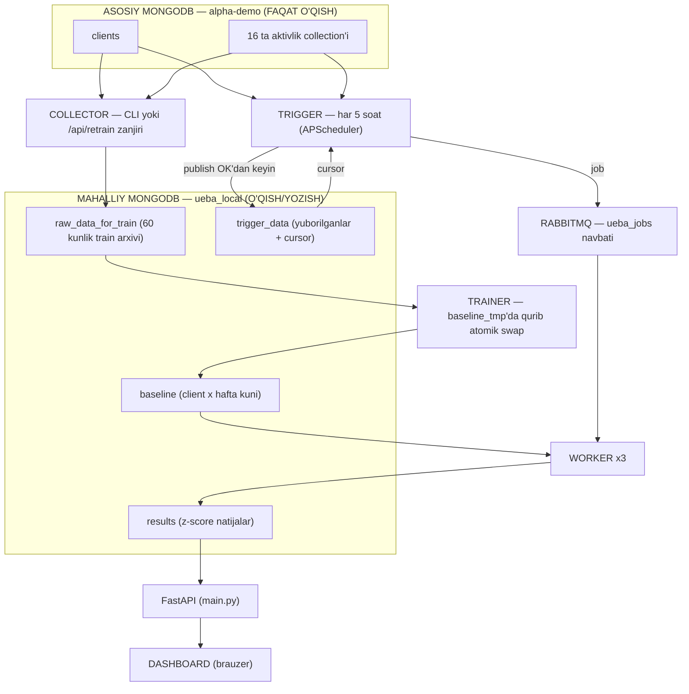

# UEBA Pipeline — V2 Arxitektura (to'liq qayta qurish rejasi)

> Bu hujjat eski `UEBA_PIPELINE_ARCHITECTURE.md` (v1) o'rnini bosadi.
> **Maqsad:** shu faylni o'qigan odam yoki agent boshqa hech qanday qo'shimcha ma'lumotsiz — hatto bo'sh papkada turib ham — butun tizimni noldan yozib chiqa olsin. Shuning uchun bu yerdagi barcha raqamlar, formulalar, so'rov shakllari va maydon nomlari **aynan shu ko'rinishda** bajarilishi shart.

---

## 1. Nima quryapmiz?

DataGaze DLP tizimi xodimlarning kompyuterlaridan har xil aktivlik yozuvlarini yig'adi: email, Telegram, fayl operatsiyalari, sayt tashriflari va hokazo — bitta MongoDB'da (`alpha-demo`). Ulardan **16 tasi** real event jurnali va pipeline shulardan foydalanadi (`activities` — kunlik agregat, ishlatilmaydi; §4.1).

Biz shu yozuvlarning **vaqtlaridan** foydalanamiz: har bir xodimning har bir kundagi **eng birinchi eventi = ishga kelgan vaqti (start)**, **eng oxirgi eventi = ketgan vaqti (finish)**. Har xodim uchun har hafta kuni bo'yicha "normal" jadval o'rganiladi (baseline), keyin har yangi kun shu norma bilan solishtirilib **z-score** hisoblanadi.

Oddiy misol: Ahmad seshanba kunlari odatda 09:00 ± 30 daqiqada keladi. Bugun seshanba, u 06:30 da kelibdi — bu normadan 5 barobar og'ish, dashboard uni **qizil** qilib ko'rsatadi.

Muhim qoida: **har hafta kuni mustaqil o'rganiladi**. Shanba faqat shanbalar bilan solishtiriladi — dushanba bilan emas. Shuning uchun dam olish kunlari boshqacha jadvalda ishlaydigan odam soxta anomaliya bermaydi.

**Eski (V1) tizim** JSON fayllar bilan qo'lda ishga tushirilar edi. **Yangi (V2) tizim** uzluksiz ishlaydi:

| | V1 (eski) | V2 (yangi) |
|---|---|---|
| Saqlash | JSON fayllar | MongoDB (`ueba_local`) |
| Ishga tushirish | qo'lda `python main.py` | avtomatik, har 5 soatda |
| Baholash | butun tarix qayta hisoblanadi | faqat yangi kelgan kunlar |
| Ko'rsatish | tayyor statik HTML | FastAPI + jonli dashboard |
| Parallellik | yo'q | RabbitMQ + 3 worker |

---

## 2. Tizim bir qarashda

Butun oqim besh bosqichdan iborat:

1. **Collector** (bir marta, train paytida) — `alpha-demo` dan har bir active client uchun oxirgi 60 kunlik barcha event vaqtlarini olib, kunlik agregatlarga (start/finish) aylantirib `ueba_local.raw_data_for_train` ga yozadi.
2. **Trainer** (bir marta, train paytida) — shu arxivdan har client × har hafta kuni uchun o'rtacha va standart og'ishlarni hisoblab `baseline` ga yozadi.
3. **Trigger** (har 5 soatda, avtomatik) — `alpha-demo` dan **faqat yangi** ma'lumotni oladi (qayerda to'xtaganini `trigger_data` dagi cursor'dan biladi), kunlik agregat qilib RabbitMQ'ga job sifatida yuboradi va nimani yuborganini `trigger_data` ga yozib qo'yadi.
4. **Worker/Processor** (3 ta parallel thread) — navbatdan job olib, undagi kunlarni `baseline` bilan solishtirib z-score hisoblaydi va `results` ga yozadi.
5. **Dashboard** (brauzer) — FastAPI'ning `/api/results` endpointidan o'qib jadval va grafiklarni chizadi. Baseline'ni yangilash ham shu yerdan — bitta tugma bilan.



### Kim nimani yozadi, kim nimani o'qiydi

Bu jadval — tizimning "mulkchilik xaritasi". Har collection'ning **bitta** yozuvchisi bor, shuning uchun hech qayerda to'qnashuv bo'lmaydi:

| Collection | Yagona yozuvchi | O'quvchi(lar) | Qachon yangilanadi |
|---|---|---|---|
| `raw_data_for_train` | collector | trainer | faqat train/retrain paytida |
| `baseline` | trainer (swap orqali) | worker'lar | faqat train/retrain paytida |
| `trigger_data` | trigger | trigger o'zi | har 5 soatlik o'tishda |
| `results` | worker'lar | API/dashboard | har job'dan keyin |

Trigger/worker oqimi `raw_data_for_train` ga umuman tegmaydi; worker `trigger_data` ni umuman o'qimaydi ham, yozmaydi ham.

---

## 3. O'zgarmas qarorlar

Quyidagi 15 qaror tasdiqlangan va muhokama qilinmaydi:

| # | Qaror |
|---|---|
| 1 | Collector avval **active client'larni** aniqlaydi, keyin **har client × har collection** uchun alohida server-side so'rov yuboradi (oxirgi 60 kun). "Hammasini yuklab olib Python'da filtrlash" usuli bekor. |
| 2 | `alpha-demo` ga **hech qanday yozuv yo'q** — faqat `find()`. Barcha yozuvlar `ueba_local` ga. |
| 3 | Eski shovqin filtrlari (kuniga ≥5 event, ≤12 soat span) **butunlay bekor**. Yangi yagona qoida — §5.1 dagi kunlik agregat. 12 soatdan uzun kunlar ham saqlanadi va anomaliya sifatida baholanadi. |
| 4 | Z-score belgilari: **erta kelish → musbat, kech ketish → musbat**; kech kelish va erta ketish → manfiy. |
| 5 | Active client = `disabled: false` (yoki maydon umuman yo'q). `isOnline` ishlatilmaydi. |
| 6 | Eski kod (`pipeline/`, `data/`, `tools/`, eski `dashboard.html`) yangi tizim E2E sinovdan o'tgach **o'chiriladi**. |
| 7 | Sun'iy data generatori kerak emas — faqat real `alpha-demo` ma'lumotlari bilan ishlanadi. |
| 8 | `.env` dagi mavjud `MONGO_URI` va `DB_NAME` qatorlari **o'zgartirilmaydi**, faqat yangi qatorlar qo'shiladi. |
| 9 | `ueba_local` xuddi shu Docker Mongo konteynerining ichida (alohida o'rnatish shart emas). Production'da faqat `.env` dagi URL o'zgaradi. |
| 10 | Matematika eski koddan **aynan** ko'chiriladi (§5). **Username umuman ishlatilmaydi** — hamma joyda faqat `hostname` (collector `clients` dan olib yozib qo'yadi). Trainer asosiy MongoDB'ga umuman so'rov yubormaydi. |
| 11 | Trigger **cursor (checkpoint)** bilan ishlaydi: cursor manbai `trigger_data`, unda faqat MQ'ga muvaffaqiyatli yuborilgan kunlik agregatlar turadi. Dedup ham shu yerda: `(start, finish, eventCount)` o'zgarmagan kun qayta yuborilmaydi. DB'dan o'qish 100 tadan bo'lib (batched). |
| 12 | Local DB'da **4 ta doimiy collection** (§2 jadvali; eski `sent_days` bekor — vazifasini `trigger_data` bajaradi). Train jarayonida vaqtincha 5-chisi — `baseline_tmp` — paydo bo'lib, swap bilan yo'qoladi. |
| 13 | **Retrain — to'liq zanjir:** dashboard'dagi «Baseline yangilash» tugmasi → `POST /api/retrain` → fon thread'ida collector (yangi 60 kun) → trainer. Retrain davomida **eski baseline joyida qoladi** — yangisi `baseline_tmp` da qurilib, tayyor bo'lgach atomik `rename(dropTarget=True)` bilan almashtiriladi; workerlar uchun bo'sh oyna bo'lmaydi. Parallel retrain'ga **409**. Birinchi o'rnatishda CLI (`python collector.py` + `python trainer.py`) ham ishlaydi. |
| 14 | **Trigger faqat avtomatik ishlaydi** — uni API orqali ishga tushirish yoki boshqarish yo'q (`/api/trigger` endpointi mavjud emas). Vazifasi — o'zgarish bo'lganda yangi datalarni olib kelish; o'zgarishni tekshirish uchun har `TRIGGER_INTERVAL_HOURS`(5) soatda ishlab turadi — bu shunchaki qiymat, faqat `.env` dan o'zgartiriladi. Takror yubormaslik `trigger_data` dedup'i bilan kafolatlanadi (qaror #11). |
| 15 | **`activities` collection'i ishlatilmaydi** — u event jurnali emas, kunlik agregat jadvali (§4.1). Pipeline faqat 16 ta real event collection'idan foydalanadi. |

---

## 4. Ma'lumotlar qayerda saqlanadi

### 4.1 Asosiy MongoDB — `alpha-demo` (faqat o'qish)

Ulanish: `.env` dagi mavjud `MONGO_URI` + `DB_NAME`.

**16 ta aktivlik collection'i.** Diqqat: maydon nomlari bir xil emas — jadvalga aynan rioya qilinadi:

| Collection | ID maydoni | Vaqt maydon(lar)i |
|---|---|---|
| `activewindows` | `clientId` | `datetime` |
| `rdps` | `clientId` | `connectTime` **va** `disconnectTime` |
| `screenshots` | `clientId` | `dateTime` |
| `keyloggers` | `clientId` | `dateTime` |
| `webvisitings` | `clientId` | `dateTime` |
| `telegrams` | `clientId` | `dateTime` |
| `whatsapps` | `clientId` | `dateTime` |
| `emails` | `clientId` | `dateTime` |
| `websearches` | `clientId` | `dateTime` |
| `websniffs` | `clientId` | `dateTime` |
| `usbmonitors` | `clientId` | `dateTime` |
| `usbsniffs` | `clientId` | `dateTime` |
| `filemonitors` | `clientId` | `dateTime` |
| `clipboards` | `clientId` | `dateTime` |
| `prints` | `clientId` | `dateTime` |
| `incidents` | `employee` | `time` |

Yodda tutiladigan istisnolar: `incidents` da ID maydoni `employee` (boshqalarida `clientId`); `activewindows` da vaqt maydoni kichik harfli `datetime`; `incidents` da `time`; `rdps` da **ikkita** vaqt maydoni bor va har biri alohida hisoblanadi.

> **`activities` ATAYLAB YO'Q (qaror #15).** U event jurnali emas — **kunlik agregat jadvali**: `dateTime` doim `00:00:00` (real ma'lumotda tekshirilgan: 155/155 yozuv), ichida `allActiveTime`, `allWebTime`, `efficiencyProcTime`, `efficiencyWebTime` kabi kunlik yig'indilar. Uni qo'shsak har kunning `start` i soxta `00:00` ga tushib, tizimning asosiy signali — "ishga kelish vaqti" — butunlay yo'qoladi.
>
> Real misol (client `rakhmatillo@...`, 2026-07-16): `activities` bilan kun `00:00:00 → 17:41:57` (1062 daqiqa), usiz esa haqiqiy `16:40:47 → 17:41:57` (61 daqiqa).
>
> Qolgan 16 collection tekshirilgan — ularda yarim tunga tushgan timestamp ulushi 0%, ya'ni hammasi real eventlar.

**`clients` collection'idan faqat 3 ta maydon kerak:** `_id` (ObjectId), `hostname`, `disabled`. Boshqa maydonlar (`firstName`, `username` va h.k.) ataylab e'tiborsiz qoldiriladi — qaror #10. `disabled` maydoni optional: umuman bo'lmasa ham client **active** hisoblanadi.

Active client'lar so'rovi (hamma joyda aynan shu):

```json
{ "$or": [ { "disabled": false }, { "disabled": { "$exists": false } } ] }
```

Projection: `{ "_id": 1, "hostname": 1 }`. `hostname` bo'sh yoki yo'q bo'lsa — o'rniga `str(_id)` ishlatiladi.

### 4.2 Mahalliy MongoDB — `ueba_local` (o'qish/yozish)

Ulanish: `.env` dan `LOCAL_MONGO_URI` + `LOCAL_DB_NAME=ueba_local`.

Kodda **ikkita alohida `MongoClient`** yaratiladi: biri `alpha-demo` uchun (faqat o'qish), ikkinchisi `ueba_local` uchun (barcha yozuvlar). Bu "asosiy bazaga yozib yuborish" xatosini kod darajasida imkonsiz qiladi (§10).

#### `raw_data_for_train` — 60 kunlik train arxivi

Har client × har kun = 1 document:

```json
{
  "_id": "ObjectId",
  "clientId": "665f2a1b... (str(_id), 24 belgili hex)",
  "hostname": "PC-042",
  "date": "2026-08-26",
  "dayOfWeek": "Tuesday",
  "start": "2026-08-26T08:54:00",
  "finish": "2026-08-26T17:12:30",
  "durationMin": 498.5,
  "eventCount": 42,
  "updatedAt": "2026-08-26T14:00:00"
}
```

Maydonlar haqida:

- `start` / `finish` — **naive lokal ISO datetime** (`YYYY-MM-DDTHH:MM:SS`). `start` = kunning eng erta eventi, `finish` = eng kechi (§5.1 qoidasi bilan).
- `durationMin` = `(finish − start)` daqiqalarda, 2 xonagacha yaxlitlanadi.
- `eventCount` = shu kunga to'g'ri kelgan yaroqli timestamp'lar soni (16 collection jami; `rdps` documenti 2 ta timestamp berishi mumkin — har biri alohida sanaladi).
- `date` — `"YYYY-MM-DD"` **string**. Bu ataylab: ISO formatdagi string'lar alifbo tartibida solishtirilganda xronologik tartib bilan mos tushadi, shuning uchun `$lt`/`$gte` filtrlar string ustida ham to'g'ri ishlaydi.
- **Indeks:** UNIQUE `{ clientId: 1, date: 1 }`.
- **Yozish usuli — replacement upsert:** har safar kunning to'liq qayta hisoblangan ma'lumoti yoziladi (merge emas). Shuning uchun qayta yozish har doim xavfsiz (idempotent).

#### `trigger_data` — MQ'ga yuborilganlar yozuvi + cursor

Schema, indeks va yozish usuli — **aynan `raw_data_for_train` dagidek**. Farqi vazifasida. Bu collection uchta savolga javob beradi:

1. **Nima yuborilgan?** — ichida faqat MQ'ga muvaffaqiyatli yuborilgan kunlik agregatlar turadi (xom eventlar ham, z-score'lar ham emas).
2. **Qayerdan davom etish kerak?** (cursor) — client'ning eng oxirgi `finish` i = "shu yergacha yuborilgan, keyingi safar shundan keyin ol".
3. **Takror yuborilmayaptimi?** (dedup) — hisoblangan kun shu yerdagi yozuv bilan bir xil bo'lsa (`start`, `finish`, `eventCount` uchchalasi ham), qayta yuborilmaydi.

Yozish tartibi qat'iy: **avval MQ'ga publish, muvaffaqiyatdan keyingina bu yerga yoziladi**. Publish xato bo'lsa yozuv ham bo'lmaydi — demak collection'da har doim faqat "haqiqatan yetib borgan" data turadi.

`updatedAt` = shu kun MQ'ga yuborilgan vaqt. Eski yozuvlar har trigger o'tishida tozalanadi (§6.3, pruning).

#### `baseline` — har client uchun 1 document (o'rganilgan model)

```json
{
  "_id": "ObjectId",
  "clientId": "665f2a1b...",
  "hostname": "PC-042",
  "windowDays": 60,
  "minDowSamples": 5,
  "totalDays": 41,
  "keptDays": 38,
  "trainedAt": "2026-08-26T09:15:00",
  "weeks": {
    "Monday":    { "count": 8, "meanStart": 532.5, "stdStart": 41.2, "meanFinish": 1012.0, "stdFinish": 66.8, "meanDuration": 479.5 },
    "Tuesday":   { "count": 9, "meanStart": 540.0, "stdStart": 30.1, "meanFinish": 1020.0, "stdFinish": 45.0, "meanDuration": 480.0 },
    "Wednesday": { "count": 3, "meanStart": null,  "stdStart": null, "meanFinish": null,   "stdFinish": null, "meanDuration": null }
  }
}
```

- Vaqt qiymatlari — **00:00 dan boshlab daqiqa** (float). Masalan 09:00 → 540.
- `weeks` da faqat kamida 1 namunasi bor hafta kunlari bo'ladi. `count < MIN_DOW_SAMPLES(5)` bo'lsa `count` yoziladi, qolgan statlar `null` — bunday kun baholanmaydi.
- **Indeks:** UNIQUE `{ clientId: 1 }`.
- **Yangilash — atomik swap** (`delete_many` YO'Q): trainer yangi baseline'ni avval vaqtinchalik **`baseline_tmp`** ga to'liq quradi, so'ng pymongo'da `db.baseline_tmp.rename("baseline", dropTarget=True)` bilan bir amalda almashtiradi. Swap'gacha eski baseline joyida turadi — workerlar uzluksiz ishlayveradi.

#### `results` — har (client × kun) uchun 1 ta baholash natijasi

```json
{
  "_id": "ObjectId",
  "clientId": "665f2a1b...",
  "hostname": "PC-042",
  "date": "2026-08-26",
  "dayOfWeek": "Tuesday",
  "start": "08:54:00",
  "finish": "17:12:30",
  "durationMin": 498.5,
  "eventCount": 42,
  "zStart": 1.892,
  "zFinish": -0.266,
  "status": "anomaly",
  "statusColor": "darkyellow",
  "evaluatedAt": "2026-08-26T14:00:01"
}
```

- `start`/`finish` bu yerda ko'rsatish uchun `"HH:MM:SS"` string.
- `zStart`/`zFinish` — 3 xonagacha yaxlitlangan yoki `null`.
- `status` va `statusColor` — §5.4 qoidalari bo'yicha.
- **Indeks:** UNIQUE `{ clientId: 1, date: 1 }`; yozish upsert — bir kun qayta baholansa yangilanadi, dublikat bo'lmaydi.
- **Retention:** `RESULTS_RETENTION_DAYS(365)` kundan eski yozuvlar har trigger o'tishida o'chiriladi (§6.3, pruning) — collection cheksiz o'smaydi.

Barcha 4 ta unique indeks dastur ishga tushganda (`main.py` boot) va `collector.py` boshida idempotent `create_index` bilan tekshiriladi.

---

## 5. Yagona qoidalar va matematika

Bu bo'limdagi funksiyalar eski `pipeline/utils.py` dan **aynan** ko'chiriladi (yangi joyi — `utils/helpers.py`). Signaturalar va xatti-harakat o'zgarmaydi.

### 5.1 Kunlik agregat — `build_day_agg(tss)`

Bir kunga tegishli barcha timestamp'lardan (16 collection jami) start/finish shunday chiqariladi:

| Kunda nechta event bor | `start` | `finish` |
|---|---|---|
| 0 ta | kun umuman mavjud emas — `None`, saqlanmaydi, baholanmaydi | — |
| 1 ta | o'sha event vaqti | `min(start + SINGLE_EVENT_STAY_HOURS, shu kun 23:59:59)` |
| 2+ ta | `min(tss)` | `max(tss)` |

Nega shunday:

- **1 event'li kun** tashlab yuborilmaydi (eski V1 shunday qilardi) — finish sintez qilinadi: "keldi va kamida 1 soat o'tirdi" degan taxmin (`SINGLE_EVENT_STAY_HOURS`, default 1, `.env` da). Keyinroq shu kunga yana event tushsa, agregat real min/max bilan qayta hisoblanadi va natija o'z-o'zidan to'g'rilanadi.
- **23:59:59 chegarasi** — 23:30 dagi yagona event finish'i ertasi kunga o'tib ketib, soxta "erta ketish" anomaliyasi bermasligi uchun.
- `durationMin = finish − start` (daqiqa, 2 xona yaxlitlash).

Bu funksiya **collector** va **trigger** da bir xil ishlatiladi. Processor agregatni qayta hisoblamaydi — unga job ichida tayyor keladi.

### 5.2 Baseline hisobi

Har client × har hafta kuni uchun, o'sha kunga tushgan `n` ta kun bo'yicha:

- `n < MIN_DOW_SAMPLES(5)` → barcha statlar `null` (faqat `count: n` yoziladi);
- aks holda:
  - `meanStart = round(avg(start_min), 2)`, `stdStart = round(sample_std(start_min), 2)`
  - `meanFinish = round(avg(finish_min), 2)`, `stdFinish = round(sample_std(finish_min), 2)`
  - `meanDuration = round(avg(dur_min), 2)`

`sample_std` — **sample** standart og'ish (maxrajda `n−1`): `sqrt( Σ(x−mean)² / (n−1) )`; `n < 2` bo'lsa `None`.

### 5.3 Z-score va belgilar

```
startMin  = to_minutes(start)        # 00:00 dan daqiqa
finishMin = to_minutes(finish)

zStart  = (meanStart − startMin)  / stdStart     # stdStart mavjud va 0 emas bo'lsa
zFinish = (finishMin − meanFinish) / stdFinish   # stdFinish mavjud va 0 emas bo'lsa
```

E'tibor bering: `zStart` formulasida ayirish tartibi teskari — bu ataylab, belgilar quyidagicha chiqishi uchun (qaror #4):

| Holat | Belgi |
|---|---|
| Erta kelish (`start < meanStart`) | `zStart` **musbat** |
| Kech kelish | `zStart` manfiy |
| Kech ketish (`finish > meanFinish`) | `zFinish` **musbat** |
| Erta ketish | `zFinish` manfiy |

`std = 0` yoki `None`, yoki shu hafta kuni uchun baseline yo'q → tegishli z = `null`.

### 5.4 Status va ranglar

Kun uchun umumiy og'ish: `z = max(|zStart| yoki 0, |zFinish| yoki 0)` (null'lar 0 deb olinadi):

| Shart | `status` | `statusColor` | hex |
|---|---|---|---|
| ikkala z ham `null` | `insufficient` | `gray` | `#95a5a6` |
| `z >= SEVERE_THRESHOLD (1.8)` | `severe` | `red` | `#e74c3c` |
| `1.2 <= z < 1.8` (`Z_THRESHOLD`) | `anomaly` | `darkyellow` | `#d99a06` |
| `0.5 <= z < 1.2` (`WATCH_THRESHOLD`) | `watch` | `yellow` | `#f1c40f` |
| `z < 0.5` | `normal` | `green` | `#2ecc71` |

**Tekshiruv misoli.** Baseline (Tuesday): `meanStart=540` (09:00), `stdStart=30`, `meanFinish=1020` (17:00), `stdFinish=45`.

- **Kun A:** 08:00 kelib 18:00 ketdi → `zStart=(540−480)/30=+2.0`, `zFinish=(1080−1020)/45=+1.33` → z=2.0 → **severe** (erta kelgan + kech ketgan).
- **Kun B:** 09:30 kelib 16:00 ketdi → `zStart=−1.0`, `zFinish=−1.33` → z=1.33 → **anomaly** (kech kelgan + erta ketgan).

### 5.5 Yordamchi funksiyalar

**`parse_to_datetime(val)`** — istalgan ko'rinishdagi vaqtni naive lokal `datetime` ga keltiradi:

- `None` → `None`
- `datetime` (BSON, tz-aware) → `dt.astimezone().replace(tzinfo=None)` — lokal vaqtga o'tkazib, timezone'ni olib tashlaydi
- `int`/`float` → `val < 1e11` bo'lsa soniya, aks holda millisekunda (`val / 1000.0`) → `datetime.fromtimestamp(...)`
- `str` → `dateutil.parser.parse(val)`
- parse bo'lmasa → `None` (document jimgina o'tkazib yuboriladi, xato tashlanmaydi)

**`to_minutes(dt)`** = `dt.hour * 60 + dt.minute + dt.second / 60.0` — 00:00 dan daqiqa.

**`DAYS_MAP`** = `{0: "Monday", 1: "Tuesday", 2: "Wednesday", 3: "Thursday", 4: "Friday", 5: "Saturday", 6: "Sunday"}` (Python `weekday()` raqamlari).

**`get_status(z_start, z_finish)`** — §5.4 jadvalini qaytaradi; worker va qo'lda tekshiruvlar uchun yagona manba.

---

## 6. Komponentlar

### 6.1 Collector (`collector.py`)

**Nima qiladi:** `alpha-demo` dan 60 kunlik tarixni yig'ib `raw_data_for_train` ni to'ldiradi.

**Qachon ishlaydi:** faqat train/retrain paytida — CLI'dan (`python collector.py`) yoki `/api/train`, `/api/retrain` zanjirining 1-bosqichi sifatida (qaror #13). Normal rejimda ishlamaydi — u paytda trigger o'z ishini qilaveradi, bu arxiv esa tinch turadi.

**Qadamlar (aynan shu tartibda):**

1. `ueba_local` da 4 ta unique indeksni yaratish/tekshirish (§4.2).
2. Active client'lar ro'yxatini olish (§4.1 so'rovi). Ro'yxat bo'sh bo'lsa — ogohlantirish va normal tugash (exit 0). Har client'ning `hostname` i shu yerda olinadi (bo'sh bo'lsa `str(_id)`).
3. **Har bir client uchun** (client → collection tartibida, ketma-ket; bitta client xato bersa qolganlari davom etadi):
   - 15 ta oddiy collection so'rovi (`T` — vaqt maydoni, `ID` — ID maydoni, `W = now − 60 kun`):
     ```json
     find( { "ID": <clientId>, "T": { "$gte": W } },
           { "ID": 1, "T": 1, "_id": 0 } )
     ```
   - `rdps` uchun alohida (ikkala vaqt maydonidan biri oynada bo'lsa document olinadi):
     ```json
     find( { "clientId": <clientId>,
             "$or": [ { "connectTime":    { "$gte": W } },
                      { "disconnectTime": { "$gte": W } } ] },
           { "clientId": 1, "connectTime": 1, "disconnectTime": 1, "_id": 0 } )
     ```
     Har documentdan `connectTime` va `disconnectTime` **alohida** parse qilinadi, `>= W` bo'lganlari olinadi.
   - Barcha timestamp'lar `parse_to_datetime` dan o'tadi; parse bo'lmagani skip.
   - **Hafta kuni bo'yicha hisobot** (faqat log uchun, data'ga ta'sir qilmaydi): olingan timestamp'lar hafta kuni bo'yicha guruhlanib konsol + log faylga yoziladi:
     `{clientId} | {collection} | {weekday} | firstDoc=YYYY-MM-DD HH:MM:SS | lastDoc=YYYY-MM-DD HH:MM:SS | docs=N`
4. Timestamp'lar kun (`YYYY-MM-DD`) bo'yicha guruhlanib, har kun uchun `build_day_agg` (§5.1) qo'llanadi.
5. Har kun `raw_data_for_train` ga replacement upsert qilinadi:
   `update_one({clientId, date}, {$set: {hostname, start, finish, dayOfWeek, durationMin, eventCount, updatedAt}}, upsert=True)`.
6. Pruning: o'sha client uchun `date < (now − 60 kun)` bo'lgan eski documentlar `delete_many` bilan o'chiriladi.
7. Xulosa log: jami clientlar, kunlar, yozilgan documentlar. Xatolik bo'lsa exit code 1.

O'qish har doim **batched streaming** usulida (§6.3.1) — katta hajm ham xotirani to'ldirmaydi.

### 6.2 Trainer (`trainer.py`)

**Nima qiladi:** `raw_data_for_train` dan har client × hafta kuni baseline'ini quradi. **Faqat** `ueba_local` bilan ishlaydi — asosiy MongoDB'ga bironta ham so'rov yubormaydi (hostname ham arxivda tayyor turadi). `trigger_data` dan foydalanmaydi.

**Qadamlar:**

1. `raw_data_for_train` dan barcha documentlarni o'qish (faqat kerakli maydonlar bilan).
2. Har client uchun kunlarni `dayOfWeek` bo'yicha guruhlash; `start`/`finish` ni `to_minutes` bilan daqiqaga o'tkazish.
3. Kunlik agregat qoidasi (§5.1) allaqachon qo'llangan: 0 event'li kun yo'q, 1 event'li kun sintez finish bilan — u ham o'qitishga **kiradi** (12 soat cheklovi yo'q).
4. Har (client × hafta kuni) uchun §5.2 statistikasi hisoblanadi.
5. `hostname` — arxiv documentlaridan olinadi, DB so'rovisiz.
6. Har client uchun 1 document **`baseline_tmp`** ga yoziladi (boshida qoldiq `baseline_tmp` bo'lsa drop qilinadi va unda UNIQUE `{clientId: 1}` indeks yaratiladi).
7. **Swap:** hamma clientlar yozilgach `db.baseline_tmp.rename("baseline", dropTarget=True)` — atomik almashtirish. Shu paytgacha eski `baseline` joyida turadi va workerlar undan foydalanaveradi.
8. **Retrain semantikasi (qaror #13):** retrain = avval collector (yangi 60 kun), so'ng trainer'ning 1–7 qadamlari. Birinchi train ham, retrain ham bir xil tmp+swap yo'lidan o'tadi (CLI rejimda collector alohida buyruq bilan yurgiziladi). Retrain **`results` va `trigger_data` ni tozalamaydi** — eski natijalar tarix sifatida qoladi, yangi kunlar yangi baseline bilan baholanadi.
9. Log: jami/olingan kunlar, clientlar soni, `trainedAt`.

### 6.3 Trigger (`services/trigger.py`, `main.py` ichida APScheduler)

**Nima qiladi:** har 5 soatda yangi ma'lumotni olib, har client uchun bitta self-contained job'ni RabbitMQ'ga yuboradi. Trigger — `trigger_data` ning yagona egasi.

**Cursor mexanizmi — asosiy g'oya.** Trigger "har 5 soatlik oyna" bilan emas, **"oxirgi to'xtagan joydan hozirgacha"** ishlaydi:

1. Har client uchun cursor: `find_one({clientId}, sort=[("finish", -1)])` → eng oxirgi `finish` = shu yergacha MQ'ga yuborilgan. (Har clientda ≤ 60 document — so'rov arzon.)
2. **Cursor bor bo'lsa:** `windowStart` = cursor turgan kunning **00:00 i** (floor). Nega kunning boshiga tushiramiz: shu kunning to'liq ma'lumoti qayta olinadi — birinchi o'tishda qisman kelgan kun keyingi o'tishda o'zi to'g'rilanadi, va har yuborilgan agregat to'liq ma'lumotga asoslangan bo'ladi.
3. **Cursor yo'q bo'lsa** (birinchi o'tish): `windowStart = now − LOOKBACK_HOURS(5)`, floor'siz.
4. Dastur 2 kun to'xtab qolsa ham muammo yo'q — keyingi o'tish cursor'dan hozirgacha hammasini oladi. Muhimi o'tishlar soni emas, cursor qayerda qolgani.

**Har ish o'tishidagi qadamlar:**

1. `now = datetime.now()`.
2. Active client'lar ro'yxati (§4.1).
3. Har client uchun (mustaqil try/except — bittasi yiqilsa qolganlari davom etadi):
   - cursor → `windowStart`;
   - 16 collection bo'yicha batched so'rovlar (§6.1 shakllari, faqat `W = windowStart`);
   - timestamp'lar kun bo'yicha guruhlanib `build_day_agg` (§5.1) → `{date: {start, finish, eventCount}}`.
4. **Dedup:** har hisoblangan (clientId, date) `trigger_data` dagi yozuv bilan solishtiriladi:
   - yozuv yo'q → yangi kun → job'ga kiradi;
   - yozuv bor va `(start, finish, eventCount)` bir xil → allaqachon yuborilgan, o'zgarmagan → **skip**;
   - yozuv bor lekin qiymatlar farqli (kunga yangi eventlar tushgan) → to'liq qayta hisoblangan agregat job'ga kiradi (self-correct).
5. `days` bo'sh bo'lmasa job tuzilib `pika` `basic_publish` bilan `ueba_jobs` ga yuboriladi (content_type `application/json`):
   ```json
   {
     "jobId": "uuid4",
     "clientId": "665f2a1b...",
     "hostname": "PC-042",
     "windowStart": "2026-08-26T00:00:00",
     "windowEnd": "2026-08-26T14:00:00",
     "days": {
       "2026-08-26": { "start": "2026-08-26T08:54:00",
                       "finish": "2026-08-26T13:59:12",
                       "eventCount": 42 }
     },
     "sentAt": "2026-08-26T14:00:00"
   }
   ```
6. **`trigger_data` ga yozish — faqat publish muvaffaqiyatidan keyin** (replacement upsert: hostname, start, finish, eventCount, dayOfWeek, durationMin, updatedAt=now). Tartib qat'iy: avval publish, keyin yozuv. RabbitMQ yotgan bo'lsa publish xatosi log'lanadi, yozuv qilinmaydi → cursor orqada qoladi → keyingi o'tishda o'sha kunlar qayta olinib qayta yuboriladi. **Ma'lumot yo'qolmaydi.**
7. Pruning: har client uchun `trigger_data.delete_many({clientId, date: {$lt: (now − 60 kun)ning "YYYY-MM-DD" stringi}})`. Shu bilan birga `results` dan ham `RESULTS_RETENTION_DAYS(365)` kundan eski yozuvlar o'chiriladi: `results.delete_many({date: {$lt: (now − 365 kun)ning "YYYY-MM-DD" stringi}})` — natijalar tarixi 1 yil saqlanadi, undan keyin o'sib ketmaydi.
8. Xulosa log: `trigger run: X client, Y yangi event, Z kun yuborildi, N kun skip (bir xil)`.

**Scheduler:** `BackgroundScheduler`, interval = `TRIGGER_INTERVAL_HOURS(5)`, `max_instances=1` (bir o'tish tugamasdan ikkinchisi boshlanmaydi); dastur ishga tushgach **10 soniyadan keyin** birinchi o'tish ham bajariladi (dashboard tezroq to'lsin).

**Trigger faqat avtomatik (qaror #14):** uni qo'lda yoki API orqali ishga tushirish yo'li yo'q — `/api/trigger` degan endpoint mavjud emas. Oraliqni o'zgartirish faqat `.env` dagi `TRIGGER_INTERVAL_HOURS` orqali.

#### 6.3.1 Batched o'qish — 100 tadan

Har client × collection so'rovi **streaming cursor** sifatida o'qiladi (`find(...)` iterator, projection faqat `{idField, timeFields}`) va `BATCH_SIZE = 100` documentlik partiyalarda qayta ishlanadi: 100 ta o'qildi → parse/agregat → keyingi 100 ta. Collector ham xuddi shu helper'dan foydalanadi.

`limit(N)` + qayta so'rov ko'rinishidagi paginatsiya **ishlatilmaydi**: bir xil timestamp'li 100+ document bo'lsa, ba'zilari tushib qolish xavfi bor. Streaming'da bunday xavf yo'q.

### 6.4 Worker / Processor (`services/processor.py` + `mq/worker.py`)

**Nima qiladi:** navbatdan job olib, kunlarini `baseline` bilan solishtirib z-score hisoblaydi, natijani `results` ga yozadi. `main.py` boot'ida `WORKER_COUNT` (default 3) ta **alohida thread** ishga tushadi; har thread'ning **o'z** `pika.BlockingConnection` i bo'ladi (pika talabi: bir connection — bir thread).

Worker `alpha-demo` ga ham, `raw_data_for_train` ga ham, `trigger_data` ga ham **umuman tegmaydi**. Faqat `baseline` ni o'qiydi, faqat `results` ga yozadi.

**Queue sozlamalari:**

| Parametr | Qiymat |
|---|---|
| Queue nomi | `QUEUE_NAME=ueba_jobs` |
| Durable | `True` |
| `basic_qos` prefetch_count | `1` |
| Auto-ack | `False` (qo'lda ack) |

**Har job uchun (aynan tartibda):**

1. JSON parse; xato bo'lsa → `basic_nack(requeue=False)` + log.
2. `baseline` dan `find_one({clientId})`. **Topilmasa ham kunlar yo'qolmaydi:** har kun uchun result baribir yoziladi — `zStart/zFinish = null`, `status = insufficient` (kulrang), keyin `basic_ack` (edge case #8). Kun dashboardda ko'rinadi; retrain'dan keyingi yangi kunlar normal baholanadi.
3. Har (date, agregat) juftligi uchun:
   - `week = baseline.weeks.get(dayOfWeek)` (`dayOfWeek` `date` dan hisoblanadi);
   - §5.3 formulalari bilan `zStart`/`zFinish` (shartlar bajarilmasa `null`);
   - §5.4 bo'yicha status;
   - `results` ga upsert (`{clientId, date}` kalit, `evaluatedAt = now`).
4. `basic_ack`.

Takroriy job'lardan qo'rqish shart emas: trigger allaqachon dedup qilgan, kelgan taqdirda ham `results` upsert'i idempotent — natija bir xil, dublikat yo'q.

**Xatolik siyosati (retry):** message header'ida `x-retries` (default 0):

- xato + `x-retries < 3` → job `x-retries+1` bilan qayta publish qilinadi (asl message `basic_reject(requeue=False)`);
- xato + `x-retries >= 3` → `basic_reject(requeue=False)` + ERROR log — message tashlanadi. Bu kunlar `trigger_data` da "yuborilgan" deb turadi, shuning uchun avtomatik qayta kelmaydi; kerak bo'lsa qo'lda `db.trigger_data.deleteOne({clientId, date})` qilinadi — keyingi trigger o'tishi u kunni qayta yuboradi.

### 6.5 API (`api/app.py` + `api/routes.py` — FastAPI)

| Endpoint | Method | Vazifasi |
|---|---|---|
| `/api/health` | GET | `{ mongo_main, mongo_local, rabbitmq: "ok"/"error", queue_depth: N, workers: N, lastTrigger: {...}, lastRetrain: {...} }`. `lastRetrain` ichida `stage` maydoni bor: `collecting` / `training` / `finished` / `error` — dashboard jarayonni shundan biladi |
| `/api/train` | POST | Birinchi o'qitish. Baseline mavjud bo'lsa → **409** `{"detail": "baseline mavjud, /api/retrain ishlatiling"}`. Aks holda fon thread'ida **collector → trainer** zanjiri → **202** `{"status": "training"}` |
| `/api/retrain` | POST | Fon thread'ida to'liq zanjir (qaror #13): collector (yangi 60 kun) → trainer (tmp + atomik swap; eski baseline swap'gacha xizmat qiladi) → **202** `{"status": "retraining"}`. Retrain allaqachon ketayotgan bo'lsa → **409** `{"detail": "retrain davom etmoqda"}` |
| `/api/results` | GET | Filtrlar: `from`, `to` (YYYY-MM-DD), `client_id`, `status` (vergul bilan bir nechta), `limit` (default 100, max 5000), `offset` (default 0). Javob: `{ "total": N, "limit": ..., "offset": ..., "items": [result doc'lari] }`, `date` kamayish tartibida |
| `/api/results/{client_id}` | GET | Xuddi shu filtrlar, bitta client uchun; client topilmasa **404** |
| `/api/baseline` | GET | Har client uchun o'rganilgan jadval (`weeks`) — dashboard «odatda qachon kelardi» ni shundan oladi |
| `/api/clients` | GET | Dashboard dropdown'i: `results` dagi client'lar (`clientId`, `hostname`, `label`, `days`, `lastDate`, `stale`). Ro'yxat tarixdan quriladi, shuning uchun **asosiy tizimdan o'chirilgan** client'lar ham chiqadi — ular `stale: true` va label'da «o'chirilgan» deb belgilanadi; **bir xil hostname'li** bir nechta clientId bo'lsa, label'ga qisqa id qo'shiladi. Eski (bekor qilingan) shakli: `results` dagi client'lar `[{clientId, hostname}]` (aggregation: `$group` + `$last: "$hostname"`) |
| `/api/dashboard` | GET | `dashboard/index.html`; `/` (root) ham shuni qaytaradi |
| `/static/*` | GET | `dashboard/static/` (StaticFiles mount) |

Mahalliy MongoDB yotgan bo'lsa API xom 500 emas, **503** `{"detail": "MongoDB bilan aloqa yo'q"}` qaytaradi (global exception handler).

Fon amallar — `threading.Thread(daemon=True)`. Har amalning holati (startedAt / finishedAt / stage / status / error) modul darajasidagi oddiy dict'da turadi va `/api/health` da ko'rinadi.

### 6.6 Dashboard (`dashboard/` — vanilla JS, hech qanday CDN yo'q)

Fayllar: `index.html`, `static/style.css`, `static/script.js`. Grafiklar brauzerda inline SVG bilan chiziladi. Faqat `fetch` + DOM — tashqi kutubxona yo'q.

**Asosiy tamoyil: dashboard statistika tilida emas, inson tilida gapiradi.** Foydalanuvchiga `zStart = -1.892` emas, «**5 soat 18 daqiqa kech keldi** — Keldi 18:00, odatda payshanbalarda 12:43» ko'rsatiladi. Z-score ichki mexanizm bo'lib qoladi: u faqat kunlarni tartiblash va rang berish uchun ishlatiladi, ekranda ko'rinmaydi.

Statuslar ham oddiy so'zlarda:

| Ichki nom | Ekranda |
|---|---|
| `severe` | 🔴 Jiddiy chetlanish |
| `anomaly` | 🟠 Sezilarli chetlanish |
| `watch` | 🟡 Kichik chetlanish |
| `normal` | 🟢 Odatdagidek |
| `insufficient` | ⚪ Baholanmadi |

**Sahifa tuzilishi (yuqoridan pastga):**

1. **Filtr paneli** — sana oralig'i, xodim tanlash, «Faqat chetlanishlar» belgisi, «Yangilash», va «**Odatiy jadvallarni yangilash**» tugmasi (= retrain, qaror #13; bosilgach disabled bo'lib `lastRetrain.stage` polling qilinadi).
   Default sana oralig'i — **ma'lumotdagi eng oxirgi kundan 30 kun orqaga** (`GET /api/results?limit=1` orqali topiladi), "oxirgi 7 kun" emas: manba ma'lumoti kechikishi mumkin va bo'sh ekran chiqib qolmasin.
2. **Xulosa** — bir-ikki jumlada: «*barcha xodimlar bo'yicha 56 ish kuni tekshirildi. Ulardan 2 kunda jiddiy yoki sezilarli chetlanish bor, yana 3 kunda kichik chetlanish.*» Baholanmagan kunlar bo'lsa, **nima uchun** baholanmagani ham tushuntiriladi (shu hafta kuni bo'yicha 5 tadan kam namuna).
3. **E'tibor talab qiladigan kunlar** — chetlanishli kunlar kartalar ko'rinishida, jiddiylik bo'yicha tartiblangan. Har karta: xodim nomi, sana o'zbekcha («20-avgust, payshanba»), nima bo'lgani («5 soat 18 daqiqa kech keldi») va dalil («Keldi 18:00 · Odatda payshanbalarda 12:43»).
4. **Ikkita grafik.** Ikkalasida ham **Y o'qi — sutka soatlari (00:00–24:00)**; xodim yuqoridagi ro'yxatdan tanlanadi (sahifa ochilganda eng ko'p ma'lumotli xodim avtomatik tanlanadi, grafik darrov to'la ko'rinsin).

   - **Asosiy grafik — «Kunlik ish vaqti»:** X o'qi — kalendar kunlari. Har kun bitta ustun: pastki uchi kelgan vaqti, yuqorigi uchi ketgan vaqti; ustun rangi status bo'yicha. Orqa fonda yashil yo'lak — shu hafta kunining odatiy kelish/ketish oralig'i (`mean ± σ`). Hover'da to'liq ma'lumot.
   - **Ikkinchi grafik — «Haftalik odatiy rejim»:** X o'qi — 7 hafta kuni. Yashil yo'lak = o'rganilgan odatiy oraliq, nuqtalar = haqiqiy kunlar (ko'k — kelish, sariq — ketish, halqasi status rangida). Bu grafik baseline'ning o'zini ko'rinadigan qiladi. Tarixi kam hafta kunida yo'lak o'rniga «tarix kam» yoziladi.
   - Xodim tanlanmagan bo'lsa (**«Barcha xodimlar»**), ikkinchi grafik o'rniga **umumiy manzara matritsasi** chiziladi: qatorlar xodimlar, ustunlar kunlar, katak rangi holat — kimda muammo borligini bir qarashda ko'rsatadi.

5. **Jadval** — ustunlar: `Sana | Xodim | Keldi | Odatda kelardi | Farq | Ketdi | Odatda ketardi | Farq | Xulosa`. Farq ustunlari «*1 soat 47 daqiqa erta*» ko'rinishida, 5 daqiqadan kichik farq «deyarli bir xil» deb yoziladi.

Baseline ma'lumoti (`meanStart`, `stdStart`, ...) dashboard'ga **`GET /api/baseline`** orqali keladi — «odatda qachon kelardi» va yashil yo'laklar shundan chiziladi.

Avto-yangilanish: har 5 daqiqada `/api/health` va `/api/results` qayta o'qiladi.

---

## 7. Konfiguratsiya (`.env`)

`.env` allaqachon mavjud. **`MONGO_URI` va `DB_NAME` qatorlari o'zgartirilmaydi** — faqat quyidagilar qo'shiladi:

| O'zgaruvchi | Default | Ma'nosi |
|---|---|---|
| `MONGO_URI` | *(mavjud)* | Asosiy MongoDB (alpha-demo) |
| `DB_NAME` | *(mavjud)* | Asosiy database nomi |
| `LOCAL_MONGO_URI` | `mongodb://localhost:27017` | Mahalliy MongoDB (o'sha Docker server; production'da almashtiriladi) |
| `LOCAL_DB_NAME` | `ueba_local` | Mahalliy database nomi |
| `RABBITMQ_HOST` | `localhost` | |
| `RABBITMQ_PORT` | `5672` | |
| `RABBITMQ_USER` | `guest` | Docker obrazining default'i |
| `RABBITMQ_PASSWORD` | `guest` | |
| `QUEUE_NAME` | `ueba_jobs` | |
| `WORKER_COUNT` | `3` | Worker thread'lar soni (2–5) |
| `API_HOST` | `127.0.0.1` | |
| `API_PORT` | `8000` | |
| `DAYS_WINDOW` | `60` | Train oynasi (kun) |
| `TRIGGER_INTERVAL_HOURS` | `5` | Trigger oralig'i |
| `LOOKBACK_HOURS` | `5` | Faqat birinchi o'tish oynasi (cursor bo'lmaganda) |
| `BATCH_SIZE` | `100` | DB o'qish partiyasi |
| `Z_THRESHOLD` | `1.2` | Anomaliya chegarasi |
| `SEVERE_THRESHOLD` | `1.8` | Jiddiy chegara |
| `WATCH_THRESHOLD` | `0.5` | Watch chegarasi |
| `MIN_DOW_SAMPLES` | `5` | Baseline uchun minimal kun (hafta kuniga) |
| `SINGLE_EVENT_STAY_HOURS` | `1` | 1 event'li kunda finish = start + shu soat |
| `RESULTS_RETENTION_DAYS` | `365` | `results` tarixi necha kun saqlanadi (trigger o'tishida eski yozuvlar o'chiriladi) |

> `MAX_DAILY_HOURS` **bo'lmasligi kerak** — eski `.env` da bo'lsa, o'chiriladi (qaror #3).

Barcha qiymatlar `config.py` da o'qiladi (default'lari yuqoridagilar); har kirish nuqtasida `load_dotenv()`.

---

## 8. Kod strukturasi

```
ueba/
├── .env                        # mavjud + yangi o'zgaruvchilar
├── config.py                   # barcha env o'qilishi, default'lar
├── main.py                     # YANGI: FastAPI + APScheduler + worker thread'lar (uvicorn)
├── collector.py                # YANGI: CLI wrapper
├── trainer.py                  # YANGI: CLI wrapper
├── requirements.txt            # yangi ro'yxat
├── services/
│   ├── __init__.py
│   ├── mongo.py                # 2 ta MongoClient (main RO + local RW), ensure_indexes()
│   ├── collector.py            # §6.1 logikasi
│   ├── trainer.py              # §6.2 logikasi (tmp'da qurish + atomik swap)
│   ├── processor.py            # §6.4 logikasi (pure: job -> results)
│   └── trigger.py              # §6.3 logikasi
├── mq/                         # DIQQAT: "queue" deb nomlanmaydi — Python stdlib'dagi
│   │                           #   `queue` moduli bilan to'qnashib, yashirin xatolarga olib keladi
│   ├── __init__.py
│   ├── rabbitmq.py             # connection, publish, queue declaration
│   └── worker.py               # worker thread: consume -> processor -> ack/retry
├── api/
│   ├── __init__.py
│   ├── app.py                  # FastAPI app factory, StaticFiles mount
│   └── routes.py               # §6.5 endpoint'lari
├── dashboard/
│   ├── index.html
│   └── static/
│       ├── style.css
│       └── script.js
├── utils/
│   ├── __init__.py
│   ├── helpers.py              # §5 funksiyalari + COLLECTIONS mapping (16 ta) + DAYS_MAP
│   └── logger.py               # konsol INFO + logs/ueba.log (RotatingFileHandler, 5MB x 3)
└── logs/                       # runtime'da yaratiladi
```

> **`models/` paketi yozilmadi (ataylab).** Dastlab Pydantic modellari rejalashtirilgan edi, lekin document'lar `utils/helpers.py` dagi `build_day_doc` / trainer / processor funksiyalarida quriladi va hech qayerda validatsiya qilinmaydi — modellar sof ortiqcha qatlam bo'lardi. Schema'lar §4.2 da hujjatlangan va shu funksiyalarda amalga oshirilgan.

Root'dagi `collector.py` va `trainer.py` — `services/` funksiyalarini chaqiruvchi **yupqa CLI o'ramlar**: argparse'siz, oddiy `main()`, xatoda `sys.exit(1)`.

### `requirements.txt`

```
pymongo
python-dotenv
python-dateutil
fastapi
uvicorn
pika
apscheduler
```

Eski ro'yxatdagi `numpy` kerak emas — barcha matematika oddiy Python'da. Mavjud `venv/` da `pip install -r requirements.txt` bilan yangilanadi.

---

## 9. Ishga tushirish

### 9.1 Docker Compose (tavsiya etilgan usul)

Uchala servis — mahalliy MongoDB, RabbitMQ va dasturning o'zi — `docker-compose.yml` da:

```bash
docker compose up -d --build      # hammasi ko'tariladi
docker compose ps                 # holat
docker compose logs -f app        # loglar
```

Compose ichidagi muhim sozlamalar:

| Sozlama | Nima uchun |
|---|---|
| `TZ: Asia/Tashkent` (app) | **Eng muhimi.** Konteynerlar default UTC bo'ladi — bu §9.4 dagi xavfning aynan o'zi. Compose'da TZ qat'iy qo'yilgani uchun server sozlamasiga bog'liqlik yo'qoladi |
| `LOCAL_MONGO_URI: mongodb://mongo:27017` | konteyner tarmog'idagi nom (`.env` dagi `localhost` faqat venv'da ishlaganda kerak) |
| `RABBITMQ_HOST: rabbitmq` | xuddi shunday |
| `API_HOST: 0.0.0.0` | konteyner tashqarisidan ko'rinishi uchun |
| `depends_on: condition: service_healthy` | Mongo va RabbitMQ tayyor bo'lgunicha app kutadi |
| `./logs:/app/logs` | loglar host'dan o'qiladi |
| `restart: unless-stopped` | reboot'dan keyin o'zi ko'tariladi |

App konteyneri **bitta protsess** ishga tushiradi (`python main.py`) — §9.4 qoidasi tabiiy bajariladi.

CLI amallar konteyner ichida:

```bash
docker compose exec app python collector.py
docker compose exec app python trainer.py
```

**Production:** faqat `.env` dagi `MONGO_URI` almashtiriladi — kod va compose o'zgarmaydi.

### 9.1.1 Docker'siz (venv bilan lokal ishlash)

```bash
docker run -d --name ueba-mongo -p 27017:27017 -v ueba_mongo_data:/data/db mongo:8.0.4
docker run -d --name ueba-rabbitmq -p 5672:5672 -p 15672:15672 rabbitmq:3.13-management
```

so'ng §9.2 dagi tartib. Bu usulda §9.4 dagi timezone ogohlantirishi **o'z kuchida qoladi**.

### 9.2 Birinchi ishga tushirish

```bash
source venv/bin/activate
pip install -r requirements.txt

python collector.py    # 1) 60 kunlik tarix -> raw_data_for_train
python trainer.py      # 2) baseline qurish
python main.py         # 3) FastAPI + scheduler + 3 worker (uzluksiz)
```

### 9.3 Kundalik amallar

| Amal | Qanday |
|---|---|
| Baseline qayta o'qitish | dashboard'dagi **«Baseline yangilash» tugmasi** (yoki `curl -X POST localhost:8000/api/retrain`) — collector + trainer avtomatik zanjirda ketadi, qo'lda hech narsa yurgizilmaydi |
| Dashboard | `http://localhost:8000/` |
| Holat | `curl localhost:8000/api/health` |

### 9.4 Muhim ogohlantirishlar

1. **Faqat bitta protsess.** `main.py` ichida scheduler va worker thread'lar yashaydi, shuning uchun u faqat `python main.py` bilan — **bitta protsess** sifatida — ishga tushiriladi. uvicorn'ning `--workers N` rejimi **ishlatilmaydi**: aks holda dasturning N nusxasi ochilib, scheduler ham, workerlar ham N barobar ko'payadi (trigger har o'tishda N marta ishlaydi).
2. **Server timezone.** Barcha vaqtlar naive lokal saqlanadi; `parse_to_datetime` Mongo'dagi UTC vaqtlarni **serverning o'z TZ'siga** o'giradi. Shuning uchun pipeline ishlaydigan server TZ'si xodimlar TZ'si bilan bir xil bo'lishi (`Asia/Tashkent`) va keyinchalik o'zgartirilmasligi **shart** — aks holda barcha start/finish vaqtlar suriladi va baseline noto'g'ri o'rganiladi.

---

## 10. Xavfsizlik: alpha-demo'ga yozishni taqiqlash

`services/mongo.py` da **ikkita alohida `MongoClient`**:

- `main_client` → `MONGO_URI` + `DB_NAME`: undan **faqat `find()`** chaqiriladi (faqat collector va trigger ishlatadi; trainer umuman ishlatmaydi);
- `local_client` → `LOCAL_MONGO_URI` + `LOCAL_DB_NAME`: barcha `insert/update/delete` faqat shu orqali.

Kodda `main_client` ustida yozma metod chaqirig'i bo'lishi **mumkin emas**. Ikki client'ga ajratish — asosiy himoya.

---

## 11. Edge caselar (kodda albatta hisobga olinadi)

| # | Holat | Xatti-harakat |
|---|---|---|
| 1 | `clients` da `disabled` maydoni umuman yo'q | `$or` so'rovi (§4.1) — client active hisoblanadi |
| 2 | `rdps` da 2 ta vaqt maydoni | `$or` so'rov; har maydon alohida parse + hisob |
| 3 | `incidents` da ID maydoni `employee` (boshqalarida `clientId`) | §4.1 jadvaliga aynan rioya |
| 4 | `hostname` bo'sh yoki yo'q | o'rniga `str(_id)` |
| 5 | Vaqt maydoni parse bo'lmasa | `None` → skip, xato tashlanmaydi |
| 6 | Vaqt son bo'lsa (sec/ms) | `parse_to_datetime` qoidasi (§5.5) |
| 7 | Shu hafta kuni uchun baseline yo'q yoki statlar null | z = null; ikkala z null bo'lsa status `insufficient` |
| 8 | Client'da baseline umuman yo'q (yangi client) | result **baribir yoziladi**: z'lar `null`, status `insufficient` (kulrang) — kun dashboardda ko'rinadi, ma'lumot yo'qolmaydi; retrain'dan keyingi yangi kunlar normal baholanadi |
| 9 | Dastur 2 kun o'chiq turdi | keyingi trigger cursor'dan hozirgacha hammasini oladi. Cursor'dan **oldingi** sanalarga keyin yozilgan (backfill) eventlar qoplanmaydi — ular uchun `python collector.py` |
| 10 | Sessiya yarim tunni kesib o'tdi (23:30 → 01:00) | har event o'z sanasi bilan guruhlanadi — kun 2 ga bo'linadi (eski, ma'lum xatti-harakat) |
| 11 | Kun 12 soatdan uzun | filtrlanmaydi — normal saqlanadi, anomaliya bo'lishi mumkin (qaror #3) |
| 12 | Bir (clientId, date) qayta yozildi | replacement upsert → idempotent, dublikat yo'q |
| 13 | Birinchi o'tishdagi 5 soatlik oyna kunni qisman berdi | keyingi o'tishda cursor shu kunda → kun 00:00 dan to'liq qayta olinadi, qiymatlar farq qilgani uchun qayta yuboriladi → `results` o'zi to'g'rilanadi |
| 14 | Publish paytida RabbitMQ yotgan | `trigger_data` yozilmaydi → cursor orqada → keyingi o'tishda qayta yuboriladi, hech narsa yo'qolmaydi |
| 15 | Kunda faqat 1 event | finish = start + `SINGLE_EVENT_STAY_HOURS`; o'qitish va baholashga kiradi; keyin event qo'shilsa o'zi to'g'rilanadi |
| 16 | Yagona event 23:00 dan keyin | finish 23:59:59 bilan cheklanadi — soxta "erta ketish" bo'lmaydi |
| 17 | Kun `trigger_data` da bor va o'zgarmagan | trigger uni job'ga kiritmaydi (dedup) — MQ'ga takror bormaydi |
| 18 | Worker 3 retry'dan keyin job'ni tashladi | kunlar `trigger_data` da "yuborilgan" → avtomatik qayta kelmaydi; kerak bo'lsa qo'lda `db.trigger_data.deleteOne({clientId, date})` — keyingi o'tish qayta yuboradi |
| 19 | Retrain davomida job kelib tushdi | muammo emas: eski `baseline` swap'gacha joyida — worker eski baseline bilan hisoblab `results` ga yozadi; swap atomik, worker hech qachon bo'sh/qisman baseline ko'rmaydi |

---

## 12. E2E sinov protokoli (real ma'lumotlar bilan)

> Sun'iy data ishlatilmaydi — hammasi `alpha-demo` real ma'lumotlarida tekshiriladi (qaror #7).

| # | Tekshiruv | Kutiladigan natija |
|---|---|---|
| 1 | `docker ps` | `ueba-mongo`, `ueba-rabbitmq` — `Up` |
| 2 | `mongosh --eval "show dbs"` | `alpha-demo` (keyinroq `ueba_local` ham) ko'rinadi |
| 3 | `python collector.py` | konsolda 16 collection × clientlar loglari; exit 0 |
| 4 | `mongosh ueba_local --eval "db.raw_data_for_train.countDocuments({})"` | `> 0`; bitta document ko'z bilan tekshiriladi (start ≤ finish, eventCount ≥ 1) |
| 5 | `python trainer.py` | `db.baseline.countDocuments({})` = data'si bor active clientlar soni; bitta `weeks.Monday` statlari mantiqiy (0–1440 daqiqa) |
| 6 | `python main.py` | loglarda: indekslar OK, 3 worker ulandi, scheduler rejasi, 10 soniyadan keyin birinchi trigger o'tishi |
| 7 | `curl localhost:8000/api/health` | hammasi `ok`, `queue_depth` sonli |
| 8 | `python main.py` ishga tushgach **10 soniyadagi birinchi avtomatik trigger o'tishini** kutish (~20–30s) | logda trigger o'tishi → `db.trigger_data.countDocuments({}) > 0` va `db.results` o'sdi (`evaluatedAt` yangi) |
| 9 | **Cursor tekshiruvi:** bir client'ning `trigger_data` dagi max(finish) ini yozib olib, `python main.py` **qayta ishga tushiriladi** (boot'dagi birinchi o'tish yangi trigger o'tishi bo'ladi) | logda oyna 5 soat emas — o'sha finish kunining 00:00 idan; yangi event bo'lmasa kunlar skip qilinadi |
| 10 | **Belgi tekshiruvi:** `start` o'z `meanStart` idan **erta** bo'lgan client+kun topiladi | `db.results.findOne({clientId, date})` da `zStart > 0` |
| 11 | `curl "localhost:8000/api/results?limit=5"` | §6.5 shaklidagi JSON |
| 12 | Brauzerda `http://localhost:8000/` | jadval + 2 grafik chiziladi; filtrlar ishlaydi; ranglar §5.4 ga mos |
| 13 | Dashboard'dagi **«Baseline yangilash» tugmasi** bosiladi → kutish | `202` → loglarda avval collector, keyin trainer → `trainedAt` yangilandi; jarayonda tugma disabled, holat (`collecting`/`training`) ko'rinadi; ikkinchi bosish **409**; retrain o'rtasida `db.baseline.countDocuments({})` **hech qachon 0 emas** — shu payt navbatdan job kelsa workerlar eski baseline bilan `results` yozishda davom etadi |
| 14 | `http://localhost:15672` (guest/guest) | `ueba_jobs` queue bor; messagelar o'tyapti, unacked to'planmayapti |
| 15 | `mongosh alpha-demo --eval "show collections"` (sinov oldi/keyin) | ro'yxat o'zgarmagan, yangi collection yo'q — **read-only tasdig'i** |
| 16 | `python main.py` qayta ishga tushiriladi (Ctrl+C → qayta) | navbatdagi joblar davom etadi (durable queue), xato yo'q |
| 17 | **Dedup tekshiruvi:** yangi event yo'q holatda `python main.py` qayta ishga tushiriladi (boot'dagi o'tish) | logda «N kun skip»; MQ'ga hech narsa bormaydi; `results` da `evaluatedAt` o'zgarmaydi |

Barcha tekshiruvlar o'tgach → §13 o'chirish bosqichi.

---

## 13. Eski kodni o'chirish — BAJARILDI

Quyidagilar allaqachon amalga oshirilgan (eski kod git tarixida saqlanib qoladi):

| Narsa | Holat |
|---|---|
| `pipeline/` | ✅ o'chirildi (butun papka) |
| `data/` | ✅ o'chirildi |
| `tools/` | ✅ o'chirildi (generator kerak emas — qaror #7) |
| `dashboard.html` (root) | ✅ o'chirildi (yangisi `dashboard/index.html`) |
| `__pycache__/` | ✅ o'chirildi |
| `main.py`, `requirements.txt` | ✅ yangi versiya bilan almashtirildi |
| `README.md` | ✅ yangi tizim bo'yicha qayta yozildi |
| `.env` | ✅ saqlandi (`MONGO_URI`, `DB_NAME` tegilmadi + yangi qatorlar; eski `MAX_DAILY_HOURS`, `MIN_DAILY_EVENTS` olib tashlandi) |
| `UEBA_PIPELINE_ARCHITECTURE.md` (v1) | **allaqachon o'chirilgan** (bu hujjat o'rnini bosadi; tarix git'da qoladi) |
| `ai-db-context (1).md` | ✅ saqlandi (DB referens) |

---

## 14. Xulosa jadvali

| Bosqich | Komponent | Qachon | O'qiydi | Yozadi |
|---|---|---|---|---|
| 0 | Collector | faqat train/retrain | alpha-demo (RO) | `raw_data_for_train` |
| 1 | Trainer | qo'lda / retrain zanjiri | `raw_data_for_train` | `baseline` (tmp + swap) |
| 2a | Trigger | har 5 soat avtomatik | alpha-demo (RO) + `trigger_data` | `trigger_data` (publish OK'dan keyin) + RabbitMQ |
| 2b | Worker | RabbitMQ navbati | `baseline` | `results` |
| 3 | Dashboard | brauzer | `results` (API orqali) | — |

**Beshta asosiy tamoyil:**

1. Baseline bir marta o'qitiladi; yangilash — faqat dashboard tugmasi orqali to'liq zanjirda (collector → trainer → atomik swap), eski baseline swap'gacha xizmat qiladi.
2. `alpha-demo` 100% read-only — ikki alohida MongoClient bilan kod darajasida kafolatlanadi.
3. Trigger cursor bilan ishlaydi: faqat yangi/ozgargan kunlar MQ'ga boradi, hech narsa yo'qolmaydi va takrorlanmaydi.
4. Yagona kunlik agregat qoidasi (0 → yo'q, 1 → sintez finish, 2+ → min/max) hamma joyda bir xil; 12 soat filtri yo'q.
5. Erta kelish / kech ketish = musbat z; kech kelish / erta ketish = manfiy z.
