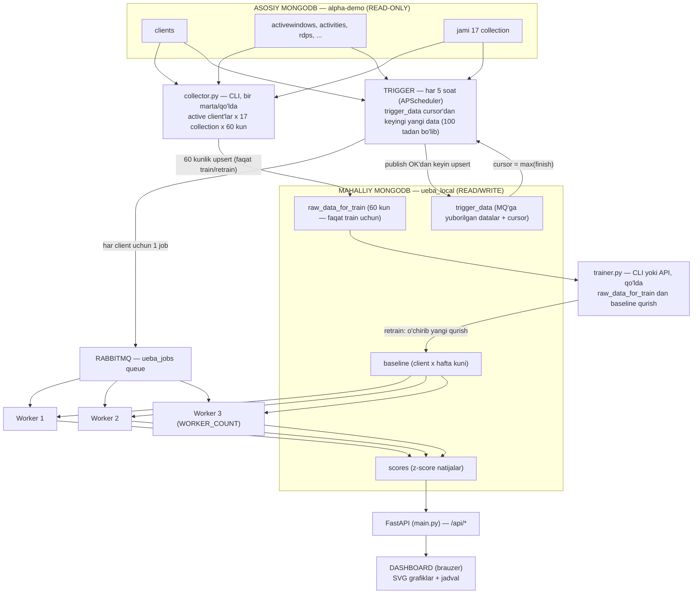

# UEBA PIPELINE — YANGI ARXITEKTURA (V2) TO'LIQ REKONSTRUKTSIYA PLANI

> Bu hujjat eski `UEBA_PIPELINE_ARCHITECTURE.md` (v1) ni almashtiradi.
> **Maqsad:** shu faylni o'qigan agent/insan **hech qanday qo'shimcha ma'lumotsiz** (bo'sh papkada turganda ham) butun yangi tizimni nol-dan to'liq yozib chiqishi mumkin bo'lgan darajada aniq bo'lishi.
> Barcha raqamli qiymatlar, formulalar, so'rov shakllari, schema maydonlari va tartiblar bu yerdagi ko'rinishida bajariladi.

---

## 1. LAYIHANING MAQSADI

UEBA (User and Entity Behavior Analytics) tizimi: DataGaze DLP tizimidan keladigan 17 ta aktivlik kolleksiyasi asosida har bir foydalanuvchining (client) kunlik ish boshlash (`start`) va tugatish (`finish`) vaqtini kuzatib, o'zining o'rtacha (baseline) rejasiga nisbatan chetlanishlarni **z-score** orqali aniqlaydi va **live dashboard** da ko'rsatadi.

Eski tizim: fayl asosli (`raw_data.json → baseline.json → results.json → dashboard.html`), ketma-ket, qo'lda ishga tushiriluvchi pipeline.
Yangi tizim: **MongoDB (2 ta database) + RabbitMQ parallel workerlar + har 5 soatda avtomatik trigger (APScheduler) + FastAPI + brauzer dashboard**.

---

## 2. TASDIQLANGAN KARORLAR (O'ZGARMAydi)

| # | Karor |
|---|-------|
| 1 | Collector avval **active client'larni** aniqlaydi (`clients` da `disabled: false`), keyin **har bir client × 17 collection** bo'yicha alohida server-side so'rov (oxirgi 60 kun) yuboradi. Eski "barcha document'larni yuklab, Python'da filtr qilish" usuli bekor. |
| 2 | Asosiy MongoDB **`alpha-demo`** database'ga **HECH QANDAY yozma amal** qilinmaydi (faqat `find()`). Barcha yozmalar (**`raw_data_for_train`**, **`trigger_data`**, **`baseline`**, **`scores`**) **`ueba_local`** database'ga boradi. **`sent_days` collection bekor qilingan** — uning vazifasini `trigger_data` bajaradi: **yagona yozuvchi — trigger** (faqat MQ'ga muvaffaqiyatli yuborilgan datalar), yagona o'quvchi — trigger (cursor + dedup uchun) (karor #11). |
| 3 | **12 soat filtri (MAX_DAILY_HOURS) va eski `eventCount >= 5` filtri butunlay bekor.** Yangi yagona kunlik agregat qoidasi (§6.6): 0 event'li kunlar umuman mavjud emas (null); **1 event'li kun** — start = event ts, finish = `start + SINGLE_EVENT_STAY_HOURS` (default 1 soat, `.env` da); **2+ event** — start = min(ts), finish = max(ts). 12 soatdan oshiq ishlagan kunlar ham saqlanadi va anomal sifatida baholana oladi. |
| 4 | Z-score belgilari: **erta kelish → +, kech ketish → +**; kech kelish va erta ketish → −. (Formulalar §7.1 da.) |
| 5 | Active client = `disabled: false`. `isOnline` maydoni ishlatilmaydi. |
| 6 | Eski kod (`pipeline/`, `data/`, `tools/`, eski `dashboard.html`) yangi tizim E2E sinovdan o'tgach **o'chiriladi** (tasdiqlangan). |
| 7 | `tools/make_synthetic_data.py` (sun'iy data generatori) **kerak emas** — real `alpha-demo` ma'lumotlari bilan ishlanadi; u ham o'chirish ro'yxatiga kiritilgan. |
| 8 | `.env` fayli allaqachon mavjud bo'lib, unda `MONGO_URI` va `DB_NAME` (alpha-demo ulanishi) yozilgan — **bularni o'zgartirmasdan qoldiring**, faqat yangi o'zgaruvchilarni qo'shing. |
| 9 | Yangi local database (`ueba_local`) ham **Docker** ichida bo'ladi (aynan shu Mongo konteynerining ichida, alohida install shart emas). Production'da faqat URL o'zgartiriladi (`LOCAL_MONGO_URI`). |
| 10 | Matematik jihatlar (baseline hisob, sample std n−1, `count < 5` → null, `parse_to_datetime`) eski kod aynan saqlanadi — §6 da qayta bayon etilgan. **Username umuman ishlatilmaydi** — o'rniga `clients` dagi `hostname` (collector tomonidan `raw_data_for_train` ga yoziladi) ko'rsatiladi; trainer asosiy MongoDB'ga **umuman** so'rov yubormaydi. Eski username prioritet zanjiri va `load_usernames` bekor. `raw_data_for_train`, `trigger_data`, `baseline`, `scores`, job payload, API javoblari va dashboard'da **faqat `hostname`** bor — `username` maydoni hechtqayerda mavjud emas. |
| 11 | Trigger **cursor (checkpoint)** mexanizmi bilan ishlaydi: cursor manbai — `ueba_local.trigger_data`, unda **faqat MQ'ga yuborilgan** kunlik agregatlar saqlanadi (yagona yozuvchi — trigger). Har o'tishda trigger shu collection'dan client'ning eng oxirgi `finish` (cursor) ni topib, shundan keyingi **barcha** yangi ma'lumotni alpha-demo'dan oladi. Har hisoblangan kun `trigger_data` dagi yozuvi bilan solishtiriladi: `(start, finish, eventCount)` bir xil bo'lsa — allaqachon yuborilgan va o'zgarmagan → **job'ga kiritilmaydi** (bir data 2-3 martalik qayta yuborilmaydi); yangi kun yoki qiymatlari o'zgangan bo'lsa → job'ga qo'shiladi. Job MQ'ga publish qilinib, **publish muvaffaqiyatli bo'lgandan keyin** yuborilgan kunlar `trigger_data` ga yoziladi. `trigger_data` da client yozumi bo'lmasa (birinchi o'tish) → faqat oxirgi `LOOKBACK_HOURS`. DB'dan o'qish **100 tadan bo'lib** (batched) olinadi. |
| 12 | Local DB da **4 ta collection** (`sent_days` bekor — vazifasini `trigger_data` bajaradi). `raw_data_for_train` = 60 kunlik **train arxivi** — yagona yozuvchi **collector**, u faqat **train/retrain paytida** ishlaydi, normal rejimda collection to'g'ri qoladi; yagona o'quvchi **trainer**. `trigger_data` = **MQ'ga yuborilgan datalar yozuvi + cursor (checkpoint)**: yagona yozuvchi **trigger** (faqat publish muvaffaqiyatidan keyin); ichida **faqat yuborilgan kunlik agregatlar** saqlanadi — boshqa hech narsa. Trigger shu orqali «qaysi data yuborilgan, qaysi datadan keyin davom etish kerak» ni biladi va takror yubormaydi. `scores` = worker natijasi (job dagi agregatlar `baseline` bilan taqqoslanib hisoblangan z-score'lar). Trigger/worker oqimi `raw_data_for_train` ga umuman tegmaydi. |

---

## 3. UMUMIY ARXITEKTURA



### Komponentlar xulosasi

| Komponent | Ishga tushirish | O'qiydi | Yozadi | Natija |
|---|---|---|---|---|
| Collector | `python collector.py` (**faqat train/retrain payti**) | alpha-demo (RO) | ueba_local (RW) | `raw_data_for_train` |
| Trainer | `python trainer.py` yoki `POST /api/retrain` | faqat `ueba_local.raw_data_for_train` (alpha-demo'ga so'rov YO'Q) | ueba_local | `baseline` |
| Trigger | avtomatik, har 5 soat | alpha-demo (RO) + `trigger_data` (cursor + dedup) | `trigger_data` (faqat publish OK'dan keyin) + RabbitMQ | job'lar |
| Processor (Worker) | RabbitMQ navbat | `baseline` | `scores` | z-score natijalar |
| Dashboard | brauzer | `scores` (API orqali) | — | HTML |

**Muhim qoida:** Worker'lar asosiy MongoDB'ga **umuman murojaat qilmaydi** — ular faqat `ueba_local` bilan ishlaydi (o'qiydi: `baseline`; yozadi: **faqat `scores`**). `trigger_data` ni worker umuman yozmaydi va o'qimaydi — u faqat **trigger** tomonidan yoziladigan «MQ'ga qaysi data yuborilgan» yozuvi va cursor'idir. `raw_data_for_train` ga faqat **collector** yozadi, undan faqat **trainer** o'qiydi — trigger/worker oqimi unga umuman tegmaydi. Job payload o'zi yetarli ma'lumot olib keladi; processor natijasi alohida `scores` da saqlanadi va dashboard shu orqali ishlaydi.

---

## 4. MONGODB DATABASE'LARI VA SCHEMA'LAR

### 4.1 Asosiy MongoDB — `alpha-demo` (READ-ONLY)

Ulanish: `.env` da mavjud `MONGO_URI` va `DB_NAME` (o'zgartirmasdan qoldiriladi).

#### 17 ta kolleksiya (aynan shu mapping, eski `pipeline/utils.py` dan olinadi)

| Collection | ID maydoni (`idField`) | Vaqt maydon(lar)i |
|---|---|---|
| `activewindows` | `clientId` | `datetime` |
| `activities` | `employee` | `dateTime` |
| `rdps` | `clientId` | `connectTime` **va** `disconnectTime` |
| `screenshots` | `clientId` | `dateTime` |
| `keyloggers` | `clientId` | `dateTime` |
| `webvisitings` | `clientId` | `dateTime` |
| `telegrams` | `clientId` | `dateTime` |
| `whatsapps` | `clientId` | `dateTime` |
| `emails` | `clientId` | `dateTime` |
| `websearches` | `clientId` | `dateTime` |
| `websniffs` | `clientId` | `dateTime` |
| `usbmonitors` | `clientId` | `dateTime` |
| `usbsniffs` | `clientId` | `dateTime` |
| `filemonitors` | `clientId` | `dateTime` |
| `clipboards` | `clientId` | `dateTime` |
| `prints` | `clientId` | `dateTime` |
| `incidents` | `employee` | `time` |

> Diqqat: maydon nomlari NONSIONAL — `activities` va `incidents` da ID maydoni `employee` (boshqalarida `clientId`); vaqt maydoni aksariyatida `dateTime`, `activewindows` da `datetime`, `incidents` da `time`, `rdps` da esa **ikki** maydon.

#### `clients` kolleksiyasidan kerakli maydonlar

**Faqat 3 ta maydon ishlatiladi:** `_id` (ObjectId), `hostname`, `disabled`.
Collection'da shuningdek `firstName`, `lastName`, `fullName`, `username` kabi maydonlar bor, lekin ular **bilib qoldiriladi** — username bekor qilingan (karor #10), ko'rsatish uchun faqat `hostname`.
`disabled` maydoni **optional** (default `false`) — shuning uchun maydon umuman bo'lmasa ham client **active** hisoblanadi (edge case, §12.2 #1 da tushirilgan).

### 4.2 Mahalliy MongoDB — `ueba_local` (READ/WRITE)

Ulanish: `.env` dan `LOCAL_MONGO_URI` (boshlang'ich qiymati — xuddi shu Docker Mongo: `mongodb://localhost:27017`) va `LOCAL_DB_NAME=ueba_local`.

Ulanish o'zgaruvchisi `MONGO_URI` bilan **mushtarak emas**: kodda 2 ta alohida `MongoClient` yaratiladi — bittasi alpha-demo uchun (faqat o'qish), ikkinchisi ueba_local uchun (barcha yozmalar). Bu "alpha-demo'ga yozish"ni kod darajasida imkonsiz qiladi (§12.1).

#### `raw_data_for_train` — 60 kunlik **train arxivi** (har client × har kun = 1 document)

**Yagona yozuvchi — collector**, va u **faqat train/retrain paytida** ishga tushadi; normal rejimda bu collection to'g'ri qoladi (trigger/worker unga tegmaydi). **Yagona o'quvchi — trainer.**

```json
{
  "_id": "ObjectId",
  "clientId": "665f2a1b... (str(_id), 24 belgili hex)",
  "hostname": "PC-042",
  "date": "2026-08-26",
  "dayOfWeek": "Tuesday",
  "start": "2026-08-26T08:54:00",
  "finish": "2026-08-26T17:12:30",
  "durationMin": 498.5,
  "eventCount": 42,
  "updatedAt": "2026-08-26T14:00:00"
}
```

- `start`/`finish`: **to'liq naive lokal ISO datetime** (`YYYY-MM-DDTHH:MM:SS`). `start` = shu kunga tegishli barcha event'larning eng erxasi, `finish` = eng kechi.
- `durationMin` = `(finish − start)` daqiqalarda, 2 belgili qayta (round).
- `eventCount` = shu kunga to'g'ri kelgan **yaroqli timestamp lar soni** (barcha 17 collection'ning jami; har bir o'qilgan vaqt maydoni alohida hisoblanadi — masalan `rdps` documenti 2 timestamp berishi mumkin).
- `hostname` — collector tomonidan olinadi (active client'lar ro'yxatidan, §5.1); `hostname` bo'sh/yo'q bo'lsa `str(_id)`; **username umuman saqlanmaydi** — ko'rsatish uchun hostname ishlatiladi.
- **Indeks:** UNIQUE `{ clientId: 1, date: 1 }`.
- **Yozish usuli — REPLACEMENT upsert** (merge emas): yozuvchi o'sha kun uchun **to'liq** kunlik ma'lumotni qayta hisoblab yozadi. Shuning uchun qayta yozishlar **idempotent** — xatolik/qayta ishlash xavfi yo'q. (`raw_data_for_train` ni faqat collector, `trigger_data` ni faqat trigger yozadi.)
- `date` maydoni "YYYY-MM-DD" **string** — string solishtirish `date` maydoni bo'yicha `$lt/$gte` filtrlashda ishlashini ta'minlaydi.

#### `trigger_data` — **MQ'ga yuborilgan datalar yozuvi** + **cursor (checkpoint)** (aynan yuqoridagi shema)

Har **client × har kun** = 1 document; maydonlar, indeks (UNIQUE `{ clientId: 1, date: 1 }`) va yozish usuli (replacement upsert) **`raw_data_for_train` dagidek**. Ichida **faqat MQ'ga yuborilgan** kunlik agregatlar saqlanadi — boshqa hech narsa saqlanmaydi (xom event'lar, z-score yoki natijalar yo'q — ular `scores` da):

- **Yagona yozuvchi — trigger:** kunlik agregat **MQ'ga muvaffaqiyatli publish qilingandan keyin** replacement upsert bilan yoziladi (tartib §5.3, bosqich 5–6). Publish xato bo'lsa yozum qilinmaydi — collection'da doim **aslda yuborilgan** data borligi kafolatlanadi.
- **Yagona o'quvchi — trigger:** (a) **cursor** — har client uchun `find_one({clientId}, sort=[("finish", -1)])` → eng oxirgi `finish` = «MQ'ga qaysi data gacha yuborilgan, keyingi safar undan keyin davom et» (har clientda ≤ DAYS_WINDOW document — so'rov arzon); (b) **dedup** — hisoblangan har bir kun yuborilishdan oldin shu yozuv bilan solishtiriladi (bir xil → qayta yuborilmaydi).
- **Pruning:** trigger har ish o'tishida har client uchun `date < (now − DAYS_WINDOW(60) kun)` bo'lgan eski yozuvlarni `delete_many` bilan tozalaydi (har o'tishda 1 arzon indexed delete).
- **Vazifasi (uchala biri):** (1) «qaysi datalar MQ'ga yuborilgan» — yuborilganlik yozuvi; (2) **cursor** — «qaysi datadan boshlab yangi datalarni olish kerak»; (3) **dedup** — MQ'ga yuborilgan data bir necha marta qaytadan uzatilmasligi. Eski `sent_days` collection **bekor qilingan** — barcha vazifalar shu collection'da.
- `updatedAt` (trigger yozish vaqti) shu kunning **MQ'ga yuborilgan** vaqtini bildiradi.
- `raw_data_for_train` esa train paytgidan to'g'ri qoladi (u esa faqat collector yozadi).

#### `baseline` — har client uchun 1 document

```json
{
  "_id": "ObjectId",
  "clientId": "665f2a1b...",
  "hostname": "PC-042",
  "windowDays": 60,
  "minDowSamples": 5,
  "totalDays": 41,
  "keptDays": 38,
  "trainedAt": "2026-08-26T09:15:00",
  "weeks": {
    "Monday":    { "count": 8, "meanStart": 532.5, "stdStart": 41.2,  "meanFinish": 1012.0, "stdFinish": 66.8, "meanDuration": 479.5 },
    "Tuesday":   { "count": 9, "meanStart": 540.0,  "stdStart": 30.1,  "meanFinish": 1020.0, "stdFinish": 45.0, "meanDuration": 480.0 },
    "Wednesday": { "count": 3, "meanStart": null,   "stdStart": null,  "meanFinish": null,   "stdFinish": null, "meanDuration": null },
    ...
  }
}
```

- Vaqt maydonlari **00:00 dan daqiqa** (float) sifatida o'lchanadi (`to_minutes` — §6.2).
- `weeks` da **faqat namunasi bo'lgan hafta kunlari** bo'ladi (eski kod xatti-harakati). `count < MIN_DOW_SAMPLES(5)` bo'lgan kunda barcha stat maydonlar `null` (lekin `count` yoziladi).
- **Indeks:** UNIQUE `{ clientId: 1 }`.
- Retraining: avval `baseline.delete_many({})` (butun collection tozalanadi), so'ng barcha client'lar uchun qayta quriladi.

#### `scores` — har (clientId × date) uchun 1 document

```json
{
  "_id": "ObjectId",
  "clientId": "665f2a1b...",
  "hostname": "PC-042",
  "date": "2026-08-26",
  "dayOfWeek": "Tuesday",
  "start": "08:54:00",
  "finish": "17:12:30",
  "durationMin": 498.5,
  "eventCount": 42,
  "zStart": 1.892,
  "zFinish": -0.266,
  "status": "anomaly",
  "statusColor": "darkyellow",
  "evaluatedAt": "2026-08-26T14:00:01"
}
```

- `start`/`finish` — ko'rsatish uchun `"HH:MM:SS"` string; `zStart`/`zFinish` — 3 belgili round yoki `null`.
- `status`: `normal | watch | anomaly | severe | insufficient` (qoidalar §7.2).
- `statusColor`: `green | yellow | darkyellow | red | gray` (CSS hex'lari §7.3).
- **Indeks:** UNIQUE `{ clientId: 1, date: 1 }` — qayta baholashda **upsert** (o'sha kun yangilanadi, dublikat yaratilmaydi).

Barcha **4 ta** indeks **idempotent `create_index`** bilan dastur ishga tushganda (`main.py` boot) va `collector.py` boshida tekshiriladi.

---

## 5. KOMPONENTLAR — ANIQ SPEKIFIKATSIYA

### 5.1 COLLECTOR (`collector.py` — yuqori darajali CLI)

**Vazifa:** alpha-demo'dan 60 kunlik tarixni yig'ib `raw_data_for_train` ga to'ldirish. **Faqat train/retrain paytida** ishga tushadi (birinchi o'qitishda + baseline'ni yangilamoqchi bo'lganda). Normal rejimda ishlatilmaydi — o'sha paytda trigger `trigger_data` ni yangilayveradi, `raw_data_for_train` esa to'g'ri qoladi.

**Bosqichlar (aynan shu tartibda):**

1. **Indexlar:** `ueba_local` da 4 ta unique indeksni yaratish/tekshirish (§4.2).
2. **Active client'lar:** `clients` collection'dan olish — so'rov:
   ```json
   { "$or": [ { "disabled": false }, { "disabled": { "$exists": false } } ] }
   ```
   Projection: `{ _id: 1, hostname: 1 }`.
   Natija ro'yxati bo'sh bo'lsa — ogohlantirib, normal tugash (exit 0).
   Har bir client uchun `hostname` **shu joyda** olinadi (qo'shimcha so'rov shart emas — document'lar allaqachon olingan); `hostname` bo'sh/yo'q bo'lsa — `str(_id)` qo'llanadi.
   Bu hostname har bir `raw_data_for_train` yozumiga yoziladi (trainer, trigger, dashboard shundan foydalanadi; **username umuman ishlatilmaydi**).
3. **Har bir client uchun** (aynan shu tartibda: **client → collection**, ketma-ket; bitta client xato bo'lsa qolganlari to'xtamaydi):
   - 16 ta oddiy collection uchun so'rov (vaqt maydoni bittasi `T`, ID maydoni `ID`, `W = now − DAYS_WINDOW(60) kun`):
     ```json
     find( { "ID": <clientId>, "T": { "$gte": W } },
           { "ID": 1, "T": 1, "_id": 0 } )
     ```
   - `rdps` uchun alohida so'rov (2 vaqt maydoni — istalgan biri oyna ichida bo'lsa document olinadi):
     ```json
     find( { "clientId": <clientId>,
             "$or": [ { "connectTime": { "$gte": W } },
                      { "disconnectTime": { "$gte": W } } ] },
           { "clientId": 1, "connectTime": 1, "disconnectTime": 1, "_id": 0 } )
     ```
     Har bir document uchun `connectTime` va `disconnectTime` **alohida** parse qilinadi; har biridan `>= W` bo'lgan timestamp saqlanadi.
   - Barcha timestamp lar `parse_to_datetime` (§6.1) bilan naive lokal `datetime` ga keltiriladi; parse bo'lmasa — skip.
   - **Hafta kuni bo'yicha chiqarish (report):** olingan timestamp lar `dayOfWeek` bo'yicha guruhlanib, har bir **borliq** hafta kuni uchun konsolga (va log faylga) yoziladi:
     `{clientId} | {collection} | {weekday} | firstDoc=YYYY-MM-DD HH:MM:SS | lastDoc=YYYY-MM-DD HH:MM:SS | docs=N`
     (`docs` = shu hafta kuniga kamida 1 timestamp qo'shgan documentlar soni; bu faqat o'qish/tekshiruv ma'lumoti — `raw_data_for_train` yozumiga ta'sir qilmaydi).
4. **Kunlik agregat:** har bir client uchun timestamp lar lokal `date` (YYYY-MM-DD) bo'yicha guruhlanib, **yagona qoida** (§6.6 `build_day_agg`) asosida hisoblanadi:
   - 0 ts → kun umuman mavjud emas (hech narsa yozilmaydi);
   - 1 ts → `start = ts`, `finish = min(ts + SINGLE_EVENT_STAY_HOURS, shu kun 23:59:59)`, `eventCount = 1`;
   - 2+ ts → `start = min(ts)`, `finish = max(ts)`, `eventCount = len(ts)`.
5. **Yozish:** har kun uchun `raw_data_for_train` ga **replacement upsert**:
   `update_one( {clientId, date}, { $set: {hostname, start, finish, dayOfWeek, durationMin, eventCount, updatedAt} }, upsert=True )`.
6. **Pruning:** o'sha client uchun `date < (now − 60 kun)` bo'lgan eski `raw_data_for_train` document'lar `delete_many` bilan o'chiriladi (sana stringi bo'yicha solishtirish ishlaydi).
7. **Xulosa logi:** jami clientlar, jami kunlar, yozilgan document'lar; xatolik bo'lsa exit code 1.

> Collector yagona "to'liq tarixni yangilash" vositasi — u **faqat train/retrain paytida** ishlaydi. Normal rejimda `raw_data_for_train` to'g'ri qoladi; trigger esa `trigger_data` ni inkremental yangilayveradi.

### 5.2 TRAINER (`trainer.py` — CLI; API orqali ham chaqiriladi)

**Vazifa:** `raw_data_for_train` dan har bir client × hafta kuni baseline'ini qurish. **Manba — faqat `ueba_local.raw_data_for_train`**: asosiy MongoDB'ga biron so'rov yuborilmaydi (hostname ham `raw_data_for_train` da bor). `trigger_data` dan **foydalanilmaydi** — o'qitish faqat collector yig'gan 60 kunlik arxivdan qilinadi.

**Bosqichlar:**

1. `raw_data_for_train` dan barcha document'larni o'qish (faqat kerakli maydonlar).
2. Har client uchun: kunlarni `dayOfWeek` bo'yicha guruhlash; har bir guruhda `start`/`finish` daqiqalariga (`to_minutes`) va `durationMin` ga o'tkazish.
3. **Kunlik agregat qoidasi (§6.6) allaqachon qo'llangan:** 0 event'li kunlar umuman mavjud emas; 1 event'li kunlar `finish = start + SINGLE_EVENT_STAY_HOURS` deb qurilgan — ular ham **o'qitishga kiradi** (12 soat cheklovi YOK).
4. Har (client × weekday) uchun:
   - `n = namunalar soni`;
   - `n < MIN_DOW_SAMPLES(5)` bo'lsa → barcha stat maydonlar `null` (faqat `count: n`);
   - aks holda:
     - `meanStart = round(avg(start_min), 2)`, `stdStart = round(sample_std(start_min), 2)`
     - `meanFinish = round(avg(finish_min), 2)`, `stdFinish = round(sample_std(finish_min), 2)`
     - `meanDuration = round(avg(dur_min), 2)`
   - `sample_std` — **sample** standart og'ish (n−1); `n < 2` → `None` (§6.3). `std = 0` yoki `None` bo'lsa z-score hisoblanmaydi (null).
5. **Hostname** — `raw_data_for_train` document'laridan to'g'ridan-to'g'ri olinadi (collector bosqichida yozilgan, §5.1) va `baseline` ga yoziladi. DB'ga so'rov yo'q.
6. Har client uchun 1 document qurib `baseline` ga yozish (schema §4.2).
7. **Retrain semantikasi:** `baseline.delete_many({})` → 1–6 qayta. CLI trainer ham xuddi shu delete-then-build ni qo'llaydi. **Retrain `scores` va `trigger_data` ni tozalamaydi** — eski scores tarix sifatida qoladi; keyingi trigger o'tishlaridan boshlab yangi kunlar yangi baseline bo'yicha baholanadi.
8. Log: jami/olgan kunlar, clientlar soni, `trainedAt`.

### 5.3 TRIGGER (`services/trigger.py`, `main.py` ichida APScheduler)

**Vazifa:** har 5 soatda **cursor (checkpoint)** asosida yangi ma'lumotlarni olib, har client uchun bittadan self-contained job'ni RabbitMQ'ga yuborish. O'rtadagi vaqtda tushgan barcha ma'lumotlar yo'qolmaydi — ular `trigger_data` collection'da saqlanadigan cursor orqali iz qo'yiladi. Trigger `trigger_data` ga **faqat MQ'ga muvaffaqiyatli yuborilgan** datalarni yozadi (publish'dan keyin) — collection har doim «aslda yuborilgan» holatni aks ettiradi.

**Cursor mexanizmi (asosiy prinsip):**

1. Har client uchun cursor `trigger_data` dan hisoblanadi: `cursor = max(finish)` — `find_one({clientId}, sort=[("finish", -1)])` natijasining `finish` maydoni (client'ning MQ'ga eng oxirgi yuborilgan/ishlangan kuni).
2. **Cursor bo'lsa:** `windowStart = cursor` ni o'zining tungi 00:00 gacha tushirish (floor). Nima uchun: (a) cursor turgan kunning **to'liq** (00:00 dan beri) ma'lumoti qayta olinib to'liq qayta hisoblanadi — shuning uchun birinchi o'tishdagi qisman kun (5 soatlik oyna) keyingi o'tishda o'zi to'g'rilanadi; (b) yuboriladigan har bir kunlik agregat **to'liq** ma'lumot asosida quriladi → replacement upsert idempotent.
3. **Cursor bo'lmasa** — `trigger_data` da shu client uchun hech qanday yozum yo'q, birinchi o'tish: `windowStart = now − LOOKBACK_HOURS(5)` (floor'siz, aynan oxirgi 5 soat).
4. Oqim doim «so'nggi cursor'dan hozirgacha» — 5 soatlik oyna emas. Dastur 2 kun to'xtagan bo'lsa ham keyingi o'tishda gap qolmaydi (muhimi — cursor qayerda qolgan, o'tishlar soni emas).

**Bosqichlar (har bir ish o'tishida):**

1. `now = datetime.now()`.
2. Active client'lar ro'yxati (ayni qoida §5.1 bosqich 2; projection da `hostname`).
3. **Har bir client uchun** (bittasi xato bo'lsa qolganlari to'xtamaydi — mustaqil `try/except`):
   - cursor → `windowStart` (yuqoridagi mexanizm).
   - 17 collection bo'yicha **batched so'rov** (§5.3.1): `windowStart` dan keyingi barcha event timestamp'lari to'planadi (16 collection uchun §5.1 so'rov shakli, `rdps` uchun `$or` shakli, lekin `W = windowStart`).
   - Timestamp lar date bo'yicha guruhlanib **kunlik agregat** quriladi (yagona qoida §6.6: 0 → mavjud emas, 1 → finish sintez, 2+ → min/max): `{date: {start, finish, eventCount}}`.
4. **Dedup tekshiruvi (`trigger_data`):** har hisoblangan (clientId, date) uchun `find_one({clientId, date})` bilan mavjud yozuv solishtiriladi:
   - **Yozum yo'q** → yangi kun → job `days` ga qo'shiladi.
   - **Yozum bor va `(start, finish, eventCount)` bir xil** → u kun allaqachon MQ'ga yuborilgan va o'zgarmagan → **job'ga kiritilmaydi** (bir data 2-3 martalik qayta yuborilmaydi, keyingi kunga o'tiladi).
   - **Yozum bor lekin qiymatlar farq qiladi** (kunga yangi event'lar tushgan) → to'liq qayta hisoblangan agregat job'ga qo'shiladi (qisman kunning to'liqlanishi — self-correct).
5. `days` **bo'sh bo'lmasa** (kamida 1 yangi/ozgaruvchan kun bo'lsa) har client uchun job tuziladi va `pika` `basic_publish` bilan `ueba_jobs` queue'iga yuboriladi (content_type `application/json`). `days` da shu o'tishda **yuborilayotgan** kunnar bo'ladi (odatda 1–2 ta):
   ```json
   {
     "jobId": "uuid4",
     "clientId": "665f2a1b...",
     "hostname": "PC-042",
     "windowStart": "2026-08-26T00:00:00",
     "windowEnd": "2026-08-26T14:00:00",
     "days": {
       "2026-08-26": { "start": "2026-08-26T08:54:00",
                        "finish": "2026-08-26T13:59:12",
                        "eventCount": 42 }
     },
     "sentAt": "2026-08-26T14:00:00"
   }
   ```
6. **`trigger_data` ga yozish — FAQAT publish muvaffaqiyatidan keyin:** yuborilgan (clientId, date) lar uchun **replacement upsert** (`hostname`, `start`, `finish`, `eventCount`, `dayOfWeek`, `durationMin`, `updatedAt = now`). **Muhim tartib — avval publish, so'ng yozish:** publish xato bo'lsa (RabbitMQ down) yozum qilinmaydi → cursor orqada qoladi → keyingi o'tishda shu kunlar qayta olinib qayta yuboriladi (gap qolmaydi). Collection'da **faqat aslda MQ'ga yetgan** data bo'ladi.
7. **Pruning:** har client uchun `trigger_data.delete_many({clientId: cid, date: {$lt: (now − DAYS_WINDOW kun)ning "YYYY-MM-DD" stringi}})`.
8. Xulosa logi: `trigger run: X client, Y yangi event, Z kun yuborildi, N kun skip (bir xil)`.

**Scheduler sozlamasi:** `BackgroundScheduler`; interval = `TRIGGER_INTERVAL_HOURS(5)`; dastur boot'ida **10 soniya kechikib birinchi ish o'tish** ham bajariladi (dashboard tezroq ma'lumot oladi).

**RabbitMQ down bo'lsa:** `publish` xatosi log'lanadi, trigger to'xtamaydi; `trigger_data` yozilmaydi (bosqich 6 publish OK'ni kutadi) → cursor orqada qoladi → keyingi o'tishda shu kunlar to'liq qayta olinib job qayta yuboriladi (ma'lumot yo'qolmaydi).

#### 5.3.1 Batched so'rov — 100 tadan o'qish

- Maqsad: bir client × collection uchun katta volume (masalan 60 kunlik o'qish) yagona qo'lga olinmasligi; muvaqqat xotira va CPU yuklamasi cheklangan bo'lishi.
- Har bir client × collection so'rovi **streaming cursor** (`find(...)` iterator, projection faqat `{idField, timeFields}`) sifatida oqib olinadi va **`BATCH_SIZE = 100` documentlik partiyalar** bilan qayta ishlanadi (100 doc o'qiladi → parse/agregat → keyingi 100 doc → ...).
- `limit(N)` + qayta so'rov usulidagi «paginatsiya» **ishlatilmaydi**: vaqt chegarasida xuddi shu timestamp'ga ega 100+ document bo'lsa, qolganlar o'tkazib yuborilishi xavfi bor; streaming — o'qim, yo'qotmasiz.
- Xuddi shu helper **collector** tomonidan ham ishlatiladi (§5.1: 60 kunlik o'qish ham 100 tadan).

### 5.4 PROCESSOR / WORKER (`services/processor.py` + `queue/worker.py`)

**Vazifa:** navbatdan job olib, undagi kunlik agregatlarni `baseline` bilan taqqoslab **z-score** hisoblash va natijani `scores` ga yozish. Worker `trigger_data` ni **umuman yozmaydi va o'qimaydi** — u faqat trigger'ning «qaysi data yuborilgan, qaysi datadan davom et» yozuvidir (eski `sent_days` o'rniga). Processor natijasi alohida — `scores` da saqlanadi; dashboard shu `scores` orqali ishlaydi. `main.py` boot'ida `WORKER_COUNT` (default 3) ta **alohida thread** ishga tushadi; har thread'da o'z `pika.BlockingConnection` (pika har connection o'z thread'ida ishlatilishi shart). `raw_data_for_train` ga **umuman** tegmaydi.

**Queue sozlamalari:**

| Parametr | Qiymat |
|---|---|
| Queue | `QUEUE_NAME=ueba_jobs` |
| Durable | `True` |
| `basic_qos` prefetch_count | `1` |
| Auto-ack | `False` (qo'lda ack) |

**Har bir olingan job uchun (aynan tartibda):**

1. Job JSON'ini parse qilish; xato bo'lsa — `basic_nack(requeue=False)` + log.
2. `ueba_local.baseline`: `{clientId: ...}` bilan `find_one`. **Topilmasa** → warning log, `basic_ack` (score yozilmaydi).
3. **Har bir (clientId, date) kun uchun:**
   - Har bir saqlangan kun `eventCount >= 1` ekanligi uchun score hisoblanadi (1 event'li kunlarda finish = start + `SINGLE_EVENT_STAY_HOURS` — §6.6; keyingi job'da shu kunga yangi event tushsa, agregat real finish bilan qayta hisoblanib score avtomatik to'g'rilanadi).
   - Aks holda: `week = baseline.weeks.get(dayOfWeek)` (bo'lmasa → `None`):
     - `zStart = (meanStart − startMin) / stdStart` — faqat `week` bor, `meanStart not None` va `stdStart` (0 emas) bo'lsa; aks holda `null`
     - `zFinish = (finishMin − meanFinish) / stdFinish` — xuddi shart bilan
     - `startMin/finishMin` = `to_minutes(start datetime)` (§6.2)
   - Status: §7.2 bo'yicha.
   - `scores` ga **upsert** (`{clientId, date}` kalit; `evaluatedAt = now`).
4. `basic_ack`.

> Takroran kelib tushgan job'lar uchun xavotir shart emas: **trigger allaqachon dedup qilgan** — `trigger_data` da qiymatlari bir xil kunlar job'ga kiritilmaydi, shuning uchun job'lar faqat yangi/ozgaruvchan kunlarni olib keladi. Xuddi shu kunning job'i takrorlanib kelsa ham — `scores` upsert'i idempotent (`{clientId, date}` unique), natija bir xil qayta hisoblanadi, dublikat bo'lmaydi.

**Xatolik siyosati (retry):** message header'ida `x-retries` (default 0) saqlanadi. Processing xatolik bo'lsa:
- `x-retries < 3` → job `x-retries: +1` header'i bilan **qayta publish** qilinadi (avvalgi `basic_reject(requeue=False)` bilan).
- `x-retries >= 3` → `basic_reject(requeue=False)` + ERROR log (message tashlanadi). Eslab qolinsin: shu kunlar `trigger_data` da allaqachon yozilgan (publish muvaffaqiyatli edi) → avtomatik qayta yuborish bo'lmaydi; shu kun uchun score yo'q bo'lsa, `trigger_data` dagi yozuvi qo'lda o'chirilsin (`db.trigger_data.deleteOne({clientId, date})`) — keyingi trigger o'tishida u kun qayta yuboriladi.

### 5.5 API (`api/app.py` + `api/routes.py` — FastAPI)

| Endpoint | Method | Vazifa / javob |
|---|---|---|
| `/api/health` | GET | `{ mongo_main: "ok"/"error", mongo_local: "ok"/"error", rabbitmq: "ok"/"error", queue_depth: N, workers: N, lastTrigger: {...}, lastRetrain: {...} }` |
| `/api/train` | POST | Birinchi o'qitish. Baseline mavjud bo'lsa → **409** `{"detail": "baseline mavjud, /api/retrain ishlatiling"}`. Aks holda fon thread'ida trainer → **202** `{"status": "training"}` |
| `/api/retrain` | POST | Fon thread'ida: `baseline` tozalash + qayta o'qitish → **202** `{"status": "retraining"}` |
| `/api/trigger` | POST | Trigger'ni hozir qo'lda ishga tushirish (fon thread) → **202** `{"status": "triggering"}` |
| `/api/scores` | GET | Parametrar: `from`, `to` (YYYY-MM-DD), `client_id`, `status` (va kommasi bilan bir nechta), `limit` (default 100, max 5000), `offset` (default 0). Javob: `{ "total": N, "limit": ..., "offset": ..., "items": [score doc'lari] }` — `date` kamayish tartibida |
| `/api/scores/{client_id}` | GET | Xuddi yuqoridagi filtrlar bilan yagona client uchun; client bo'lmasa **404** |
| `/api/dashboard` | GET | `dashboard/index.html` ni qaytaradi. `/` (root) ham shuni qaytaradi |
| `/static/style.css`, `/static/script.js` | GET | `dashboard/static/` ichidagi fayllar (StaticFiles mount) |

**Fon job'lar:** `threading.Thread(daemon=True)`. Har bir asinxron amalning holati (startedAt / finishedAt / status / error) modul darajasidagi oddiy dict'da saqlanadi va `/api/health` da ko'rinadi.

**Dashboard uchun ma'lumot oqimi:** brauzer → `GET /api/scores?from=...&to=...&client_id=...&status=...` → `items` massivi → JS tomonda render.

### 5.6 DASHBOARD (`dashboard/` — vanilla JS, CDN YO'Q)

Fayllar: `index.html`, `static/style.css`, `static/script.js`. Eski dashboard'ning "server SVG" usuli bekor — barcha grafiklar **browser'da JS bilan SVG** orqali chiziladi.

**Interfeys (yagona sahifa):**

1. **Filter paneli:**
   - sana oralig'i: `from` / `to` (input[type=date], default: so'nggi 7 kun)
   - client: dropdown (ro'yxati `scores` dan `distinct(clientId)` + hostname asosida)
   - status: checkbox'lar (normal / watch / anomaly / severe / insufficient)
   - "Yangilash" tugmasi + avto-refresh **har 5 daqiqada** (`setInterval`, `fetch`)
2. **Xulosa kartalari:** tanlangan oralikda jami kunlar soni va statuslar bo'yicha sonlar (5 ta karta, rang bilan).
3. **SVG grafik 1 — z-timeline:** x o'qi = sana, har bir client uchun 2 ta chiziq/bar: `zStart` (mavji rang, masalan `#3b82f6`) va `zFinish` (`#f97316`); fon bandlari: |z| ≥ 1.8 qizil, 1.2–1.8 to'q sariq (so'plangan miniq), ±1.2 va ±1.8 chiziqlari belgilanadi. Client filtri tanlangan bo'lsa faqat u, bo'sh bo'lsa jami (yoki top-10 client).
4. **SVG grafik 2 — client'lar x anomaly:** gorizontal ustunli diagramma: har client uchun `anomaly + severe` kunlar soni (qizil rang), kamayish tartibida.
5. **Jadval:** ustunlar — `date | client | start | finish | durationMin | zStart | zFinish | status`. `status` hujayrasi rangli badge (hex'lari §7.3). Saralash: sana bo'yicha kamayish, keyin hostname bo'yicha.

**Texnik:** hech qanday tashqi kutubxona (framework/CDN) yo'q; faqat `fetch` + DOM + inline SVG. JS da z-score band funksiyasi API bilan bir xil bo'lishi shart (bir xil threshold'lar, lekin qiymatlar `score.status` da allaqachon bor — JS faqat ko'rsatish uchun ishlatadi).

---

## 6. UMUMIY YORDAMCHI FUNKSIYALAR (ESKI KOD AYNAN SAQLANADI)

> Bu funksiyalar eski `pipeline/utils.py` dan **aynan** o'tkaziladi (faqat modul joyi `utils/helpers.py` ga ko'chadi). Signaturalar va xatti-harakatlar o'zgarmaydi.

### 6.1 `parse_to_datetime(val) -> datetime | None`

- `None` → `None`
- `datetime` (BSON date, tz-aware) → lokal vaqtga keltirish: `dt.astimezone().replace(tzinfo=None)` (**naive lokal** qaytaradi)
- `int` / `float` → `val < 1e11` bo'lsa **soniya**, aks holda **millisekunda** (`val / 1000.0`); `datetime.fromtimestamp(...)`
- `str` → `dateutil.parser.parse(val)`
- Parse xatosi → `None` (document skip, xatoga tushmaydi)

### 6.2 `to_minutes(dt) -> float`

`dt.hour * 60 + dt.minute + dt.second / 60.0` — 00:00 dan daqiqa. (Baseline mean/std va z-score'larda ishlatiladi.)

### 6.3 `sample_std(values) -> float | None`

Sample standart og'ish: `sqrt( Σ(x−mean)² / (n−1) )`; `n < 2` → `None`.

### 6.4 `DAYS_MAP`

`{0: "Monday", 1: "Tuesday", 2: "Wednesday", 3: "Thursday", 4: "Friday", 5: "Saturday", 6: "Sunday"}` (Python `weekday()` raqamlari bo'yicha).

### 6.5 `get_status(z_start, z_finish) -> (status, color)`

§7.2 qoidalarini qaytaradi (worker'lar va qo'lda tekshiruvlar uchun yagona manba).

### 6.6 `build_day_agg(tss) -> (start, finish, durationMin) | None` — YAGONA kunlik agregat qoidasi

`tss` — shu kunga to'g'ri kelgan barcha timestamp'lar (barcha 17 collection jami):

| `len(tss)` | `start` | `finish` |
|---|---|---|
| `0` | `None` qaytariladi — kun mavjud emas, saqlanmaydi, baholanmaydi (null) | — |
| `1` | `tss[0]` | `min(tss[0] + SINGLE_EVENT_STAY_HOURS soat, shu kun 23:59:59)` |
| `2+` | `min(tss)` | `max(tss)` |

- `durationMin = (finish − start)` daqiqalarda (2 belgili round) — 1 event'li kunda bu sintez qilingan davomiylik.
- `finish` 23:59:59 bilan chegaralanishi: 23:30 dagi yagona event finish=00:30 (keyingi kun) bo'lib, `to_minutes` da soxta «erta ketish» anomaliyasiga olib bormasligi uchun.
- Bu yagona funksiya **collector** (§5.1) va **trigger** (§5.3) tomonidan ishlatiladi; natija collector'da `raw_data_for_train` ga yoziladi, trigger'da esa job payload'iga tushib **processor** ga shu job orqali yetkaziladi va publish'dan keyin `trigger_data` ga (yuborilganlik yozuvi sifatida) yoziladi. Processor agregatni qayta hisoblamaydi (job'da tayyor keladi) — faqat `baseline` bilan taqqoslab `scores` ga yozadi.
- 1 event'li kunlar finish sintez qilingani uchun o'qitishga va baholashga **kiradi**; keyingi job'da shu kunga 2+ event tushsa, agregat real min/max bilan qayta hisoblanadi (self-correct).

---

## 7. Z-SCORE VA STATUS QOIDALARI

### 7.1 Formulalar va belgilar (ESKIDAN O'ZGARDI — ESKIDA zStart BEG'LI BO'LGAN)

```
startMin   = to_minutes(start)      # 00:00 dan daqiqa
finishMin  = to_minutes(finish)

zStart   = (meanStart  − startMin)  / stdStart    # agar stdStart  mavjud
zFinish  = (finishMin  − meanFinish) / stdFinish   # agar stdFinish mavjud
```

| Holat | Nima bo'ladi | Belgi |
|---|---|---|
| **Erta kelish** (`start < meanStart`) | `zStart` | **+ (musbat)** |
| **Kech kelish** (`start > meanStart`) | `zStart` | **− (manfiy)** |
| **Kech ketish** (`finish > meanFinish`) | `zFinish` | **+ (musbat)** |
| **Erta ketish** (`finish < meanFinish`) | `zFinish` | **− (manfiy)** |

`std = 0` yoki `None`, yoki shu weekday uchun baseline yo'q → mos z = `null`.

### 7.2 Status

Kunlik z = `max(|zStart| yoki 0, |zFinish| yoki 0)` (null'lar e'tiborga olinmaydi):

| Shart | `status` | `statusColor` |
|---|---|---|
| `zStart = null` va `zFinish = null` | `insufficient` | `gray` |
| `z >= SEVERE_THRESHOLD (1.8)` | `severe` | `red` |
| `Z_THRESHOLD (1.2) <= z < 1.8` | `anomaly` | `darkyellow` |
| `0.5 <= z < 1.2` | `watch` | `yellow` |
| `z < 0.5` | `normal` | `green` |

### 7.3 Ranglar (CSS hex)

| status | hex |
|---|---|
| red | `#e74c3c` |
| darkyellow (to'q sariq) | `#d99a06` |
| yellow | `#f1c40f` |
| green | `#2ecc71` |
| gray | `#95a5a6` |

### 7.3.1 Misol (tekshiruv uchun)

Baseline (Tuesday): `meanStart=540.0` (09:00), `stdStart=30.0`, `meanFinish=1020.0` (17:00), `stdFinish=45.0`.

- **Kun A:** start 08:00 (480), finish 18:00 (1080) → `zStart=(540−480)/30=+2.0`, `zFinish=(1080−1020)/45=+1.33` → z=2.0 → **severe** (erta kelgan + kech ketgan).
- **Kun B:** start 09:30 (570), finish 16:00 (960) → `zStart=(540−570)/30=−1.0`, `zFinish=(960−1020)/45=−1.33` → z=1.33 → **anomaly** (kech kelgan + erta ketgan).

---

## 8. KUNLIK AGREGAT QOIDASI (ESKI SHO'QIN FILTRI O'RNIGA)

Eski `eventCount >= 5` filtri bekor qilindi. Endi yagona qoida — §6.6 (`build_day_agg`):

| Kunda event (17 collection jami) | start | finish |
|---|---|---|
| 0 ta | — (kun mavjud emas — null; saqlanmaydi, baholanmaydi) | — |
| 1 ta | event ts | `start + SINGLE_EVENT_STAY_HOURS` (default **1 soat**; tungi 00:00 ni kesib o'tsa 23:59:59 bilan cheklanadi) |
| 2+ ta | `min(ts)` | `max(ts)` |

- Qoida collector, trigger va (orqali) trainer/processor'da **bir xil** ishlaydi.
- 1 event'li kunlar finish sintez qilingani uchun o'qitishga va baholashga **kiradi**.
- `MAX_DAILY_HOURS` olib tashlandi: 12 soatdan oshiq davom etgan kunlar saqlanadi, o'qitiladi va `z` bo'yicha anomaliya bo'lishi mumkin.

---

## 9. KONFIGURATSIYA (`.env`)

> `.env` allaqachon mavjud. **`MONGO_URI` va `DB_NAME` qatorlarini o'zgartirmang** (ular alpha-demo ulanishi). Quyidagi qatorlarni **qo'shing**:

| O'zgaruvchi | Default | Ma'nosi |
|---|---|---|
| `MONGO_URI` | *(mavjud, o'zgarmaydi)* | Asosiy MongoDB (alpha-demo) |
| `DB_NAME` | *(mavjud, o'zgarmaydi)* | Asosiy database nomi |
| `LOCAL_MONGO_URI` | `mongodb://localhost:27017` | Mahalliy MongoDB (boshlang'ichda xuddi shu Docker server; production'da URL almashtiriladi) |
| `LOCAL_DB_NAME` | `ueba_local` | Mahalliy database nomi |
| `RABBITMQ_HOST` | `localhost` | |
| `RABBITMQ_PORT` | `5672` | |
| `RABBITMQ_USER` | `guest` | Docker obrazining default |
| `RABBITMQ_PASSWORD` | `guest` | Docker obrazining default |
| `QUEUE_NAME` | `ueba_jobs` | |
| `WORKER_COUNT` | `3` | Worker thread'lar (2–5) |
| `API_HOST` | `127.0.0.1` | FastAPI host |
| `API_PORT` | `8000` | FastAPI port |
| `DAYS_WINDOW` | `60` | O'qitish uchun orqa karra kunlar |
| `TRIGGER_INTERVAL_HOURS` | `5` | Trigger oralig'i |
| `LOOKBACK_HOURS` | `5` | Faqat **birinchi o'tish** oynasi (`trigger_data` da cursor bo'lmasa); keyinchalik cursor ishlaydi (§5.3) |
| `BATCH_SIZE` | `100` | DB so'rovlari 100 documentlik partiyalar bilan o'qiladi (§5.3.1) |
| `Z_THRESHOLD` | `1.2` | Anomaliya chegarasi |
| `SEVERE_THRESHOLD` | `1.8` | Jiddiy chegarasi |
| `WATCH_THRESHOLD` | `0.5` | Watch chegarasi |
| `MIN_DOW_SAMPLES` | `5` | Baseline uchun minimal kunlar (hafta kuniga) |
| `SINGLE_EVENT_STAY_HOURS` | `1` | 1 event'li kunda finish = start + shu soat (keyincha 2 soat deb o'zgartirish mumkin — faqat `.env` ni o'zgartirish kifoya) |

> `MAX_DAILY_HOURS` — **bo'lmasligi kerak** (agar eski `.env` da bo'lsa, o'chiriladi).

Barcha qiymatlar `config.py` da o'qiladi (default'lari yuqoridagilar); `load_dotenv()` har dastur kirish nuqtasida.

---

## 10. KOD STRUKTURASI (YAKUNIY)

```
ueba/
├── .env                        # mavjud + yangi o'zgaruvchilar
├── config.py                   # barcha env o'qilishi, default'lar
├── main.py                     # YANGI: FastAPI app + APScheduler + worker thread'lar (uvicorn)
├── collector.py                # YANGI: CLI wrapper (python collector.py)
├── trainer.py                  # YANGI: CLI wrapper (python trainer.py)
├── requirements.txt            # yangi dependency ro'yxati
├── models/
│   ├── __init__.py
│   ├── client.py               # Client (Pydantic): clientId, hostname (username YO'Q — bekor)
│   ├── raw_day.py              # RawDay: clientId, hostname, date, dayOfWeek, start, finish, durationMin, eventCount (raw_data_for_train VA trigger_data uchun umumiy shema)
│   ├── baseline.py             # WeekStats + Baseline (Pydantic, weeks: Dict[str, WeekStats])
│   └── score.py                # Score: zStart, zFinish, status, statusColor, ...
├── services/
│   ├── __init__.py
│   ├── mongo.py                # 2 ta MongoClient: main_client (RO) + local_client (RW); ensure_indexes() — 4 collection'ning unique indekslari
│   ├── collector.py            # §5.1 logikasi
│   ├── trainer.py              # §5.2 logikasi (pure: raw_data_for_train -> baseline doc'lari)
│   ├── processor.py            # §5.4 job qayta ishlash logikasi (pure: job -> trigger_data + scores)
│   └── trigger.py              # §5.3 logikasi (alpha-demo o'qish + job tuzish + publish)
├── queue/
│   ├── __init__.py
│   ├── rabbitmq.py             # BlockingConnection o'rnatish, publish, queue declaration
│   └── worker.py               # worker thread: consume -> processor -> ack/retry
├── api/
│   ├── __init__.py
│   ├── app.py                  # FastAPI app factory, StaticFiles mount
│   └── routes.py               # §5.5 endpoint'lari
├── dashboard/
│   ├── index.html
│   └── static/
│       ├── style.css
│       └── script.js
├── utils/
│   ├── __init__.py
│   ├── helpers.py              # §6 funksiyalari + COLLECTIONS mapping (17 ta) + DAYS_MAP
│   └── logger.py               # logging: konsol INFO + logs/ueba.log (RotatingFileHandler, 5MB x 3)
└── logs/                       # runtime'da yaratiladi
```

`collector.py` (root) va `trainer.py` (root) — `services/` funksiyalarini chaqiruvchi **nozik CLI o'ralgichlar** (argparse kerak emas; oddiy `main()` + xatolikni chaptirib `sys.exit(1)`).

### `requirements.txt` (yangi)

```
pymongo
python-dotenv
python-dateutil
fastapi
uvicorn
pika
apscheduler
```

> Eski ro'yxatdagi `numpy` **kerak emas** — barcha matematika oddiy Python'da. Mavjud `venv/` da `pip install -r requirements.txt` orqali yangilanadi.

---

## 11. INFRASTRUKTURA VA ISHGA TUSHIRISH

### 11.1 Docker konteynerlari (biz o'rnatmaymiz — foydalanuvchi o'rnatadi)

```bash
# MongoDB (ichida 2 ta database: alpha-demo — RO, ueba_local — RW)
docker run -d --name ueba-mongo --restart unless-stopped \
  -p 27017:27017 -v ueba_mongo_data:/data/db mongo:7

# RabbitMQ (+ management UI :15672, guest/guest)
docker run -d --name ueba-rabbitmq --restart unless-stopped \
  -p 5672:5672 -p 15672:15672 rabbitmq:3-management
```

Tekshiruv: `docker ps` (ikkalasi `Up`), `http://localhost:15672` (guest/guest) ochilishi, `mongosh --eval "show dbs"` da `alpha-demo` ko'rinishi.

> **Production:** konteynerlarni/URL'larni almashtirish uchun `.env` da faqat `MONGO_URI` (agar boshqa host bo'lsa), `LOCAL_MONGO_URI` o'zgartiriladi — kodda hech narsa o'zgarmaydi.

### 11.2 Birinchi ishga tushirish tartibi

```bash
source venv/bin/activate        # mavjud venv
pip install -r requirements.txt

python collector.py             # 1. 60 kunlik tarix -> raw_data_for_train (faqat train/retrain payti)
python trainer.py               # 2. baseline qurish (faqat train/retrain payti)
python main.py                  # 3. FastAPI + scheduler + 3 worker (uzluksiz)
```

### 11.3 Kundalik amallar

| Amal | Qanday |
|---|---|
| Baseline qayta o'qitish | avval `python collector.py` (yangi 60 kun → `raw_data_for_train`), so'ng `curl -X POST http://localhost:8000/api/retrain` (yoki `python trainer.py`) |
| Qo'lda baholash | `curl -X POST http://localhost:8000/api/trigger` |
| Dashboard | `http://localhost:8000/` (yoki `/api/dashboard`) |
| Holat | `curl http://localhost:8000/api/health` |

---

## 12. XAVFSIZLIK VA MUHIM QOIDALAR

### 12.1 alpha-demo'ga yozishni taqiqlash

- `services/mongo.py` da **2 ta alohida `MongoClient`**:
  - `main_client` → `MONGO_URI` + `DB_NAME`: **faqat `find()` chaqiriladi** (faqat **collector** va **trigger**; trainer faqat `ueba_local` bilan ishlaydi).
  - `local_client` → `LOCAL_MONGO_URI` + `LOCAL_DB_NAME`: barcha `insert/update/delete`.
- Kodda `main_client` ga yozma method chaqiruvlar **mumkin emas**. (Optional qo'shimcha: `main_client` yaratilganda read-only check — ammo 2 client'lik ajratish yetarli va asosiy himoya.)

### 12.2 Edge caselar (kodda hisobga olinishi shart)

| # | Edge case | Xatti-harakat |
|---|---|---|
| 1 | `clients` da `disabled` maydoni umuman yo'q | `{ $or: [{disabled: false}, {disabled: {$exists: false}}] }` — active hisoblanadi |
| 2 | `rdps` da 2 vaqt maydoni | `$or` bilan 2 so'rov sharti; har bir maydon alohida parse + hisob |
| 3 | `activities`/`incidents` da ID maydoni `employee` | §4.1 mapping aynan |
| 4 | `hostname` maydoni bo'sh yoki yo'q | ko'rsatish uchun `str(_id)` qo'llanadi (username umuman ishlatilmaydi) |
| 5 | Vaqt maydoni parse bo'lmasa (null/anoformat) | `None` → skip, xatoga tushmaydi |
| 6 | Vaqt maydoni son/saniliq str (sec/ms) | §6.1 aynan |
| 7 | Baseline'da shu weekday yo'q yoki stats null | z = null → status `insufficient` (ikkala z null bo'lsa) |
| 8 | Client'da baseline umuman yo'q (yangi client) | Warning log, job ack'lanadi, score yozilmaydi |
| 9 | Dastur 2 kun turgan bo'lsa | **Avtomatik qoplanadi:** keyingi trigger cursor'dan keyingi barcha ma'lumotni oladi (§5.3). Cursor'dan **oldinga** gapirib yozilgan (backfill) event'lar esa qoplanmaydi — ular uchun `python collector.py` |
| 10 | Kunduzi 00:00 ni kesib o'tgan sessiya (23:30 → 01:00) | Har event o'z sanasi bilan guruhlanadi (eski xatti-harakat aynan); 2 kunga bo'linadi — ma'lum xatti-harakat |
| 11 | Bir kun 12 soatdan oshiq davom etsin | Filtrlanmaydi; normal hisoblanadi/anomaliya bo'lishi mumkin |
| 12 | Xuddi shu (clientId, date) qayta yozilsa | Replacement upsert → idempotent, dublikat/kuzatish xatolari yo'q |
| 13 | Birinchi o'tishdagi 5 soatlik oyna qisman kun berib qo'ysin (kun haqiqiy starti oynadan oldin) | Keyingi o'tishda cursor aynan shu kunda → kun 00:00 dan to'liq qayta olinadi; qiymatlar `trigger_data` dagidan farq qilgani uchun qayta yuborilib `scores` o'zi to'g'rilanadi (self-correct) |
| 14 | Publish xato bo'lsa (RabbitMQ tushgan) | `trigger_data` yozilmaydi (yozuv publish OK'dan keyin qilinadi) → cursor orqada qoladi → keyingi o'tishda shu kunlar to'liq qayta olinib job qayta yuboriladi |
| 15 | Kunda faqat 1 ta event bo'lsa | start = event ts; finish = start + `SINGLE_EVENT_STAY_HOURS` (default 1h) — o'qitishga va baholashga kiradi; keyinchalik 2+ event tushsa real finish bilan qayta hisoblanadi |
| 16 | Yagona event 23:00 dan keyin bo'lsa (finish tungi 00:00 ni kesadi) | finish shu kun 23:59:59 bilan cheklanadi — soxta «erta ketish» anomaliyasidan saqlanadi |
| 17 | Kun `trigger_data` da allaqachon yozilgan bo'lsa (trigger dedup) | Qiymatlar `(start, finish, eventCount)` bo'yicha bir xil → trigger uni job'ga kiritmaydi (MQ'ga takrorlanmaydi); farq bo'lsa (yangi event tushgan) → to'liq qayta hisoblanib qayta yuboriladi |
| 18 | Worker 3 retry'dan keyin job tashlasa | Shu kunlar `trigger_data` da allaqachon yozilgan → avtomatik qayta yuborish bo'lmaydi; zarur bo'lsa `db.trigger_data.deleteOne({clientId, date})` — keyingi trigger o'tishida u kun qayta yuboriladi |

---

## 13. E2E SINOV PROTOKOLI (REAL MA'LUMOTLAR BILAN)

> Sun'iy data **ishlatilmaydi** — hamma narsa `alpha-demo` real ma'lumotlarida tekshiriladi.

| # | Tekshiruv | Kutiladigan natija |
|---|---|---|
| 1 | `docker ps` | `ueba-mongo`, `ueba-rabbitmq` — `Up` |
| 2 | `mongosh --eval "show dbs"` | `alpha-demo` (va so'ng `ueba_local`) ko'rinadi |
| 3 | `python collector.py` | Konsolda 17 collection x client'lar loglari; exit 0 |
| 4 | `mongosh ueba_local --eval "db.raw_data_for_train.countDocuments({})"` | `> 0`; bitta document'ni ko'z bilan ko'rib chiqish (start ≤ finish, eventCount ≥ 1) |
| 5 | `python trainer.py` | `db.baseline.countDocuments({})` = data'si bo'lgan active clientlar soni; bitta `weeks.Monday` stats'i haqiqiy ko'rinishda (0–1440 daqiqa oralig'i) |
| 6 | `python main.py` | Log'larda: indexlar OK, 3 worker ulandi, scheduler rejasi, 10s kechikib birinchi trigger ish o'tdi |
| 7 | `curl localhost:8000/api/health` | Barcha `ok`; `queue_depth` sonli |
| 8 | `curl -X POST localhost:8000/api/trigger` → 15s kutish | `202` → `db.trigger_data.countDocuments({}) > 0` (birinchi o'tish = 5 soatlik oyna) va `db.scores` o'sdi/yangilandi (`evaluatedAt` yangi) |
| 9 | **Cursor tekshiruvi:** `trigger_data` dan bir client uchun max(finish) ni olib, qo'lda `POST /api/trigger` | Log'da oyna **5 soat emas** — o'sha finish'ning tungi 00:00 dan boshlanadi; yangi event bo'lsa aynan ular qatnashadi, bo'lmasa xuddi shu kunlar **trigger tomonidan skip** qilinadi (`trigger_data` da qiymatlar bir xil → job'ga kiritilmaydi) |
| 10 | **Belgilar tekshiruvi:** bir client+kun topiladiki u yerda `start` baseline `meanStart` dan **erta** bo'lsin | `db.scores.findOne({clientId, date})` da `zStart > 0` |
| 11 | `curl "localhost:8000/api/scores?limit=5"` | §5.5 javob shaklida JSON |
| 12 | Brauzerda `http://localhost:8000/` | Jadval + 2 grafik render; filter'lar ishlaydi; ranglar §7.3 ga mos |
| 13 | `curl -X POST localhost:8000/api/retrain` → 30s → `db.baseline.findOne({}).trainedAt` | `202` → `trainedAt` yangilandi |
| 14 | `http://localhost:15672` (guest/guest) | `ueba_jobs` queue mavjud; message'lar o'tmoqda, unacked to'planmayapti |
| 15 | `mongosh alpha-demo --eval "show collections"` + DB hajmi (sinov oldi/orasida) | Ro'yxat o'zgarmagan, yangi collection paydo bo'lmagan — **read-only tasdig'i** |
| 16 | `python main.py` ni qayta ishlash (Ctrl+C → qayta) | Navbatdagi job'lar eskidan davom etadi (durable queue), xatolik yo'q |
| 17 | **Skip/dedup tekshiruvi:** yangi event bo'lmagan holda yana bir `POST /api/trigger` | Trigger log'ida «N kun skip» — `trigger_data` qiymatlari bir xil → ular job'ga kiritilmaydi, MQ'ga faqat yangi/ozgaruvchan kunlar boradi; `scores` da `evaluatedAt` o'zgarmaydi |

**Barcha tekshiruvlar o'tgach → §14 o'chirish bosqichi.**

---

## 14. ESKI KODLARNI O'CHIRISH (tasdiqlangan, sinovdan keyin)

E2E sinov protokoli to'liq o'tgach:

| Narsa | Amal |
|---|---|
| `pipeline/` | **o'chirish** (butun papka) |
| `data/` | **o'chirish** (butun papka) |
| `tools/` | **o'chirish** (butun papka — `make_synthetic_data.py` kerak emas) |
| `dashboard.html` (root) | **o'chirish** (yangisi `dashboard/index.html`) |
| `__pycache__/` | o'chirish |
| `main.py`, `requirements.txt` | joyida yangi versiya bilan **almashtiriladi** |
| `README.md` | yangi tizim bo'yicha **qayta yoziladi** (ishga tushirish, endpoint'lar, .env) |
| `.env` | saqlanadi (mavjud 2 qator + yangi qatorlar) |
| `UEBA_PIPELINE_ARCHITECTURE.md` (v1) | saqlanadi (tarix; bu hujjatning muqaddimasida almashtirilgani aytilgan) |
| `ai-db-context (1).md` | saqlanadi (DB referens hujjati) |

---

## 15. XULOSA JADVALI

| Bosqich | Komponent | Ishga tushirish | O'qiydi | Yozadi | Natija |
|---|---|---|---|---|---|
| 0 | Collector | **faqat train/retrain payti** | alpha-demo (RO) | ueba_local | `raw_data_for_train` (60 kun) |
| 1 | Trainer | qo'lda / API | faqat `raw_data_for_train` | ueba_local | `baseline` |
| 2a | Trigger | har 5 soat avtomatik | alpha-demo (RO) + `trigger_data` (cursor + dedup) | `trigger_data` (faqat publish OK'dan keyin) + RabbitMQ | `ueba_jobs` (client/job) |
| 2b | Processor | RabbitMQ worker | `baseline` | ueba_local | `scores` |
| 3 | Dashboard | brauzer | `scores` (API) | — | HTML + SVG |

**Asosiy tamoyillar:**
1. Baseline bir marta o'qitiladi — har 5 soatlik tsiklda qayta qurilmaydi; trigger faqat **cursor'dan keyingi** yangi ma'lumotni oladi (cursor manbai — `trigger_data`, §5.3).
2. Alpha-demo 100% READ-ONLY (2 alohida ulanish bilan kod darajasida kafolatlanadi).
3. 12 soat filtri yo'q — 12 soatdan oshiq ishlagan kunlar anomal sifatida ko'rinadi.
4. Erta kelish / kech ketish = musbat z; kech kelish / erta ketish = manfiy z.
5. Barcha natijalar `ueba_local` da — dashboard, API va retrain faqat mahalliy DB bilan ishlaydi.
6. **Ikkala arxiv alohida:** `raw_data_for_train` (train arxivi) normal rejimda to'g'ri qoladi, faqat collector qayta ishga tushirilgach yangilanadi; `trigger_data` esa har 5 soatlik trigger oqimi bilan yangilanib boradi — unda **faqat MQ'ga yuborilgan** kunlik agregatlar saqlanadi va **cursor (checkpoint) + dedup** vazifasini bajaradi («qaysi data yuborilgan, qaysi datadan keyin davom et, takror yubormaslik» — `sent_days` bekor). Processor natijasi alohida — `scores` da; dashboard faqat `scores` orqali ishlaydi.
